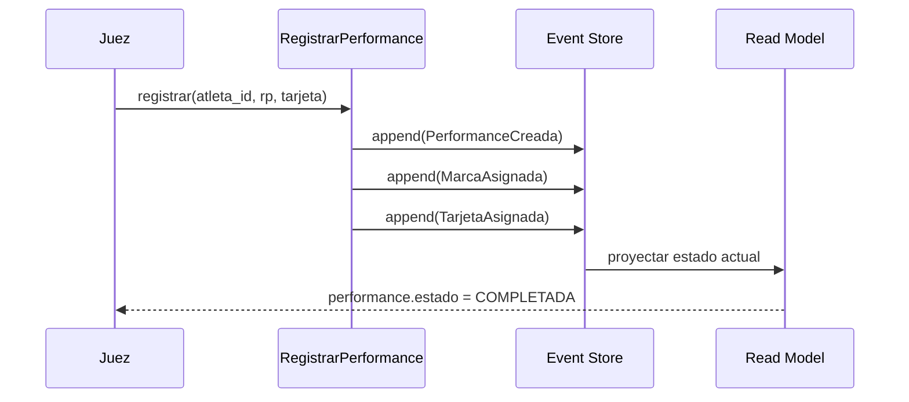

# ADR-001: Event Sourcing para la fase de competencia

| Campo | Valor |
|-------|-------|
| **Estado** | Aceptada |
| **Fecha** | 2026-03-14 |
| **Autores** | Victor Valotto |
| **Reemplaza** | — |

---

## Contexto

La fase de ejecución de una competencia de apnea tiene requisitos de integridad muy altos:
los resultados de un torneo oficial son disputables ante la federación (FAAS), y cualquier
modificación de una performance cerrada podría considerarse manipulación de resultados.

Adicionalmente, un juez puede cometer errores durante el registro (marca incorrecta, tarjeta
equivocada) y necesita un mecanismo de corrección que deje rastro explícito del motivo.

El modelo CRUD tradicional (UPDATE de un registro) destruye la historia: si se modifica
una marca, no queda evidencia de qué había antes ni quién lo cambió.

## Opciones Consideradas

**Opción A — CRUD con audit log:** Tabla de performances con campos mutables + tabla de
auditoría separada con triggers de base de datos.

**Opción B — Event Sourcing:** El estado de cada performance se deriva de una secuencia
inmutable de eventos. El estado actual es una proyección. Las correcciones son eventos
adicionales, nunca modificaciones.

**Opción C — CRUD con soft deletes y versioning:** Cada cambio crea una nueva versión del
registro, la anterior queda marcada como obsoleta.

## Decisión

Se adopta **Event Sourcing (Opción B)** para los aggregates de la fase de competencia:
`Performance` y `Competencia`.

Los aggregates de los BCs de soporte (`Torneo`, `Registro`, `Resultados`, `Identidad`)
usan CRUD estándar porque su historial no tiene valor regulatorio y la complejidad de
Event Sourcing no está justificada para ellos (ver ADR-005).

## Consecuencias

**Positivas:**
- Historial completo e inmutable de cada performance — cumple requisito de auditoría
- Las correcciones son eventos (`MarcaCorregida` con motivo) — trazabilidad total
- Al cerrar una disciplina se puede calcular un hash SHA-256 sobre todos los eventos
  como sello criptográfico de integridad (AC-SG-04)
- El Event Store es la fuente de verdad; el Read Model es derivado y reconstruible

**Negativas:**
- Mayor complejidad inicial: hay que implementar el Event Store, las proyecciones,
  y mantener la consistencia entre ambos
- Las queries sobre el Read Model son distintas a las queries sobre el Event Store —
  dos modelos de datos para el mismo concepto

**Riesgos:**
- El Read Model puede quedar desincronizado si falla la proyección. Mitigación:
  las proyecciones deben ser idempotentes y reconstruibles desde cero
