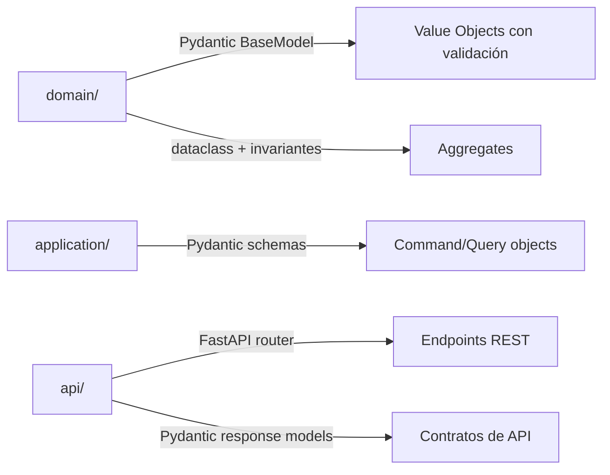

# ADR-002: FastAPI como framework backend

| Campo | Valor |
|-------|-------|
| **Estado** | Aceptada |
| **Fecha** | 2026-03-14 |
| **Autores** | Victor Valotto |
| **Reemplaza** | — |

---

## Contexto

AtaraxiaDive necesita un backend que exponga una API JSON consumida por el frontend React PWA.
El backend aloja la lógica de dominio (aggregates, invariantes, Event Sourcing) y persiste en
SQLite (un archivo por Bounded Context — ver ADR-007).

El desarrollador trabaja solo, con experiencia en Python. Las herramientas del entorno de
desarrollo (Software Limpio, Claude Dev Kit) están calibradas para Python.

## Opciones Consideradas

**Opción A — Flask:** Framework minimalista Python, ampliamente conocido. Requiere librerías
adicionales para validación de tipos (Marshmallow), async (no nativo), y documentación OpenAPI.

**Opción B — FastAPI:** Framework moderno Python, async nativo, validación con Pydantic v2
integrada, documentación OpenAPI automática.

**Opción C — Node.js / Express:** Comparte proceso con el frontend React, pero introduce un
segundo ecosistema de herramientas (npm, ESLint) desconectado de Software Limpio y el Dev Kit.

## Decisión

Se adopta **FastAPI (Opción B)**.

## Consecuencias

**Positivas:**
- Pydantic v2 permite expresar invariantes de dominio directamente en los modelos:
  validadores, constraints, tipos estrictos — sin capas adicionales
- Async nativo es coherente con el modelo de concurrencia de la interfaz del juez
  (hasta 50 usuarios concurrentes, AC-DS-02); con SQLite se usa `aiosqlite` como
  adaptador async (ver ADR-007)
- OpenAPI generado automáticamente sirve como documentación viva del contrato de API
- El ecosistema completo es Python: Software Limpio cubre backend y dominio con un
  solo conjunto de herramientas

**Negativas:**
- Menor familiaridad inicial con el modelo async/await comparado con Flask síncrono
- Pydantic v2 tiene breaking changes respecto a v1 — la documentación existente puede
  ser de v1

**Riesgos:**
- Mezclar Pydantic schemas de API con los modelos de dominio puede crear acoplamiento.
  Mitigación: los schemas de API viven en `api/` y son distintos de los modelos de `domain/`
