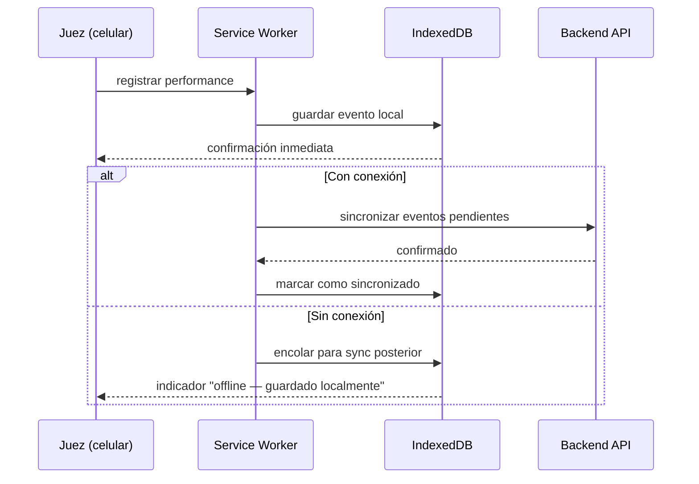

# ADR-003: Offline-first con PWA + IndexedDB para la interfaz del juez

| Campo | Valor |
|-------|-------|
| **Estado** | Aceptada |
| **Fecha** | 2026-03-14 |
| **Autores** | Victor Valotto |
| **Reemplaza** | — |

---

## Contexto

Los torneos de apnea se realizan en piletas cubiertas o al aire libre. La conectividad
WiFi o celular en estos entornos es frecuentemente inestable o inexistente.

El atributo de calidad AC-DS-03 establece que la interfaz del juez **debe funcionar sin
conexión a internet**. Un juez no puede detenerse a mitad de una competencia porque la
señal se cortó. La pérdida de datos de performance durante la competencia es inaceptable.

## Opciones Consideradas

**Opción A — App nativa móvil (iOS/Android):** Offline garantizado, pero requiere
publicar en stores, desarrollar en Swift/Kotlin o React Native, y mantener dos codebases.

**Opción B — PWA con Service Worker + IndexedDB:** Aplicación web instalable, offline
mediante Service Worker que intercepta requests. Los datos se persisten localmente en
IndexedDB y se sincronizan al recuperar conexión.

**Opción C — App web tradicional con manejo de errores de red:** Sin offline real —
solo reintentos y mensajes de error. No cumple AC-DS-03.

## Decisión

Se adopta **PWA con Service Worker + IndexedDB (Opción B)**.

## Consecuencias

**Positivas:**
- Una sola codebase web — no hay apps nativas que mantener
- Instalable en el celular del juez como cualquier app
- IndexedDB persiste los eventos localmente con durabilidad garantizada
- El modelo de eventos (Event Sourcing) es naturalmente compatible: los eventos
  generados offline se sincronizan en orden al reconectar
- Indicador visual de estado de conexión (AC-DS-03 requiere que sea explícito)

**Negativas:**
- Service Workers tienen comportamientos no intuitivos en desarrollo — debugging más complejo
- IndexedDB tiene una API verbose; se recomienda usar una librería wrapper (Dexie.js)
- La sincronización de conflictos (si dos jueces modifican la misma performance offline)
  requiere lógica de resolución explícita

**Riesgos:**
- El modo offline se activa en SP4 (Incremento 4.1). SP1, SP2, SP3 asumen conectividad.
  Mitigación: el diseño de la interfaz del juez desde SP1 debe ser compatible con el
  agregado posterior del Service Worker (sin acoplamiento a fetch directo)
