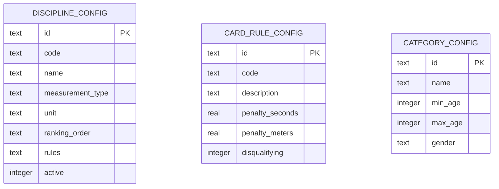

# ADR-004: Reglas de competencia como datos configurables

| Campo | Valor |
|-------|-------|
| **Estado** | Aceptada |
| **Fecha** | 2026-03-14 |
| **Autores** | Victor Valotto |
| **Reemplaza** | — |
| **Relacionado** | ADR-005 (Bounded Contexts — propietario de cada tabla), ADR-007 (SQLite por BC) |

---

## Contexto

Las reglas de apnea competitiva cambian aproximadamente cada 2 años (actualización del
reglamento de la federación). Los cambios típicos incluyen: nuevas disciplinas, modificación
de penalizaciones por tarjeta amarilla, cambio en los criterios de ranking, nuevas categorías
por edad o género.

Si estas reglas están hardcodeadas en el código fuente, cada cambio de reglamento requiere
un ciclo de desarrollo, testing y despliegue — con riesgo de regresiones.

El atributo de calidad AC-CF-01 establece que el administrador debe poder agregar disciplinas
sin reiniciar el sistema. AC-CF-02 requiere que las penalizaciones sean configurables.

## Opciones Consideradas

**Opción A — Hardcoded en el dominio:** Las disciplinas (STA, DNF, DBF, DYN, SPE2X50) y sus
reglas están en constantes o enums en `domain/`. Cambiar una regla requiere modificar código.

**Opción B — Configuración en archivos (YAML/JSON):** Las reglas viven en archivos de
configuración versionados. Cambiar una regla requiere editar un archivo y hacer deploy.

**Opción C — Configuración como datos en base de datos:** Las reglas se almacenan en la
base de datos. El administrador las modifica desde un panel sin intervención técnica.
El sistema las lee en runtime.

## Decisión

Se adopta **configuración como datos en base de datos (Opción C)** para disciplinas,
categorías y reglas de tarjetas.

Las reglas que son invariantes del dominio (ej: "una performance cerrada no puede
modificarse") siguen en el código — son parte del modelo, no configuración.

## Consecuencias

### Propietario de cada tabla (per ADR-005)

El BC `Configuración` fue eliminado (ADR-005). Las tablas de configuración pertenecen
a los BCs que las consumen:

| Tabla | BC propietario | Archivo SQLite |
|-------|---------------|----------------|
| `discipline_config` | **Torneo** | `torneo.db` |
| `category_config` | **Torneo** | `torneo.db` |
| `card_rule_config` | **Competencia** | `competencia.db` |

### Esquema de tablas (SQLite)

> **Nota:** Los tipos son SQLite (`text`, `real`, `integer`). El campo `rules` almacena
> JSON serializado como `text` — SQLite no tiene tipo JSONB nativo.

**Positivas:**
- El administrador puede agregar una disciplina nueva o modificar una penalización
  desde el panel sin tocar código ni hacer deploy (AC-CF-01, AC-CF-02)
- Los torneos futuros usan la configuración vigente; los torneos pasados conservan
  la configuración con la que se ejecutaron (snapshot al crear el torneo)
- JSON como `text` en SQLite es suficiente para este volumen; la validación
  de estructura es responsabilidad de la capa de aplicación

**Negativas:**
- La validación de las reglas configuradas es responsabilidad de la aplicación,
  no del compilador — se requieren tests exhaustivos de los valores de configuración
- El modelo de dominio necesita leer configuración en runtime, lo que introduce
  dependencia de infraestructura en los casos de uso (mitigado por inyección de dependencias)

**Riesgos:**
- Una configuración inválida puede romper una competencia en producción.
  Mitigación: validación estricta al guardar la configuración + tests de integración
  que cubran las combinaciones de reglas más comunes
