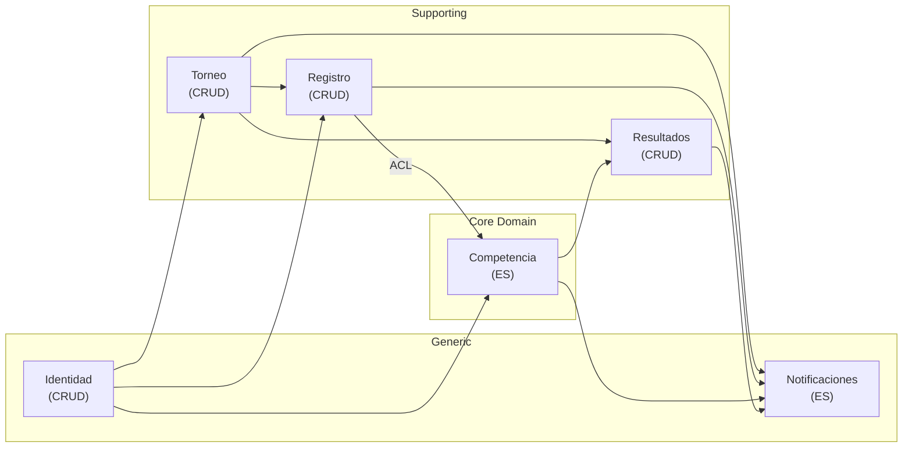

# ADR-005: Diseño Estratégico DDD — Bounded Contexts y Event Sourcing en Notificaciones

| Campo | Valor |
|-------|-------|
| **Estado** | Aceptada |
| **Fecha** | 2026-03-18 |
| **Autores** | Victor Valotto |
| **Relacionado** | ADR-001 (Event Sourcing en Competencia) |
| **Fuente** | Event Storming Big Picture + análisis Context Map |

---

## Contexto

Completado el Event Storming Big Picture (6 fases, 25 hot spots, línea de eventos del
dominio completo), el diseño estratégico DDD requiere dos decisiones formales:

1. **¿Cuáles son los Bounded Contexts definitivos del sistema?**
   El análisis preliminar en CLAUDE.md §7 identificó 7 BCs. El ES produjo un mapa
   diferente. Hay que formalizar cuál es el diseño adoptado y por qué difiere del
   análisis preliminar.

2. **¿Notificaciones es un BC de dominio o un servicio de infraestructura?**
   Durante el análisis del Context Map emergió una tensión: Notificaciones tiene
   comportamiento propio (ciclo de vida de una notificación, preferencias del destinatario,
   reintentos) pero también puede tratarse como infraestructura técnica sin modelo de dominio.

---

## Decisión 1: Bounded Contexts definitivos

Se adoptan **6 Bounded Contexts**: 4 de dominio + 2 genéricos.

| BC | Tipo | Implementación | Justificación |
|----|------|:--------------:|---------------|
| **Competencia** | Core Domain | Event Sourcing | Lógica no trivial, auditoría regulatoria, ES ya decidido en ADR-001 |
| **Torneo** | Supporting | CRUD | Gestión de ciclo de vida y catálogos — sin historial regulatorio |
| **Registro** | Supporting | CRUD | Datos personales de atletas e inscripciones — sin historial regulatorio |
| **Resultados** | Supporting | CRUD + proyecciones | Cálculo derivado de eventos de Competencia — sin lógica propia compleja |
| **Identidad** | Generic | CRUD | Cross-cutting estándar — candidato a reemplazar con solución existente en el futuro |
| **Notificaciones** | Generic | Event Sourcing | Ver Decisión 2 |

### Por qué 6 BCs y no 7 (diferencia con análisis preliminar)

El BC `Configuración` (disciplinas, categorías, reglas) fue eliminado porque no emergió
como frontera natural en el ES Big Picture: ningún evento del dominio pertenecía
exclusivamente a un contexto de configuración.

Sus conceptos fueron absorbidos por los BCs que los usan:
- Disciplinas y categorías → **Torneo** (se seleccionan al crear el torneo)
- Reglas de tarjetas → **Competencia** (las aplica el juez durante la ejecución)

> **Dato experimental:** el ES Big Picture produjo un modelo más simple y coherente
> que el análisis estático de RFs. La compresión de 7 a 6 BCs emergió del comportamiento
> del dominio, no de una decisión de diseño top-down. Esto es evidencia a favor de la
> hipótesis de que ES mejora la calidad del modelo DDD.

---

## Decisión 2: Notificaciones como BC Generic con Event Sourcing

### Opciones consideradas

**Opción A — Infraestructura:** Notificaciones es un servicio de plataforma sin modelo
de dominio propio. Suscribe a eventos, despacha a canales externos (SMTP, FCM).
Configuración por BC via archivo de reglas. Sin aggregate, sin event store propio.

**Opción B — BC Generic con CRUD:** Notificaciones es un BC con aggregate `Notificacion`
y estado persistido en tabla relacional. Idempotencia implementada con columna `evento_fuente_id`
+ unique constraint.

**Opción C — BC Generic con Event Sourcing:** Notificaciones es un BC con aggregate
`Notificacion` y estado derivado de una secuencia de eventos. La idempotencia emerge
naturalmente del event store: antes de enviar se verifica si `NotificacionEnviada`
ya existe para ese `eventoFuenteId`.

### Decisión

Se adopta **Opción C — BC Generic con Event Sourcing**.

### Justificación

**El argumento principal es la idempotencia operativa.**

En una competencia de apnea, una notificación duplicada no es solo un inconveniente
técnico — es ruido en un momento de alta carga emocional para atletas y jueces.
El sistema debe garantizar exactly-once delivery por diseño, no por convención.

Con ES, la garantía es estructural:

```
al recibir evento X:
  if NotificacionEnviada(eventoFuenteId=X.id) exists in store:
    ignorar  ← idempotencia natural
  else:
    append NotificacionSolicitada
    enviar al canal externo
    append NotificacionEnviada | NotificacionFallida
```

Con CRUD (Opción B), la misma garantía requiere lógica ad-hoc (unique constraint +
manejo de race conditions en concurrencia). Con infraestructura (Opción A), no hay
garantía estructural — depende de la implementación del consumidor del bus.

**Argumentos secundarios:**

- La infraestructura de ES ya existe (construida para Competencia en ADR-001).
  El costo marginal de un segundo BC con ES es bajo.
- El aggregate `Notificacion` tiene ciclo de vida real: `Solicitada → Enviada / Fallida → Reintentada`.
  ES modela ese ciclo de forma natural.
- El historial de notificaciones tiene valor operativo: "¿le avisamos al atleta de
  la cancelación del torneo?" es una pregunta con respuesta en el event store.

**Lenguaje ubicuo propio del BC:**

| Concepto | Descripción |
|----------|-------------|
| `Notificacion` | Aggregate — una comunicación a un destinatario por un evento de dominio |
| `Destinatario` | Value Object — userId + canal preferido (email / push) |
| `Plantilla` | Entidad — template de mensaje por tipo de evento |
| `Canal` | Enum — Email, Push |
| `eventoFuenteId` | Identificador del evento de dominio que originó la notificación |

**Eventos del BC:**

```
NotificacionSolicitada   → intento registrado (eventoFuenteId, destinatario, plantilla)
NotificacionEnviada      → canal externo confirmó entrega
NotificacionFallida      → canal externo rechazó o timeout (con motivo)
NotificacionReintentada  → reintento programado tras fallo
PreferenciasActualizadas → atleta cambió canal preferido
```

### Trade-off documentado

> **Riesgo de lock-in:** Notificaciones es Generic — candidato natural a ser reemplazado
> por un SaaS en el futuro (SendGrid con reglas, Firebase, etc.). Con ES, la migración
> implica exportar el event store o aceptar pérdida del historial. Con CRUD, la migración
> sería más limpia.
>
> **Decisión consciente:** se acepta este trade-off porque (a) la idempotencia estructural
> tiene valor operativo real en el contexto actual, (b) la infraestructura ES ya existe,
> y (c) el proyecto está en un horizonte de desarrollo propio sin presión de reemplazar
> componentes en el corto plazo.
>
> Si en el futuro se decide migrar a SaaS, este ADR documenta el motivo del diseño y
> facilita la decisión informada de migración.

---

## Consecuencias

### Estructura final del sistema



### Impacto en la implementación

- SP1 (La Performance) implementa el BC **Competencia** — el event store y las
  proyecciones son el núcleo técnico del subproyecto.
- **Notificaciones** no es parte de SP1. Se implementa en SP4 (La Plataforma) cuando
  la infraestructura de todos los BCs esté establecida.
- **Identidad** tampoco es parte de SP1 — en los primeros incrementos se asume un
  usuario autenticado sin implementar el BC completo.

### Impacto en CLAUDE.md

La sección §7 (Bounded Contexts) debe actualizarse para reflejar los 6 BCs definitivos
con la columna de implementación (ES vs CRUD).

---

*Documento creado: 2026-03-18 — Semana 0, Fase 0*
*Basado en: Event Storming Big Picture + Context Map v1.1*
