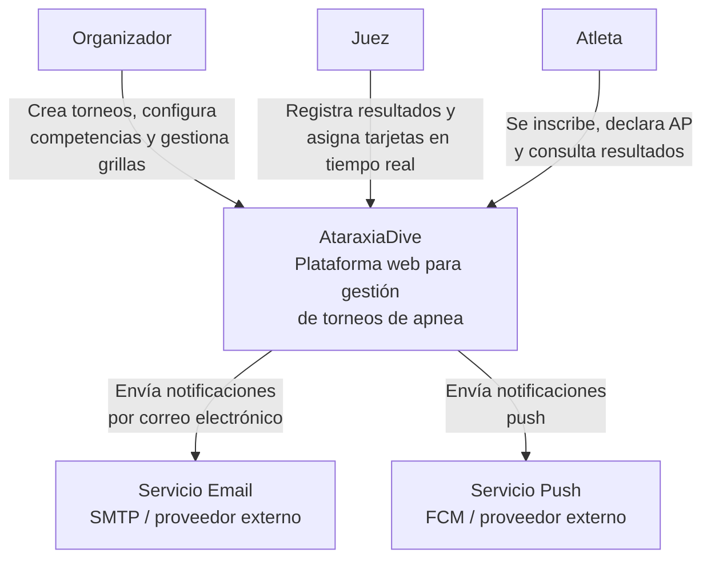

# 01 System Context

## Propósito

Describir la vista de más alto nivel de AtaraxiaDive: qué problema resuelve,
quiénes interactúan con el sistema y con qué servicios externos se integra.

Este documento fija el **límite del sistema** y sirve como punto de entrada para
las vistas arquitectónicas de menor nivel.

## Alcance

Incluye:

- actores principales;
- sistema bajo diseño;
- sistemas externos relevantes;
- relaciones de alto nivel entre esos elementos.

No incluye la descomposición interna en contenedores ni bounded contexts.

## Fuentes

- `docs/requirements/vision.md`
- `docs/design/architecture.md`
- `docs/design/context-map.md`
- `docs/adr/ADR-003-offline-first-pwa.md`

## Descripción

AtaraxiaDive es una plataforma web para la gestión de torneos de apnea
(freediving). Soporta el ciclo de vida completo del torneo, con foco especial en
la fase de ejecución, donde jueces registran performances en tiempo real y el
sistema debe preservar auditabilidad, integridad de resultados y operación
robusta en condiciones de conectividad limitada.

Desde la perspectiva de contexto, AtaraxiaDive se comporta como un único sistema
que:

- permite al organizador configurar y operar torneos;
- permite al juez registrar resultados y decisiones operativas durante la
  competencia;
- permite al atleta inscribirse, declarar anuncios de performance y consultar
  resultados;
- delega el envío de notificaciones a servicios externos especializados.

## Actores

### Organizador

Responsable de crear torneos, configurar competencias, gestionar grillas y
conducir el torneo a través de sus distintas fases.

### Juez

Responsable de operar durante la competencia: registrar resultados, asignar
tarjetas y ejecutar el flujo operativo de cada performance.

### Atleta

Responsable de inscribirse, declarar su AP antes de la competencia y consultar
sus resultados y publicaciones asociadas al torneo.

## Sistemas externos

### Servicio Email

Proveedor externo para envío de correos electrónicos transaccionales y
notificaciones del sistema.

### Servicio Push

Proveedor externo para envío de notificaciones push a dispositivos móviles o
navegadores compatibles.

## Diagrama de contexto

## Relaciones

| Relación | Descripción |
|----------|-------------|
| `Organizador -> AtaraxiaDive` | Opera la creación, configuración y gestión del torneo. |
| `Juez -> AtaraxiaDive` | Ejecuta la operación de competencia y registra resultados en tiempo real. |
| `Atleta -> AtaraxiaDive` | Interactúa con el sistema en inscripción, anuncios y consulta de resultados. |
| `AtaraxiaDive -> Servicio Email` | Delega el envío de emails transaccionales y notificaciones. |
| `AtaraxiaDive -> Servicio Push` | Delega el envío de push notifications. |

## Restricciones relevantes en esta vista

- El sistema debe soportar operación de juez en contexto mobile-first y con
  conectividad potencialmente inestable.
- La fase de ejecución de competencia exige trazabilidad completa de acciones y
  protección de la integridad del resultado.
- Las notificaciones se resuelven mediante integración con proveedores externos,
  no mediante infraestructura propia de mensajería al usuario final.

## Implicancias para las siguientes vistas

Esta vista introduce tres ejes que deben preservarse en las vistas internas:

- separación entre actores con responsabilidades claramente distintas;
- tratamiento explícito de integraciones externas de notificación;
- prioridad arquitectónica de la fase de competencia como centro operativo del
  sistema.

## Siguiente paso

El documento siguiente es `02-container-view.md`, donde AtaraxiaDive deja de
verse como una caja negra y se descompone en frontend, backend y persistencia.
