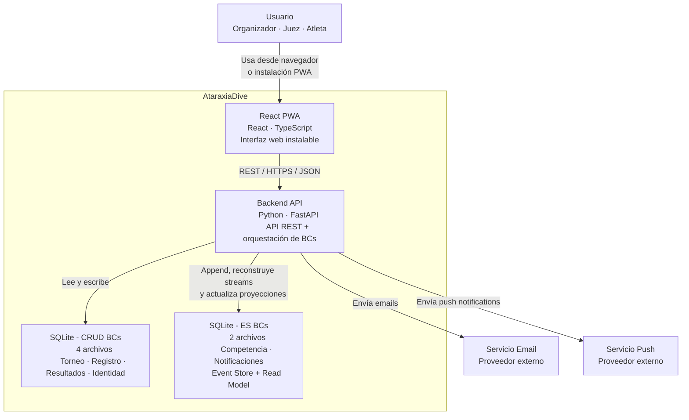

# 02 Container View

## Propósito

Describir la descomposición de AtaraxiaDive en sus principales contenedores
técnicos y las relaciones entre ellos.

Esta vista muestra cómo el sistema deja de comportarse como una única caja negra
y se organiza en frontend, backend, persistencia e integraciones externas.

## Alcance

Incluye:

- contenedores principales de la solución;
- responsabilidades de cada contenedor;
- tecnologías asociadas a cada uno;
- relaciones de alto nivel entre frontend, backend, bases de datos y servicios
  externos.

No incluye todavía la descomposición interna del backend en bounded contexts ni
el detalle de los flujos de runtime entre ellos.

## Fuentes

- `docs/design/architecture.md`
- `docs/adr/ADR-003-offline-first-pwa.md`
- `docs/adr/ADR-006-estructura-bc-first.md`
- `docs/adr/ADR-007-sqlite-persistencia-bc.md`
- `docs/adr/ADR-008-event-store-sqlite.md`

## Descripción

AtaraxiaDive se organiza en una arquitectura web con dos contenedores de
aplicación principales:

- una `React PWA` como interfaz de usuario;
- una `Backend API` en `FastAPI` que concentra la lógica de aplicación y
  orquesta los bounded contexts del sistema.

La persistencia se encuentra segmentada por bounded context, con una decisión
explícita de **un archivo SQLite por BC**. Esta separación distingue:

- BCs CRUD, con persistencia relacional convencional;
- BCs con Event Sourcing, donde el mismo archivo contiene event store y read
  model.

## Contenedores

### React PWA

Interfaz de usuario instalable desde navegador. Atiende los flujos de
organizador, juez y atleta.

Su diseño objetivo contempla capacidad offline-first para la interfaz del juez,
sin modificar el límite arquitectónico principal: sigue siendo un cliente del
backend vía HTTP.

**Tecnología principal:** `React` + `TypeScript`

### Backend API

Aplicación backend que expone la API REST, aplica la arquitectura hexagonal por
bounded context y coordina la ejecución de casos de uso.

Actúa como composition root del sistema y concentra:

- validación de requests;
- orquestación de comandos y queries;
- acceso a persistencia por BC;
- coordinación de políticas entre contextos;
- integración con servicios externos.

**Tecnología principal:** `Python` + `FastAPI`

### SQLite - CRUD BCs

Conjunto de archivos SQLite, uno por bounded context CRUD:

- `torneo.db`
- `registro.db`
- `resultados.db`
- `identidad.db`

Cada archivo encapsula la persistencia del BC correspondiente y refuerza la
frontera arquitectónica a nivel de infraestructura.

**Tecnología principal:** `SQLite`

### SQLite - ES BCs

Conjunto de archivos SQLite para los bounded contexts que usan Event Sourcing:

- `competencia.db`
- `notificaciones.db`

Cada archivo contiene:

- tabla append-only de eventos;
- estructuras de proyección/read model necesarias para consultas;
- mecanismos de concurrencia optimista a nivel de stream.

**Tecnología principal:** `SQLite`

### Servicio Email

Servicio externo responsable del envío de correos electrónicos del sistema.

### Servicio Push

Servicio externo responsable del envío de notificaciones push.

## Diagrama de contenedores

## Relaciones

| Relación | Descripción |
|----------|-------------|
| `Usuario -> React PWA` | El usuario interactúa con el sistema a través de una interfaz web instalable. |
| `React PWA -> Backend API` | El frontend consume la API REST del backend. |
| `Backend API -> SQLite - CRUD BCs` | El backend persiste y consulta el estado de los bounded contexts CRUD. |
| `Backend API -> SQLite - ES BCs` | El backend hace append de eventos, reconstruye aggregates y mantiene proyecciones. |
| `Backend API -> Servicio Email` | El backend delega envíos de correo a un proveedor externo. |
| `Backend API -> Servicio Push` | El backend delega envíos push a un proveedor externo. |

## Restricciones relevantes en esta vista

- El frontend no accede directamente a bases de datos ni a servicios externos.
- Cada bounded context accede únicamente a su propia persistencia.
- No hay base de datos compartida con joins transversales entre BCs.
- Los bounded contexts con Event Sourcing mantienen event store y read model
  dentro del mismo archivo SQLite del BC.
- La capacidad offline-first del juez impacta al frontend, pero no elimina al
  backend como fuente de verdad del sistema.

## Decisiones arquitectónicas reflejadas

- `FastAPI` como backend principal.
- `React PWA` como frontend principal.
- estructura `BC-first` en el backend;
- `SQLite` con un archivo por bounded context;
- `Event Sourcing` aplicado solo a `Competencia` y `Notificaciones`.

## Implicancias para las siguientes vistas

Esta vista deja planteadas tres profundizaciones necesarias:

- cómo se organiza el backend internamente en bounded contexts;
- cómo colaboran esos contexts en runtime sin romper sus fronteras;
- cómo se resuelve la capacidad offline-first sin comprometer integridad ni
  trazabilidad.

## Siguiente paso

El documento siguiente es `03-bounded-contexts.md`, que describe la
descomposición interna del backend desde la perspectiva de dominio y límites de
responsabilidad.
