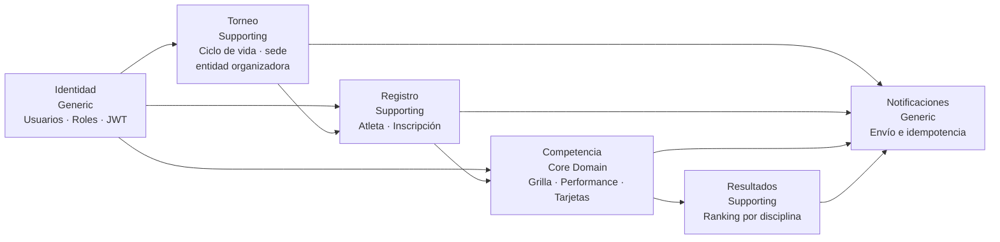

# 03 Bounded Contexts

## Propósito

Describir la descomposición interna del backend de AtaraxiaDive en bounded
contexts y resumir el rol arquitectónico de cada uno.

Esta vista funciona como puente entre la vista de contenedores y los documentos
específicos por BC.

## Alcance

Incluye:

- bounded contexts definidos para el sistema;
- tipo DDD y estilo de persistencia;
- responsabilidad principal de cada contexto;
- relaciones más relevantes entre contextos;
- referencias a la documentación detallada de cada BC.

No repite el detalle interno de cada contexto ni el context map completo de
integraciones.

## Fuentes

- `docs/architecture/20-context-map-integrations.md`
- `docs/design/context-map.md`
- `docs/design/domain-model.md`
- `docs/adr/ADR-005-bounded-contexts-ddd-estrategico.md`
- `docs/adr/ADR-006-estructura-bc-first.md`

## Descripción

El backend de AtaraxiaDive está organizado con enfoque `BC-first`. Cada bounded
context delimita:

- un lenguaje ubicuo;
- una frontera de dominio;
- su propia persistencia;
- sus propios adaptadores de entrada y salida.

La solución vigente distingue seis bounded contexts:

- `Competencia`
- `Torneo`
- `Registro`
- `Resultados`
- `Identidad`
- `Notificaciones`

## Diagrama general de bounded contexts

## Resumen por bounded context

| BC | Tipo DDD | Persistencia | Responsabilidad principal | Documento |
|----|----------|--------------|---------------------------|-----------|
| `Competencia` | Core Domain | Event Sourcing | Ejecución deportiva, grilla, performances, resultados y tarjetas | [10-bc-competencia.md](/Users/victor/PycharmProjects/ataraxiadive/docs/architecture/10-bc-competencia.md) |
| `Torneo` | Supporting | CRUD | Ciclo de vida del torneo y contexto organizativo | [11-bc-torneo.md](/Users/victor/PycharmProjects/ataraxiadive/docs/architecture/11-bc-torneo.md) |
| `Registro` | Supporting | CRUD | Atletas, inscripciones y validación de participación | [12-bc-registro.md](/Users/victor/PycharmProjects/ataraxiadive/docs/architecture/12-bc-registro.md) |
| `Resultados` | Supporting | CRUD + stream propio | Ranking derivado y publicación de resultados por disciplina | [13-bc-resultados.md](/Users/victor/PycharmProjects/ataraxiadive/docs/architecture/13-bc-resultados.md) |
| `Identidad` | Generic | CRUD | Usuarios, roles, autenticación y JWT | [14-bc-identidad.md](/Users/victor/PycharmProjects/ataraxiadive/docs/architecture/14-bc-identidad.md) |
| `Notificaciones` | Generic | Event Sourcing | Ciclo de vida de notificaciones e idempotencia de envío | [15-bc-notificaciones.md](/Users/victor/PycharmProjects/ataraxiadive/docs/architecture/15-bc-notificaciones.md) |

## Relaciones dominantes entre contextos

### Identidad -> Torneo, Registro y Competencia

`Identidad` es upstream como proveedor de claims JWT.

Los BCs consumidores verifican el token localmente y no consultan a `Identidad`
en runtime por cada operación.

### Torneo -> Registro

`Torneo` habilita conceptualmente la inscripción y provee el contexto mínimo
para aceptar participación en un torneo.

### Registro -> Competencia

`Registro` es fuente de datos de atleta y participación; `Competencia` protege
su modelo mediante un ACL que traduce `Atleta` a `Participante`.

### Competencia -> Resultados

`Competencia` es la fuente de verdad deportiva; `Resultados` deriva rankings a
partir del cierre de la disciplina.

### Todos los BCs funcionales -> Notificaciones

`Notificaciones` es downstream de eventos funcionales y no debe convertirse en
dependencia síncrona de negocio.

## Diferencias relevantes entre diseño y código actual

La topología de BCs ya está consolidada, pero la implementación aún muestra
algunas asimetrías:

- `Competencia` y `Resultados` ya materializan una colaboración técnica real;
- `Registro` valida contra `Torneo` mediante un ACL read-only a SQLite;
- `Notificaciones` está definido arquitectónicamente pero aún no está
  implementado de extremo a extremo;
- algunos contratos estratégicos por eventos todavía existen más como diseño que
  como infraestructura operativa completa.

## Implicancias arquitectónicas

- la frontera de BC debe preservarse tanto en código como en persistencia;
- las integraciones cross-BC deben quedar contenidas en adaptadores o
  composition root;
- la elección de un core domain explícito (`Competencia`) sigue siendo la guía
  principal para priorizar complejidad y rigor.
