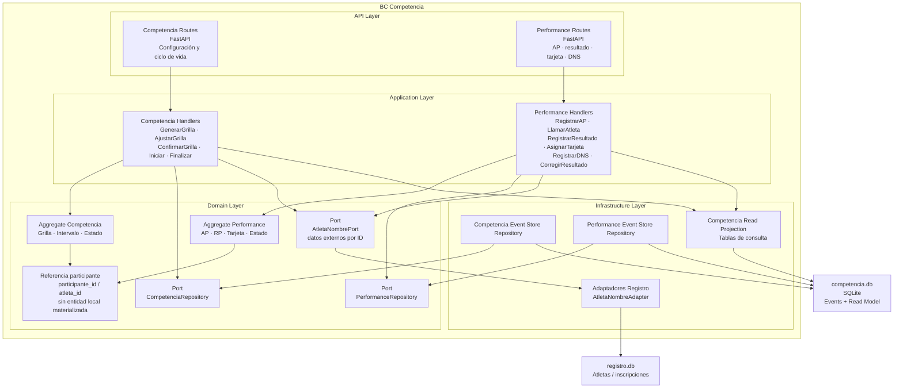

# 10 BC Competencia

## Propósito

Describir la arquitectura interna del bounded context `Competencia`, que actúa
como core domain de AtaraxiaDive.

Este documento muestra cómo se organiza el BC por capas, cuáles son sus
componentes principales, cómo se persiste su estado y qué integraciones externas
atraviesan su frontera.

## Alcance

Incluye:

- responsabilidad del BC;
- estructura interna por capas;
- aggregates y entidades principales;
- puertos y adaptadores relevantes;
- uso de Event Sourcing;
- integración con `Registro` mediante puertos/adaptadores y referencias por ID.

No detalla el comportamiento completo de cada caso de uso ni el contrato HTTP de
cada endpoint.

## Fuentes

- `docs/design/architecture.md`
- `docs/design/domain-model.md`
- `docs/design/context-map.md`
- `docs/adr/ADR-001-event-sourcing-competencia.md`
- `docs/adr/ADR-008-event-store-sqlite.md`

## Rol del bounded context

`Competencia` es el **core domain** del sistema. Modela la ejecución deportiva de
una competencia de apnea y concentra la lógica que tiene mayor valor de negocio y
mayor sensibilidad regulatoria.

Su responsabilidad principal incluye:

- configurar y gestionar la competencia por disciplina;
- generar y ajustar la grilla de salida;
- administrar el ciclo de vida de la competencia;
- registrar anuncios de performance y resultados;
- asignar tarjetas y registrar DNS;
- preservar trazabilidad completa de las acciones críticas del juez.

## Tipo de persistencia

`Competencia` utiliza **Event Sourcing**.

La fuente de verdad del BC no es una fila mutable sino la secuencia de eventos de
cada aggregate. El estado actual se reconstruye reproduciendo el stream de
eventos y las consultas se resuelven contra proyecciones mantenidas en el mismo
archivo SQLite del BC.

## Estructura interna

El BC sigue arquitectura hexagonal con organización interna por capas:

- `api`: adaptadores de entrada HTTP;
- `application`: handlers de comandos y queries;
- `domain`: aggregates, entidades, value objects, eventos y puertos;
- `infrastructure`: event store, repositorios y proyecciones.

## Diagrama del BC

## Componentes principales

### API Layer

Expone endpoints HTTP para operar la competencia y las performances.

Sus responsabilidades son:

- validar entrada y salida;
- traducir requests a comandos o queries;
- delegar ejecución a la capa de aplicación;
- no contener lógica de negocio del dominio.

### Application Layer

Orquesta los casos de uso del BC.

Sus responsabilidades son:

- recibir comandos y queries;
- cargar aggregates desde sus repositorios;
- ejecutar operaciones del dominio;
- persistir eventos resultantes;
- actualizar proyecciones de lectura;
- coordinar puertos de integración o políticas de aplicación cuando
  corresponda.

### Domain Layer

Contiene el núcleo del BC.

Sus elementos centrales son:

- `Competencia` como aggregate root de la disciplina en ejecución;
- `Performance` como aggregate root de cada performance individual;
- referencias a participante/atleta por ID dentro de `Performance`, grilla y
  eventos;
- value objects e invariantes del dominio;
- puertos que abstraen persistencia y acceso externo.

### Infrastructure Layer

Implementa los puertos definidos por el dominio.

Sus responsabilidades son:

- persistir y cargar streams de eventos;
- reconstruir aggregates desde el event store;
- mantener el read model usado por queries;
- materializar la integración de infraestructura requerida por el BC.

## Aggregates y conceptos principales

### Competencia

Aggregate root que modela la competencia por disciplina.

Responsable de:

- configurar intervalos;
- generar y ajustar la grilla;
- confirmar la grilla;
- iniciar y finalizar la competencia;
- preservar invariantes del ciclo de vida.

### Performance

Aggregate root que modela la ejecución individual de un participante.

Responsable de:

- registrar AP;
- registrar resultado;
- asignar tarjeta;
- registrar DNS;
- corregir resultados con trazabilidad explícita.

### Referencia a participante

Concepto de identidad local del BC, pero no entidad materializada en código.

La implementación actual opera con `participante_id` / `atleta_id` como
referencia estable dentro de:

- `Performance`;
- `EntradaGrilla`;
- eventos de dominio;
- queries y read models.

Los datos descriptivos del atleta, como nombre completo, se obtienen mediante
puertos de dominio y adaptadores de infraestructura.

## Integración con Registro

La integración entre `Competencia` y `Registro` se implementa como puertos de
dominio y adaptadores de infraestructura, no como una entidad `Participante`
persistida dentro de `Competencia`.

El BC `Competencia` no incorpora el modelo completo de atleta o inscripción de
`Registro`. En cambio:

- conserva IDs estables en streams y eventos (`participante_id` / `atleta_id`);
- usa `PerformancesAPPort` para obtener las performances con AP registrado
  desde su propio event store;
- usa `AtletaNombrePort` para resolver datos descriptivos del atleta cuando una
  query lo necesita;
- implementa `AtletaNombreAdapter` en infraestructura consultando `registro.db`.

Esto mantiene el dominio de `Competencia` desacoplado del modelo interno de
`Registro`, aunque la integración actual es más liviana que el ACL conceptual
original.

## Event Sourcing en Competencia

La persistencia del BC se apoya en streams por aggregate:

- `competencia-{competencia_id}`
- `performance-{performance_id}`

Cada stream representa la historia completa de cambios de un aggregate.

El BC usa:

- append-only sobre tabla de eventos;
- concurrencia optimista por versión del stream;
- reconstrucción de estado por replay;
- proyecciones síncronas para consultas operativas.

## Proyecciones y consultas

Las queries del BC no se resuelven reproduciendo eventos en cada request.
Se apoyan en un read model proyectado dentro del mismo archivo SQLite.

Esto permite:

- consultas rápidas para grillas y estado actual;
- separación entre modelo de escritura y modelo de lectura;
- reconstrucción del read model si fuera necesario.

## Restricciones arquitectónicas del BC

- el dominio no depende de `FastAPI`, `SQLite` ni librerías externas;
- la lógica de negocio vive en aggregates y value objects, no en routes ni
  repositorios;
- las correcciones no mutan estado previo: agregan nuevos eventos;
- `Competencia` no consulta directamente la base de datos de `Registro`;
- todo dato externo relevante se traduce dentro de la frontera del BC;
- el read model no es fuente de verdad; deriva del event store.

## Integraciones relevantes

### Entrada desde Registro

- referencias por `atleta_id` / `participante_id`;
- resolución de datos descriptivos mediante `AtletaNombrePort`;
- adaptación concreta mediante `AtletaNombreAdapter`.

### Salida hacia Resultados

- evento `CompetenciaFinalizada`;
- publicación del resultado consolidado como fuente de verdad deportiva.

### Salida hacia Notificaciones

- eventos de dominio del BC que puedan disparar comunicaciones downstream.

## Implicancias para implementación

Este BC es el lugar donde más estrictamente debe sostenerse la disciplina
arquitectónica del sistema:

- fronteras claras con otros BCs;
- invariantes en el dominio;
- trazabilidad completa;
- persistencia inmutable de eventos;
- desacoplamiento entre escritura y lectura.

## Siguiente paso

El siguiente documento puede ser otro bounded context supporting, o bien el BC
`Resultados`, que es el principal consumidor downstream de `Competencia`.
