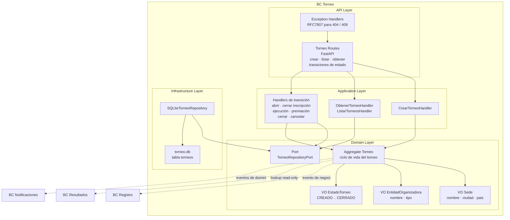

# 11 BC Torneo

## Propósito

Describir la arquitectura interna del bounded context `Torneo`, responsable del
ciclo de vida organizativo del torneo y de la configuración básica que consumen
otros bounded contexts.

Este documento muestra cómo se organiza el BC por capas, cuáles son sus
componentes principales, cómo persiste su estado y qué integraciones externas
atraviesan su frontera.

## Alcance

Incluye:

- responsabilidad del BC;
- estructura interna por capas;
- aggregate y value objects principales;
- puertos y adaptadores relevantes;
- persistencia CRUD en SQLite;
- integraciones hacia `Registro`, `Resultados` y `Notificaciones`.

No detalla todavía el modelado completo de catálogos independientes ni la
configuración avanzada prevista para `FormulaPuntos` o `VentanaImpugnacion`.

## Fuentes

- `docs/design/architecture.md`
- `docs/design/domain-model.md`
- `docs/design/context-map.md`
- `docs/adr/ADR-005-bounded-contexts-ddd-estrategico.md`
- `docs/adr/ADR-006-estructura-bc-first.md`
- `docs/adr/ADR-007-sqlite-persistencia-bc.md`
- `src/torneo/`

## Rol del bounded context

`Torneo` es un **supporting domain**. Modela el contenedor organizativo sobre el
que se apoyan inscripción, ejecución deportiva, publicación de resultados y
cierre del evento.

Su responsabilidad principal incluye:

- crear torneos;
- administrar el ciclo de vida del torneo;
- conservar datos de sede y entidad organizadora;
- habilitar operativamente la inscripción;
- proveer contexto read-only a otros BCs;
- emitir eventos de negocio al avanzar o cerrar fases.

## Estado actual

La implementación vigente del BC ya está materializada en `src/torneo/` y sigue
un enfoque CRUD.

Hoy el modelo operativo real está centrado en un único aggregate `Torneo`, con
`Sede` y `EntidadOrganizadora` embebidos como value objects persistidos dentro
de la misma fila. El diseño de referencia proyecta una evolución posterior donde
esos conceptos pueden crecer como catálogos con ciclo de vida propio.

## Tipo de persistencia

`Torneo` persiste su estado en `data/torneo.db`.

La implementación actual usa una tabla relacional:

- `torneos`

Cada fila almacena:

- datos básicos del torneo;
- rango de fechas;
- estado actual;
- `sede` serializada como JSON;
- `entidad` serializada como JSON.

No utiliza Event Sourcing. El estado actual se actualiza por reemplazo de fila
mediante `INSERT OR REPLACE`.

## Estructura interna

El BC sigue arquitectura hexagonal con organización interna por capas:

- `api`: endpoints FastAPI y exception handlers;
- `application`: handlers de comandos y queries;
- `domain`: aggregate, value objects, excepciones y puertos;
- `infrastructure`: repositorio SQLite.

## Diagrama del BC

## Componentes principales

### API Layer

Expone endpoints HTTP para creación, consulta y transición de estado del
torneo.

Sus responsabilidades son:

- validar payloads con Pydantic;
- instanciar handlers de aplicación;
- devolver respuestas serializadas del aggregate;
- traducir excepciones de dominio a errores HTTP.

### Application Layer

Orquesta los casos de uso del BC.

Sus responsabilidades son:

- crear un torneo nuevo a partir del request;
- obtener un torneo por identificador;
- listar torneos persistidos;
- ejecutar transiciones de estado válidas sobre el aggregate;
- persistir el nuevo estado vía repositorio.

### Domain Layer

Contiene el modelo del BC.

Sus elementos centrales son:

- `Torneo` como aggregate root;
- `EstadoTorneo` como máquina de estados explícita;
- `Sede` y `EntidadOrganizadora` como value objects embebidos;
- invariantes de fechas y transiciones;
- `TorneoRepositoryPort` como abstracción de persistencia.

### Infrastructure Layer

Implementa los puertos definidos por el dominio.

Sus responsabilidades son:

- crear y mantener la tabla `torneos`;
- serializar y deserializar value objects embebidos;
- persistir y recuperar aggregates desde SQLite;
- aislar el detalle técnico de `aiosqlite`.

## Aggregate y value objects principales

### Torneo

Aggregate root que modela el ciclo de vida organizativo del torneo.

Responsable de:

- validar nombre y coherencia de fechas;
- abrir inscripción;
- cerrar inscripción;
- iniciar ejecución;
- volver a preparación;
- iniciar premiación;
- cerrar o cancelar el torneo;
- impedir transiciones inválidas o acciones sobre un torneo cerrado.

### EstadoTorneo

Value object tipo `StrEnum` que expresa el estado vigente del torneo:

- `CREADO`
- `INSCRIPCION_ABIERTA`
- `PREPARACION`
- `EJECUCION`
- `PREMIACION`
- `CERRADO`
- `CANCELADO`

### Sede y EntidadOrganizadora

Value objects que hoy encapsulan el contexto organizativo mínimo del torneo.

En la implementación actual:

- se crean junto con el torneo;
- se persisten embebidos en la fila del aggregate;
- no tienen repositorio ni ciclo de vida independiente.

## Integraciones con otros bounded contexts

### Torneo -> Registro

`Torneo` es upstream de `Registro`.

La arquitectura objetivo define que la apertura de inscripción publique
`InscripcionHabilitada`, habilitando que `Registro` acepte inscripciones para un
`torneoId` concreto.

### Torneo -> Resultados

`Resultados` consume contexto read-only de `Torneo`.

El lookup esperado incluye información como:

- nombre del torneo;
- sede;
- fechas;
- configuración relevante para publicación o overall.

### Torneo -> Notificaciones

`Notificaciones` consume eventos de dominio emitidos por `Torneo`, en especial
al cierre o cancelación del torneo.

## Diferencias entre implementación actual y modelo de referencia

El diseño estratégico del BC `Torneo` prevé más riqueza que la implementación
actual. En particular:

- `EntidadOrganizadora` y `Sede` aparecen en el modelo de referencia como
  candidatos a catálogos CRUD propios;
- `FormulaPuntos` y `VentanaImpugnacion` todavía no forman parte del aggregate
  implementado;
- los eventos de dominio relevantes para integración aún no están
  materializados en código dentro de este BC.

Este documento prioriza la arquitectura vigente del código, pero conserva esas
extensiones como dirección de evolución ya acordada.
