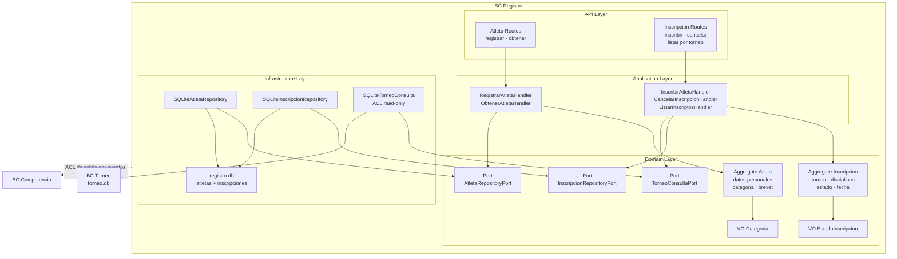

# 12 BC Registro

## Propósito

Describir la arquitectura interna del bounded context `Registro`, responsable
de administrar atletas e inscripciones a torneos.

Este documento muestra cómo se organiza el BC por capas, cuáles son sus
componentes principales, cómo persiste su estado y qué integraciones externas
atraviesan su frontera.

## Alcance

Incluye:

- responsabilidad del BC;
- estructura interna por capas;
- aggregates y value objects principales;
- puertos y adaptadores relevantes;
- persistencia CRUD en SQLite;
- integración de entrada con `Torneo`;
- integración de salida hacia `Competencia`.

No detalla todavía eventos publicados ni la evolución futura de anuncios de
participación o actualización de datos de atleta.

## Fuentes

- `docs/design/architecture.md`
- `docs/design/domain-model.md`
- `docs/design/context-map.md`
- `docs/adr/ADR-005-bounded-contexts-ddd-estrategico.md`
- `docs/adr/ADR-006-estructura-bc-first.md`
- `docs/adr/ADR-007-sqlite-persistencia-bc.md`
- `src/registro/`

## Rol del bounded context

`Registro` es un **supporting domain**. Modela la información personal del
atleta y su participación en un torneo específico.

Su responsabilidad principal incluye:

- registrar atletas;
- validar datos personales básicos;
- crear inscripciones a torneos;
- impedir inscripciones fuera de ventana o duplicadas;
- cancelar inscripciones dentro del plazo permitido;
- exponer listados de inscriptos por torneo;
- actuar como fuente upstream de datos para `Competencia`.

## Tipo de persistencia

`Registro` persiste su estado en `data/registro.db`.

La implementación actual usa persistencia CRUD con dos tablas principales:

- `atletas`
- `inscripciones`

Cada aggregate se almacena en su propia tabla y se reconstruye por lectura
directa desde SQLite. No utiliza Event Sourcing.

## Estructura interna

El BC sigue arquitectura hexagonal con organización interna por capas:

- `api`: endpoints FastAPI para atletas e inscripciones;
- `application`: handlers de comandos y queries;
- `domain`: aggregates, value objects, excepciones y puertos;
- `infrastructure`: repositorios SQLite y ACL read-only hacia `Torneo`.

## Diagrama del BC

## Componentes principales

### API Layer

Expone endpoints HTTP para alta de atletas, consulta individual, inscripción,
cancelación y listado de inscriptos.

Sus responsabilidades son:

- validar requests con Pydantic;
- delegar ejecución a la capa de aplicación;
- serializar aggregates en respuestas JSON;
- mapear errores de dominio a códigos HTTP.

### Application Layer

Orquesta los casos de uso del BC.

Sus responsabilidades son:

- verificar duplicados antes de registrar atletas;
- consultar disponibilidad del torneo antes de inscribir;
- validar disciplinas disponibles para el torneo;
- cargar y persistir inscripciones activas o canceladas;
- exponer consultas simples para lectura.

### Domain Layer

Contiene el modelo propio del BC.

Sus elementos centrales son:

- `Atleta` como aggregate root de datos personales;
- `Inscripcion` como aggregate de participación en un torneo;
- `Categoria` y `EstadoInscripcion` como value objects;
- invariantes de formato, unicidad operativa y plazo de cancelación;
- puertos para persistencia y consulta del torneo.

### Infrastructure Layer

Implementa los puertos definidos por el dominio.

Sus responsabilidades son:

- persistir `Atleta` e `Inscripcion` en tablas separadas;
- serializar disciplinas de una inscripción;
- consultar datos mínimos de `Torneo` para validar reglas de inscripción;
- encapsular el acceso SQLite de este BC y del ACL read-only.

## Aggregates y value objects principales

### Atleta

Aggregate root que modela a la persona dentro del BC `Registro`.

Responsable de:

- validar nombre y apellido no vacíos;
- validar formato de email;
- exigir fecha de nacimiento en el pasado;
- conservar categoría y brevet.

### Inscripcion

Aggregate que modela la participación de un atleta en un torneo.

Responsable de:

- asociar atleta, torneo y disciplinas;
- mantener fecha de inscripción;
- conservar el estado actual;
- aplicar la regla de cancelación antes de la fecha de inicio del torneo.

### Categoria y EstadoInscripcion

Value objects que expresan:

- la categoría deportiva del atleta;
- el estado operativo de la inscripción (`ACTIVA`, `CANCELADA`).

## Integración con Torneo

`Registro` depende de `Torneo` para validar que una inscripción sea aceptable.

Esa colaboración se encapsula en `TorneoConsultaPort`, implementado hoy por
`SQLiteTorneoConsulta`, que permite:

- verificar si el torneo está abierto para inscripción;
- obtener la fecha de inicio del torneo;
- consultar las disciplinas disponibles.

La implementación actual realiza lectura read-only directa sobre `torneo.db`.
Eso coincide con la necesidad operativa del BC, pero introduce un acoplamiento
de infraestructura que debe permanecer contenido en el ACL y no propagarse al
dominio.

## Integración hacia Competencia

En el diseño estratégico, `Registro` es upstream de `Competencia`.

La integración objetivo prevista es:

- `AtletaInscripto` como evento de salida;
- ACL en `Competencia` que traduce `Atleta` a `Participante`.

La implementación vigente no publica explícitamente `AtletaInscripto` ni
materializa una entidad `Participante` local en `Competencia`. Hoy `Competencia`
opera con referencias `participante_id` / `atleta_id` y resuelve datos
descriptivos mediante puertos/adaptadores como `AtletaNombrePort` y
`AtletaNombreAdapter`.

## Diferencias entre implementación actual y modelo de referencia

El modelo de referencia del BC incluye más capacidades que el código actual. En
particular:

- el diseño contempla eventos como `AtletaRegistrado`, `AtletaInscripto`,
  `InscripcionCancelada` y `DatosAtletaActualizados`;
- el contexto map menciona anuncios de participación como parte del BC;
- la consulta de disciplinas del torneo hoy devuelve todas las disciplinas como
  solución transitoria mientras `Torneo` no persiste esa selección.

Este documento describe la arquitectura vigente implementada, manteniendo esas
extensiones como dirección de evolución ya definida.
