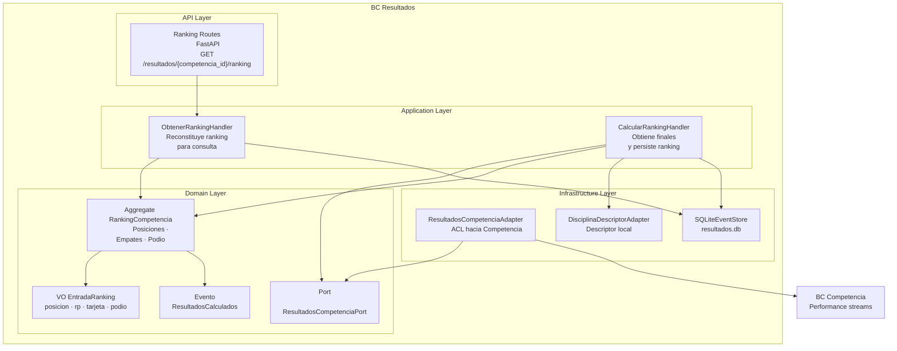

# 13 BC Resultados

## Propósito

Describir la arquitectura interna del bounded context `Resultados`, responsable
de calcular y exponer rankings derivados del cierre de una competencia.

Este documento muestra cómo se organiza el BC por capas, cuáles son sus
componentes principales, cómo persiste su estado y qué integraciones externas
atraviesan su frontera.

## Alcance

Incluye:

- responsabilidad del BC;
- estructura interna por capas;
- aggregate, evento y value object principal;
- puertos y adaptadores relevantes;
- persistencia basada en stream de ranking;
- integración de entrada desde `Competencia`.

No detalla el futuro `OverallTorneo`, la publicación incremental completa ni el
contrato externo de otros BCs consumidores.

## Fuentes

- `docs/design/architecture.md`
- `docs/design/domain-model.md`
- `docs/design/context-map.md`
- `docs/adr/ADR-005-bounded-contexts-ddd-estrategico.md`
- `docs/adr/ADR-006-estructura-bc-first.md`
- `src/resultados/`

## Rol del bounded context

`Resultados` es un **supporting domain**. Su función es transformar el cierre de
una disciplina en una vista ordenada y publicable del ranking final, sin
reimplementar la lógica deportiva de validación que pertenece a `Competencia`.

Su responsabilidad principal incluye:

- obtener resultados finales de una disciplina;
- calcular posiciones, empates y podio;
- persistir el ranking calculado;
- exponer consultas del ranking por `competenciaId` y `disciplina`;
- preparar la base para publicación y overall posteriores.

## Tipo de persistencia

`Resultados` persiste su estado en `data/resultados.db`.

En la implementación actual, el BC usa un stream propio por ranking de
disciplina:

- `ranking-{competencia_id}-{disciplina}`

El aggregate `RankingCompetencia` se reconstruye desde ese stream y considera
`ResultadosCalculados` como su evento persistido. Aunque el BC está clasificado
como CRUD a nivel de diseño general, hoy su implementación materializa el
ranking mediante un event stream propio.

## Estructura interna

El BC sigue arquitectura hexagonal con organización interna por capas:

- `api`: adaptadores de entrada HTTP para consulta;
- `application`: handlers de comandos y queries;
- `domain`: aggregate, evento, value objects, excepciones y puertos;
- `infrastructure`: adaptadores hacia `Competencia` y descriptor de disciplina.

## Diagrama del BC

## Componentes principales

### API Layer

Expone endpoints HTTP de consulta para el ranking calculado.

Sus responsabilidades son:

- resolver dependencias de infraestructura;
- recibir `competenciaId` y `disciplina`;
- delegar la consulta al handler correspondiente;
- serializar la respuesta sin lógica de ranking.

### Application Layer

Orquesta cálculo y consulta del ranking.

Sus responsabilidades son:

- `CalcularRankingHandler`: consultar resultados finales vía ACL, reconstituir
  `RankingCompetencia`, ejecutar el cálculo y persistir `ResultadosCalculados`;
- `ObtenerRankingHandler`: cargar el stream del ranking y devolver DTOs listos
  para respuesta;
- mantener el stream canónico `ranking-{competencia_id}-{disciplina}`.

### Domain Layer

Contiene la lógica propia del BC.

Sus elementos centrales son:

- `RankingCompetencia` como aggregate root del ranking por disciplina;
- `EntradaRanking` como value object de cada línea publicada;
- `ResultadosCalculados` como evento de dominio persistido;
- `ResultadosCompetenciaPort` como puerto de entrada de datos deportivos desde
  `Competencia`.

### Infrastructure Layer

Implementa los puertos definidos por el dominio y los adaptadores técnicos del
BC.

Sus responsabilidades son:

- leer el store propio de `Resultados`;
- traducir información proveniente de `Competencia`;
- resolver el descriptor de disciplina usado para ordenar o enriquecer el
  cálculo;
- aislar la dependencia técnica respecto de otros módulos.

## Aggregate, evento y value object principal

### RankingCompetencia

Aggregate root que modela el ranking final de una disciplina.

Responsable de:

- ordenar performances válidas por mejor RP;
- ubicar DNS y tarjetas rojas al final;
- asignar posiciones con manejo de empates;
- marcar podio;
- emitir `ResultadosCalculados`.

### ResultadosCalculados

Evento que representa un ranking ya calculado y disponible para consulta.

Persiste:

- competencia;
- disciplina;
- cantidad total de entradas;
- snapshot serializado de las entradas del ranking;
- timestamp de cálculo.

### EntradaRanking

Value object que representa una fila del ranking.

Incluye:

- posición;
- atleta;
- marca efectiva;
- unidad;
- tarjeta;
- indicador DNS;
- indicador de podio.

## Integración con Competencia

La entrada principal al BC proviene de `Competencia`.

En el diseño estratégico, `Resultados` consume el cierre de competencia como
relación `Customer-Supplier`. En la implementación actual, el cálculo se apoya
en un ACL encapsulado por `ResultadosCompetenciaPort` y
`ResultadosCompetenciaAdapter`, que:

- carga streams `performance-{competencia_id}-*` del BC `Competencia`;
- reconstituye cada `Performance`;
- filtra solo estados `Ejecutada` y `DNS`;
- traduce el estado final al DTO `ResultadoFinal`.

Esto preserva un modelo de ranking propio dentro de `Resultados`, aunque hoy el
adaptador presenta un acoplamiento técnico directo con clases del dominio de
`Competencia`. Arquitectónicamente, ese acoplamiento debe permanecer contenido
en infraestructura y no propagarse al dominio de `Resultados`.

## Persistencia y consulta

El cálculo del ranking produce un stream propio del BC en `resultados.db`.

La consulta HTTP no recalcula el ranking en runtime. En cambio:

- carga el stream del ranking;
- reconstituye `RankingCompetencia`;
- devuelve las entradas ya materializadas por el último
  `ResultadosCalculados`.

Esto mantiene separadas la fase de cálculo y la fase de lectura.
