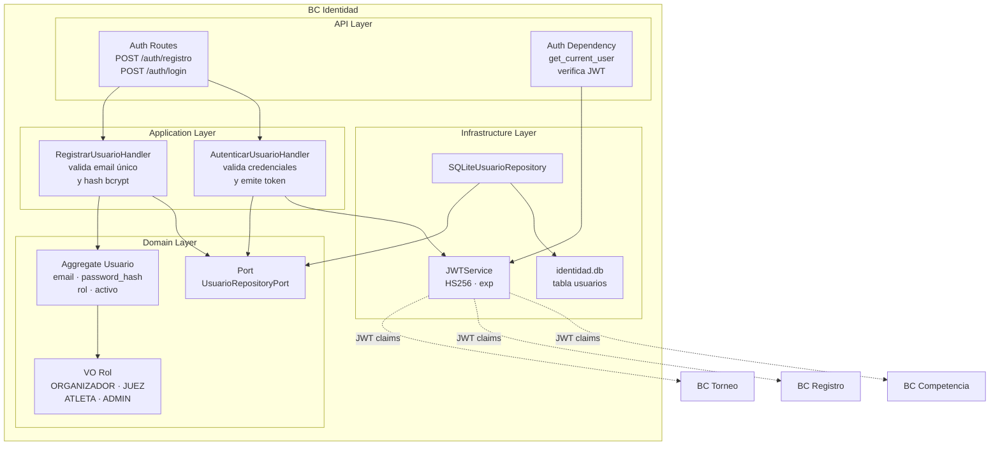

# 14 BC Identidad

## Propósito

Describir la arquitectura interna del bounded context `Identidad`,
responsable de usuarios, roles y autenticación basada en JWT.

Este documento muestra cómo se organiza el BC por capas, cuáles son sus
componentes principales, cómo persiste su estado y qué contrato expone al resto
del sistema.

## Alcance

Incluye:

- responsabilidad del BC;
- estructura interna por capas;
- aggregate y value object principal;
- puertos y adaptadores relevantes;
- persistencia CRUD en SQLite;
- generación y verificación local de JWT;
- relación upstream hacia otros bounded contexts.

No detalla federación externa de identidad ni políticas avanzadas de
autorización por recurso. La funcionalidad de cambio de contraseña está
implementada (`cambiar_password`) pero no se desarrolla aquí.

## Fuentes

- `docs/design/architecture.md`
- `docs/design/domain-model.md`
- `docs/design/context-map.md`
- `docs/adr/ADR-005-bounded-contexts-ddd-estrategico.md`
- `docs/adr/ADR-006-estructura-bc-first.md`
- `docs/adr/ADR-007-sqlite-persistencia-bc.md`
- `src/identidad/`

## Rol del bounded context

`Identidad` es un **generic domain** cross-cutting. No modela reglas deportivas
ni organizativas; provee un contrato común de autenticación y rol consumido por
los demás BCs.

Su responsabilidad principal incluye:

- registrar usuarios;
- almacenar credenciales con hash seguro;
- autenticar email y contraseña;
- emitir JWT con claims de identidad;
- validar tokens en dependencias de API;
- representar roles operativos del sistema.

## Tipo de persistencia

`Identidad` persiste su estado en `data/identidad.db`.

La implementación actual usa persistencia CRUD con una tabla principal:

- `usuarios`

Cada fila almacena:

- `usuario_id`;
- `email` único;
- `password_hash`;
- `rol`;
- bandera `activo`.

No utiliza Event Sourcing.

## Estructura interna

El BC sigue arquitectura hexagonal con organización interna por capas:

- `api`: endpoints de registro/login y dependencias de autenticación;
- `application`: handlers de registro y autenticación;
- `domain`: aggregate, value object, excepciones y puerto de repositorio;
- `infrastructure`: repositorio SQLite y servicio JWT.

## Diagrama del BC

## Componentes principales

### API Layer

Expone endpoints de autenticación y una dependencia reutilizable para validar el
token en requests autenticados.

Sus responsabilidades son:

- validar payloads de registro y login;
- delegar en handlers de aplicación;
- devolver token bearer al autenticar;
- rechazar tokens inválidos o expirados con `401`.

### Application Layer

Orquesta los casos de uso del BC.

Sus responsabilidades son:

- verificar unicidad de email antes de registrar;
- aplicar política mínima de longitud de contraseña;
- hashear contraseñas con bcrypt;
- autenticar contra credenciales persistidas;
- impedir login de usuarios inactivos;
- delegar la emisión del JWT al servicio de infraestructura.

### Domain Layer

Contiene el modelo propio del BC.

Sus elementos centrales son:

- `Usuario` como aggregate root;
- `Rol` como value object del contrato de autorización;
- excepciones de negocio para email duplicado, credenciales inválidas, usuario
  inactivo y token inválido;
- `UsuarioRepositoryPort` como abstracción de persistencia.

### Infrastructure Layer

Implementa los puertos y servicios técnicos del BC.

Sus responsabilidades son:

- persistir usuarios en SQLite;
- generar JWT firmados con `HS256`;
- verificar JWT localmente;
- obtener secreto y expiración desde variables de entorno.

## Aggregate y value object principal

### Usuario

Aggregate root que modela una identidad autenticable del sistema.

Responsable de conservar:

- identificador del usuario;
- email;
- hash de contraseña;
- rol operativo;
- estado activo/inactivo.

### Rol

Value object tipo `StrEnum` que expresa los roles vigentes:

- `ORGANIZADOR`
- `JUEZ`
- `ATLETA`
- `ADMIN`

Este valor forma parte del contrato JWT consumido por otros BCs.

## JWT como contrato de salida

El BC emite JWT con claims equivalentes a:

- `sub`: `usuario_id`;
- `email`;
- `nombre`;
- `apellido`;
- `rol`;
- `exp`.

La verificación del token se realiza localmente en cada BC consumidor. Según el
context map, `Torneo`, `Registro` y `Competencia` adoptan una relación
`Conformist`: aceptan este contrato sin negociar el modelo de identidad.

## Persistencia y seguridad básica

La implementación actual materializa dos decisiones centrales:

- nunca persistir contraseña en texto plano;
- no consultar a `Identidad` en runtime para cada operación downstream.

Las contraseñas se almacenan como `bcrypt hash` y el token firmado permite que
los demás BCs trabajen con claims locales en cada request.

## Diferencias entre implementación actual y horizonte futuro

`Identidad` está implementado con alcance básico y suficiente para el sistema
actual. Aun así, el diseño estratégico lo considera candidato a ser reemplazado
por una solución externa en horizontes posteriores.

Por eso conviene preservar estas restricciones:

- el contrato público del BC debe mantenerse pequeño y estable;
- los demás BCs solo deben depender de claims, no de tablas ni consultas hacia
  `Identidad`;
- la lógica de autenticación no debe filtrarse al dominio de otros contextos.
