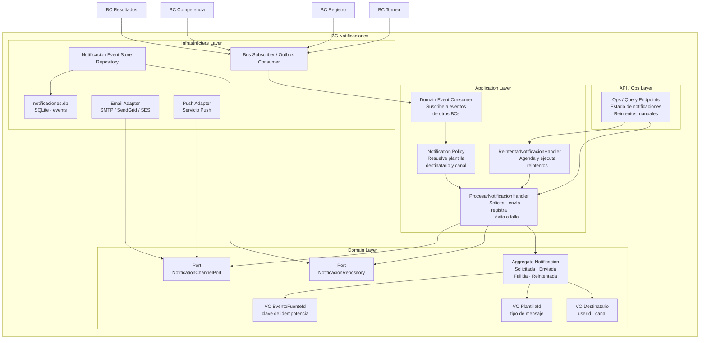

# 15 BC Notificaciones

## Propósito

Describir la arquitectura interna objetivo del bounded context
`Notificaciones`, responsable de gestionar el ciclo de vida de cada
notificación emitida por el sistema y de garantizar idempotencia de envío.

Este documento muestra cómo se organiza el BC por capas, cuáles son sus
componentes principales, cómo persiste su estado y qué integraciones externas
atraviesan su frontera.

## Alcance

Incluye:

- responsabilidad del BC;
- estructura interna por capas;
- aggregate, eventos y value objects principales;
- puertos y adaptadores relevantes;
- uso de Event Sourcing para idempotencia;
- integración de entrada desde otros bounded contexts;
- integración de salida hacia canales externos.

No detalla la implementación concreta de proveedores como SendGrid, SES o FCM,
ni una matriz exhaustiva de plantillas por evento.

## Fuentes

- `docs/design/context-map.md`
- `docs/design/domain-model.md`
- `docs/design/architecture.md`
- `docs/adr/ADR-005-bounded-contexts-ddd-estrategico.md`
- `docs/adr/ADR-007-sqlite-persistencia-bc.md`
- `docs/adr/ADR-008-event-store-sqlite.md`
- `docs/dominio/05-requerimientos_funcionales.md`
- `src/notificaciones/`

## Estado actual

La carpeta `src/notificaciones/` ya existe con estructura BC-first, pero al
momento de este documento no contiene todavía la implementación funcional del
aggregate, sus handlers ni los adaptadores de entrega.

Por lo tanto, esta especificación describe la **arquitectura objetivo vigente**
del BC, consistente con los ADRs y el diseño estratégico ya definidos.

## Rol del bounded context

`Notificaciones` es un **generic domain** downstream de los bounded contexts
funcionales. Su responsabilidad no es decidir el negocio que originó el evento,
sino administrar de manera confiable la comunicación resultante.

Su responsabilidad principal incluye:

- suscribirse a eventos de dominio publicados por otros BCs;
- decidir la plantilla y el canal a utilizar;
- registrar cada intento de envío;
- evitar envíos duplicados para un mismo `eventoFuenteId`;
- registrar éxito, falla y reintentos;
- delegar la entrega a servicios externos de email y push.

## Tipo de persistencia

`Notificaciones` utiliza **Event Sourcing** sobre `data/notificaciones.db`.

La razón principal no es auditoría regulatoria sino **idempotencia operativa**:
antes de ordenar un envío, el BC puede verificar si ya existe una
`NotificacionEnviada` para el mismo `eventoFuenteId`.

La convención de stream es:

- `notificacion-{notificacion_id}`

Cada stream representa el ciclo de vida completo de una comunicación:

- `NotificacionSolicitada`
- `NotificacionEnviada`
- `NotificacionFallida`
- `NotificacionReintentada`

## Estructura interna

El BC sigue arquitectura hexagonal con organización interna por capas:

- `api`: puntos de entrada administrativos o de observabilidad, si se exponen;
- `application`: consumidores de eventos, handlers y políticas de reintento;
- `domain`: aggregate, eventos, value objects y puertos;
- `infrastructure`: event store, suscripción al bus y adaptadores externos.

## Diagrama del BC

## Componentes principales

### Application Layer

Orquesta la recepción de eventos y la ejecución del ciclo de vida de cada
notificación.

Sus responsabilidades son:

- consumir eventos de otros BCs sin acoplar su dominio al de origen;
- resolver destinatario, plantilla y canal según el evento recibido;
- consultar o reconstruir el aggregate `Notificacion`;
- registrar `NotificacionSolicitada`, `NotificacionEnviada` o
  `NotificacionFallida`;
- coordinar políticas de reintento cuando corresponda.

### Domain Layer

Contiene el modelo propio del BC.

Sus elementos centrales son:

- `Notificacion` como aggregate root;
- `Destinatario`, `PlantillaId` y `EventoFuenteId` como value objects
  relevantes;
- eventos de dominio que representan el ciclo de vida del envío;
- puertos para persistencia y entrega por canal.

### Infrastructure Layer

Implementa los puertos definidos por el dominio.

Sus responsabilidades son:

- persistir streams en `notificaciones.db`;
- suscribirse al mecanismo de publicación de eventos del sistema;
- delegar envío a proveedores de email y push;
- encapsular detalles de transporte, timeouts y errores técnicos.

## Aggregate, eventos y value objects principales

### Notificacion

Aggregate root que modela una comunicación originada por un evento de dominio.

Responsable de:

- preservar unicidad lógica por `eventoFuenteId`;
- registrar solicitud, envío, falla y reintento;
- mantener el estado actual del intento;
- impedir duplicados observables para el mismo evento fuente.

### Eventos del BC

Los eventos principales del aggregate son:

- `NotificacionSolicitada`;
- `NotificacionEnviada`;
- `NotificacionFallida`;
- `NotificacionReintentada`;
- `PreferenciasActualizadas` cuando el cambio de canal preferido forme parte del
  BC.

### Value Objects

Los value objects centrales son:

- `Destinatario`: identidad del receptor y canal preferido;
- `PlantillaId`: referencia a la plantilla del mensaje;
- `EventoFuenteId`: identificador del evento que origina la notificación.

## Integraciones de entrada

`Notificaciones` es downstream de `Torneo`, `Registro`, `Competencia` y
`Resultados`.

La colaboración sigue estas reglas:

- ningún BC funcional espera una respuesta síncrona de `Notificaciones`;
- el BC consume eventos de dominio de manera asíncrona;
- la semántica del evento recibido se traduce al lenguaje ubicuo propio del BC;
- el evento fuente se conserva como clave de idempotencia.

Entre los disparadores ya definidos aparecen, por ejemplo:

- confirmaciones o cambios relevantes de inscripción;
- recordatorios vinculados a anuncios;
- `ResultadosPublicados`;
- `TorneoCerrado`.

## Integraciones de salida

`Notificaciones` no produce comandos de negocio hacia otros bounded contexts.

Sus salidas son exclusivamente técnicas hacia canales externos:

- email;
- push.

`Servicio Push` se mantiene como abstracción genérica; el proveedor concreto no
queda fijado en esta documentación.

## Idempotencia y reintentos

La garantía central del BC es evitar duplicados por evento fuente.

La política base es:

1. recibir un evento de dominio;
2. verificar si ya existe una `NotificacionEnviada` para ese `eventoFuenteId`;
3. si existe, no volver a enviar;
4. si no existe, registrar `NotificacionSolicitada`;
5. intentar entrega por el canal configurado;
6. registrar `NotificacionEnviada` o `NotificacionFallida`;
7. si aplica, programar `NotificacionReintentada`.

Esta secuencia justifica el uso de Event Sourcing en este BC.
