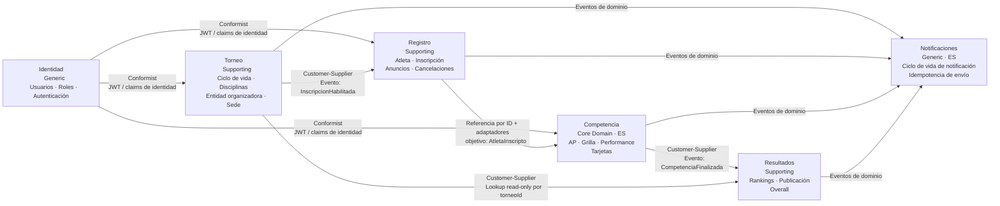

# 20 Context Map Integrations

## Propósito

Describir cómo se relacionan los bounded contexts de AtaraxiaDive entre sí,
poniendo foco en las integraciones, la dirección de dependencia y los mecanismos
permitidos de colaboración entre contextos.

Esta vista no describe la estructura interna de cada BC, sino las fronteras entre
ellos y los contratos que las atraviesan.

## Alcance

Incluye:

- bounded contexts del sistema;
- tipo de relación entre contextos;
- dirección upstream/downstream;
- mecanismos de integración;
- ACLs, eventos y consultas permitidas entre BCs.

No incluye componentes internos de cada BC ni el detalle técnico de cada
adaptador.

## Fuentes

- `docs/design/context-map.md`
- `docs/design/domain-model.md`
- `docs/design/architecture.md`
- `docs/adr/ADR-005-bounded-contexts-ddd-estrategico.md`
- `docs/adr/ADR-006-estructura-bc-first.md`

## Bounded Contexts

AtaraxiaDive se compone de seis bounded contexts:

| BC | Tipo DDD | Persistencia | Responsabilidad principal |
|----|----------|--------------|---------------------------|
| `Competencia` | Core Domain | Event Sourcing | Ejecución de la competencia, grilla, performances y tarjetas. |
| `Torneo` | Supporting | CRUD | Ciclo de vida del torneo, disciplinas y catálogos organizativos. |
| `Registro` | Supporting | CRUD | Atletas, inscripciones y anuncios vinculados al torneo. |
| `Resultados` | Supporting | CRUD + proyecciones | Rankings, publicaciones y resultados derivados de competencias. |
| `Identidad` | Generic | CRUD | Usuarios, roles y autenticación/autorización. |
| `Notificaciones` | Generic | Event Sourcing | Gestión del ciclo de vida de las notificaciones e idempotencia de envío. |

## Principios de integración entre BCs

Las integraciones entre bounded contexts deben respetar estas reglas:

- un BC no accede directamente a la base de datos de otro BC;
- no se permiten joins ni lecturas cruzadas sobre archivos SQLite de otros BCs;
- la colaboración entre BCs se da por eventos, ACLs, puertos o consultas
  explícitas permitidas;
- los imports directos entre BCs no forman parte del modelo de dominio y, si
  existen, deben quedar contenidos en composición o adaptadores de
  infraestructura;
- cada BC conserva su propio lenguaje ubicuo y protege su modelo interno.

## Diagrama de mapa de contexto

## Relaciones entre bounded contexts

### Identidad -> Torneo, Registro y Competencia

**Patrón:** upstream/downstream con conformidad del downstream.

`Identidad` provee autenticación y autorización mediante token con claims. Los
BCs consumidores no modelan autenticación por cuenta propia: aceptan el contrato
definido por `Identidad`.

**Mecanismo principal:**

- validación síncrona de token en cada request;
- contrato basado en `userId` y `role`.

**Restricción:**

- los BCs downstream no consultan a `Identidad` en runtime para cada operación;
- el contrato de identidad se consume localmente a partir del token.

### Torneo -> Registro

**Patrón:** Customer-Supplier.

`Torneo` habilita la existencia operativa de la inscripción. `Registro` depende
de que exista un torneo habilitado para aceptar inscripciones.

**Mecanismo principal:**

- evento de dominio `InscripcionHabilitada`.

**Datos que cruzan la frontera:**

- `torneoId`;
- `fechaFinInscripcion`;
- `disciplinasDisponibles`.

### Registro -> Competencia

**Patrón:** referencia por ID + adaptadores de infraestructura; ACL de dominio
como evolución objetivo.

`Competencia` no reutiliza el modelo de `Registro` de forma directa. La
implementación actual conserva IDs estables (`participante_id` / `atleta_id`) y
resuelve datos descriptivos mediante puertos/adaptadores.

**Mecanismo actual:**

- referencias `participante_id` / `atleta_id` en streams y eventos;
- `AtletaNombrePort` como puerto de dominio;
- `AtletaNombreAdapter` consultando `registro.db`.

**Evolución objetivo:**

- evento `AtletaInscripto`;
- traducción a un modelo local si el BC necesita más datos que una referencia por
  ID.

**Objetivo de la frontera:**

- desacoplar `Competencia` de cambios en el modelo de `Registro`;
- copiar o resolver solo los datos relevantes para la competencia;
- evitar dependencia semántica directa entre los dos modelos.

### Competencia -> Resultados

**Patrón:** Customer-Supplier.

`Resultados` depende de `Competencia` como fuente de verdad para calcular y
publicar rankings. No revalida la lógica deportiva; consume el cierre de la
competencia como dato confiable.

**Mecanismo principal:**

- evento `CompetenciaFinalizada`.

**Datos que cruzan la frontera:**

- disciplina;
- lista de participantes con resultado y tarjeta;
- contexto necesario para cálculo de ranking.

### Torneo -> Resultados

**Patrón:** Customer-Supplier.

`Resultados` necesita datos contextuales del torneo para enriquecer la
publicación, pero no depende de `Torneo` para validar la lógica del ranking.

**Mecanismo principal:**

- consulta síncrona read-only por `torneoId`.

**Restricción:**

- esta integración debe permanecer de solo lectura y no debe transformar a
  `Resultados` en un coordinador del ciclo de vida del torneo.

### Todos los BCs -> Notificaciones

**Patrón:** Customer-Supplier.

`Notificaciones` es downstream de todos los bounded contexts funcionales. Consume
eventos de dominio y decide si debe solicitar, enviar o reintentar una
notificación.

**Mecanismo principal:**

- consumo asíncrono de eventos de dominio.

**Restricción:**

- ningún BC funcional depende de `Notificaciones` para completar su caso de uso;
- el envío de notificaciones no debe introducir acoplamiento de runtime hacia
  los BCs productores.

## Tabla resumen de integraciones

| Upstream | Downstream | Patrón | Mecanismo |
|----------|------------|--------|-----------|
| `Identidad` | `Torneo` | Conformist | JWT / claims |
| `Identidad` | `Registro` | Conformist | JWT / claims |
| `Identidad` | `Competencia` | Conformist | JWT / claims |
| `Torneo` | `Registro` | Customer-Supplier | Evento `InscripcionHabilitada` |
| `Registro` | `Competencia` | Referencia por ID + adaptadores | `participante_id` / `atleta_id`; objetivo futuro: `AtletaInscripto` |
| `Competencia` | `Resultados` | Customer-Supplier | Evento `CompetenciaFinalizada` |
| `Torneo` | `Resultados` | Customer-Supplier | Consulta read-only por `torneoId` |
| `Torneo` | `Notificaciones` | Customer-Supplier | Eventos de dominio |
| `Registro` | `Notificaciones` | Customer-Supplier | Eventos de dominio |
| `Competencia` | `Notificaciones` | Customer-Supplier | Eventos de dominio |
| `Resultados` | `Notificaciones` | Customer-Supplier | Eventos de dominio |

## Decisiones y restricciones relevantes

- `Competencia` protege su modelo mediante ACL y no debe depender
  conceptualmente de `Registro`.
- `Resultados` depende de `Competencia` para datos deportivos y de `Torneo`
  solo para enriquecimiento contextual.
- `Notificaciones` es un BC independiente, no un detalle de infraestructura
  embebido en otros contextos.
- `Identidad` es un contexto genérico y reusable; los demás contextos consumen
  su contrato sin negociar el modelo.

## Implicancias para los diagramas por BC

Este mapa fija qué debe aparecer después en los documentos por bounded context:

- en `Competencia`, el ACL de entrada desde `Registro`;
- en `Resultados`, la dependencia hacia `Competencia` y el lookup read-only a
  `Torneo`;
- en `Notificaciones`, el rol downstream consumidor de eventos;
- en `Identidad`, el contrato de claims consumido por otros BCs.

## Siguiente paso

El siguiente grupo de documentos puede describir cada bounded context por
separado, comenzando por `Competencia`, por ser el core domain y el BC con mayor
densidad arquitectónica.
