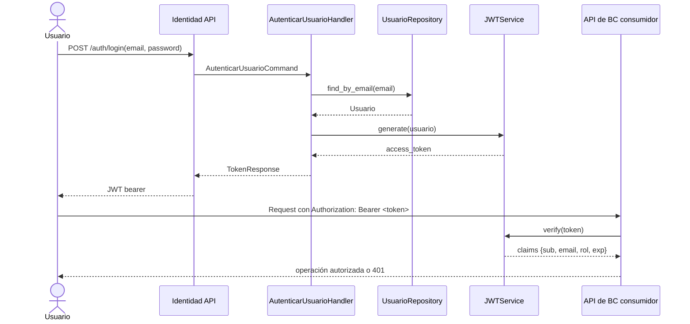
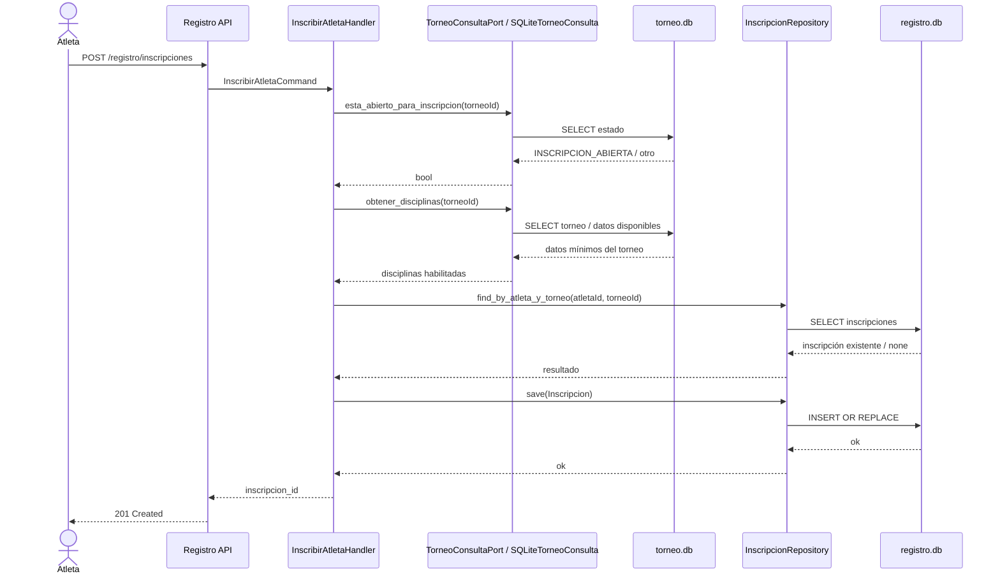
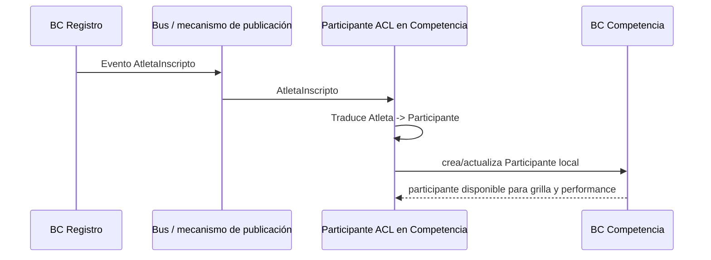
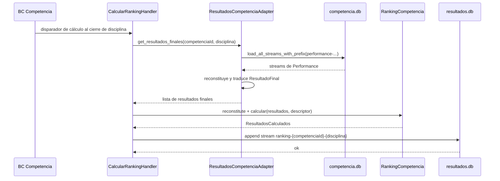
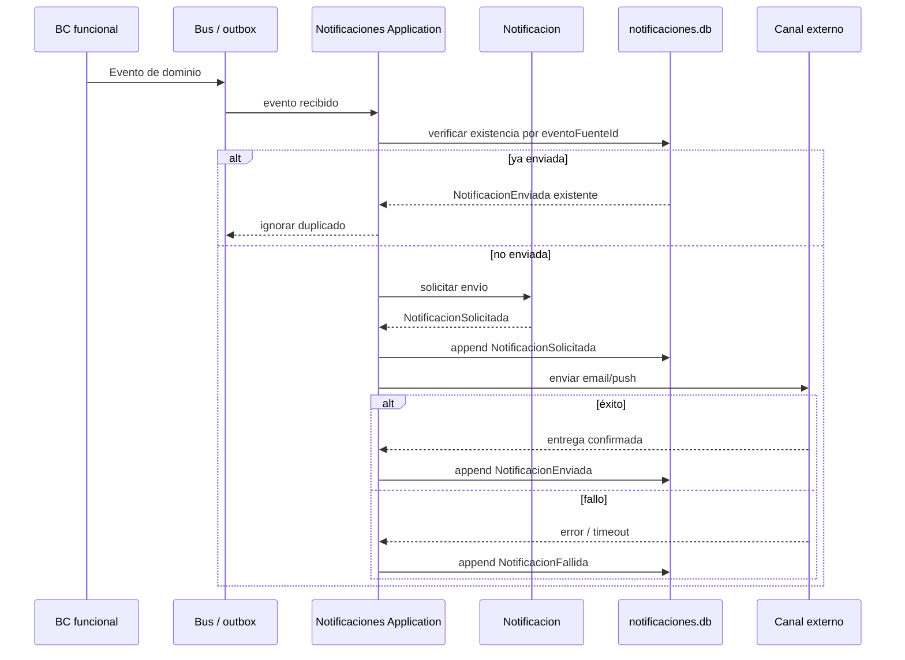

# 30 Runtime Interactions

## Propósito

Describir las interacciones dinámicas más relevantes entre bounded contexts y
componentes principales de AtaraxiaDive.

Esta vista complementa los documentos estructurales mostrando cómo fluye la
información en runtime, qué dependencias síncronas existen y dónde aparecen
integraciones asíncronas entre contextos.

## Alcance

Incluye:

- flujos síncronos dentro de un BC;
- interacciones entre BCs por ACL, lookup o claims;
- flujos asíncronos previstos por eventos de dominio;
- diferencias entre interacciones implementadas y objetivo arquitectónico.

No cubre el detalle offline-first del juez, que se documenta por separado en
`50-offline-sync.md`.

## Fuentes

- `docs/architecture/20-context-map-integrations.md`
- `docs/architecture/10-bc-competencia.md`
- `docs/architecture/11-bc-torneo.md`
- `docs/architecture/12-bc-registro.md`
- `docs/architecture/13-bc-resultados.md`
- `docs/architecture/14-bc-identidad.md`
- `docs/architecture/15-bc-notificaciones.md`
- `docs/design/context-map.md`
- `docs/adr/ADR-003-offline-first-pwa.md`
- `src/`

## Principios de interacción

Las interacciones de runtime deben respetar estas reglas:

- cada BC persiste únicamente en su propia base;
- la autenticación se resuelve por verificación local de JWT;
- los BCs funcionales no dependen de `Notificaciones` para completar su caso de
  uso;
- las dependencias cross-BC deben quedar contenidas en ACLs, lookups read-only o
  consumo de eventos;
- cuando exista una brecha entre diseño e implementación, esa brecha debe ser
  explícita.

## Escenario 1: autenticación y uso de claims

Este flujo muestra cómo `Identidad` autentica y cómo los demás BCs consumen el
token sin consultar de nuevo al BC emisor.

### Observaciones

- `Identidad` es upstream y el BC consumidor adopta una relación `Conformist`.
- La verificación del token es local; no hay llamada síncrona a `Identidad` en
  cada request.
- Este flujo está implementado en `src/identidad/`.

## Escenario 2: inscripción de atleta a torneo

Este flujo muestra el caso de uso principal de `Registro`, incluyendo el ACL
read-only hacia `Torneo`.

### Observaciones

- La regla de negocio depende del estado del torneo y de la fecha de inicio.
- Hoy la integración `Registro -> Torneo` está implementada como lectura
  read-only directa sobre `torneo.db` contenida en infraestructura.
- Arquitectónicamente, el diseño de referencia preferiría eventos o contratos
  más explícitos; la implementación actual resuelve la validación con un ACL
  técnico.

## Escenario 3: atleta inscripto propagado hacia Competencia

Este flujo refleja la colaboración estratégica `Registro -> Competencia`.

### Observaciones

- Este flujo está definido arquitectónicamente y ya aparece en el context map.
- La implementación del ACL está documentada del lado de `Competencia`.
- La publicación explícita del evento todavía no está materializada en
  `Registro`.

## Escenario 4: cierre de competencia y cálculo de ranking

Este flujo muestra cómo `Resultados` obtiene el estado final deportivo desde
`Competencia` y persiste el ranking calculado.

### Observaciones

- El diseño estratégico define `CompetenciaFinalizada` como evento upstream de
  `Resultados`.
- La implementación actual encapsula la integración en un ACL que lee streams de
  `Competencia` y reconstruye `Performance`.
- La consulta posterior del ranking es local al BC `Resultados` y no vuelve a
  consultar `Competencia`.

## Escenario 5: publicación de eventos hacia Notificaciones

Este flujo representa la arquitectura objetivo de notificaciones, donde los BCs
funcionales producen eventos pero no esperan respuesta.

### Observaciones

- Este flujo es objetivo arquitectónico vigente, no implementación ya completa.
- La propiedad importante es que el productor del evento no depende del resultado
  de la notificación para completar su caso de uso.
- La idempotencia se resuelve dentro del BC `Notificaciones`.

## Dependencias síncronas y asíncronas

Resumen de la naturaleza de las principales colaboraciones de runtime:

| Origen | Destino | Tipo | Estado |
|--------|---------|------|--------|
| Usuario autenticado | `Identidad` | Síncrona HTTP | Implementado |
| BC consumidor | `Identidad` claims | Verificación local JWT | Implementado |
| `Registro` | `Torneo` | Lookup read-only vía ACL | Implementado |
| `Registro` | `Competencia` | Evento + ACL | Parcial / objetivo |
| `Competencia` | `Resultados` | Evento / ACL de cierre | Parcialmente implementado |
| BCs funcionales | `Notificaciones` | Evento asíncrono | Objetivo |

## Restricciones de runtime relevantes

- `Competencia` no debe consultar `Registro` en runtime para operar una
  performance; debe trabajar sobre `Participante` local.
- `Resultados` no debe recalcular ranking en cada lectura si ya existe el stream
  local calculado.
- `Notificaciones` no debe introducir dependencia síncrona en los casos de uso
  funcionales.
- La validación de identidad downstream debe resolverse a partir del token, no
  con round-trips al BC `Identidad`.
