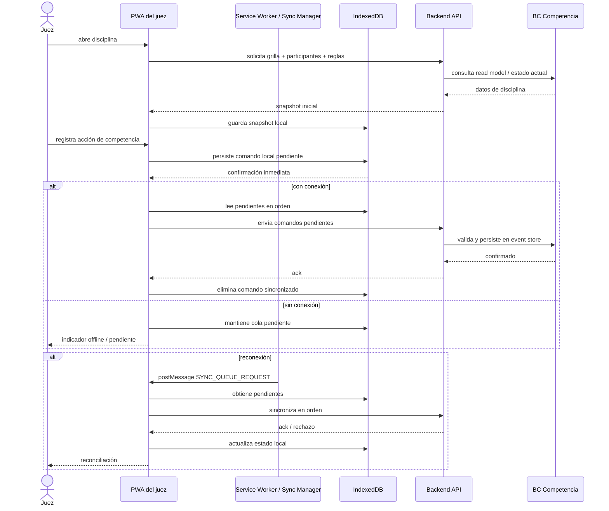

# 50 Offline Sync

## Propósito

Describir la arquitectura implementada para operación offline-first de la
interfaz del juez y la sincronización posterior con el backend.

Esta vista se enfoca en cómo el sistema debe seguir operando cuando la
conectividad falla durante la competencia, preservando confirmación inmediata,
durabilidad local y sincronización ordenada al reconectar.

## Alcance

Incluye:

- estrategia offline-first de la PWA del juez;
- responsabilidades de cliente, almacenamiento local y backend;
- flujo de pre-carga, operación local, sync y reconciliación;
- relación entre offline y Event Sourcing de `Competencia`;
- riesgos y restricciones arquitectónicas.

No describe la UI completa del juez ni el detalle de componentes frontend.

## Fuentes

- `docs/adr/ADR-003-offline-first-pwa.md`
- `docs/dominio/02-arquitectura_referencia.md`
- `docs/dominio/04-estrategia_desarrollo.md`
- `docs/architecture/02-container-view.md`
- `docs/architecture/10-bc-competencia.md`
- `docs/architecture/30-runtime-interactions.md`

## Estado actual

El modo offline-first fue materializado en SP4 para la interfaz del juez.

Implementación observable:

- Service Worker con Workbox y Background Sync:
  `frontend/src/sw.ts`;
- almacenamiento local durable en IndexedDB vía Dexie:
  `frontend/src/db/index.ts`, `frontend/src/db/schema.ts`;
- cache de grilla/estado y cola local de comandos:
  `frontend/src/db/queries.ts`;
- precarga y fallback de lectura desde cache:
  `frontend/src/hooks/usePrecarga.ts`;
- encolado optimista de comandos de juez:
  `frontend/src/hooks/useComandoQueue.ts`;
- proyección visual de comandos pendientes sobre la grilla:
  `frontend/src/hooks/useGrillaQueue.ts`;
- sincronización ordenada, reintentos y reconciliación básica:
  `frontend/src/hooks/useSyncQueue.ts`.

Este documento describe la arquitectura vigente implementada y los límites que
quedan como evolución futura.

## Objetivo operativo

Durante la ejecución de una disciplina, el juez debe poder:

- abrir la grilla desde el celular;
- seguir operando sin conexión;
- recibir confirmación inmediata de cada acción;
- no perder datos si la red cae;
- sincronizar las acciones cuando la conectividad vuelva.

## Principio arquitectónico

La fuente de verdad del sistema sigue estando en el backend, pero la interfaz
del juez debe comportarse como **offline-first**.

Eso implica una separación clara:

- el backend conserva el estado canónico y la auditoría oficial;
- el dispositivo del juez mantiene una cola local durable de comandos
  pendientes;
- el usuario no depende de un round-trip al servidor para seguir operando.

## Modelo de operación

El flujo operativo implementado es:

1. pre-cargar la disciplina en el dispositivo;
2. operar localmente sobre datos ya descargados;
3. persistir cada acción como comando local pendiente;
4. sincronizar en orden al recuperar conexión;
5. reconciliar respuesta del servidor y estado local.

## Diagrama de sincronización

## Datos pre-cargados en el dispositivo

Antes de operar offline, el cliente necesita un snapshot mínimo de trabajo:

- grilla de salida;
- participantes;
- disciplina y unidad;
- reglas operativas aplicables;
- estado actual de la competencia relevante para ese juez.

La pre-carga evita dependencias de lectura remota durante la operación local.

## Cola local de comandos

La implementación usa `IndexedDB` como almacenamiento local durable mediante
`Dexie.js`.

Cada acción del juez puede registrarse localmente como comando pendiente, por
ejemplo:

- llamar atleta;
- registrar resultado;
- registrar DNS;
- asignar tarjeta;
- corregir resultado, si la política lo permite.

La cola se persiste en `comando_queue` con estado `pendiente`, `enviando` o
`error`. La sincronización lee los comandos por `id`, preservando el orden de
creación local.

## Relación con Event Sourcing

El modo offline encaja naturalmente con el modelo de `Competencia` porque el BC
ya persiste una secuencia de eventos inmutables.

La estrategia implementada es:

- generar comandos primero en local cuando no hay conectividad o existen
  pendientes previos;
- proyectar cambios optimistas sobre la grilla cacheada;
- sincronizar esos comandos al backend en el mismo orden lógico;
- dejar que el BC `Competencia` valide invariantes y persista los eventos
  canónicos derivados;
- refrescar grilla/estado desde el servidor cuando la cola queda vacía.

Esto reduce la fricción conceptual entre cliente offline y backend auditor.

## Reconciliación y conflictos

La reconciliación ocurre cuando el backend responde a cada comando sincronizado.

Reglas arquitectónicas vigentes:

- el servidor sigue validando invariantes de dominio;
- el cliente no asume aceptación automática de todo evento local;
- si un comando es rechazado, queda en estado `error` con mensaje visible para
  la UI;
- la resolución de conflicto se simplifica por la partición operativa por
  andarivel o disciplina.

La documentación de referencia menciona `last-write-wins por andarivel` como una
estrategia posible. La implementación actual evita asumir aceptación automática:
un rechazo HTTP 4xx detiene la cola y conserva el comando con error para
intervención visible.

## Responsabilidades por componente

### PWA del juez

- renderizar estado local;
- confirmar visualmente cada acción;
- trabajar aunque la red no esté disponible.

### Service Worker / Sync Manager

- detectar conectividad;
- precachear assets de la PWA;
- cachear lecturas API relevantes con estrategia Network First;
- registrar Background Sync con tag `ataraxia-sync-queue`;
- enviar `SYNC_QUEUE_REQUEST` a las ventanas abiertas para que la aplicación
  sincronice la cola.

### IndexedDB

- persistir snapshot local;
- persistir comandos pendientes;
- conservar estado de sincronización.

### Backend API y BC Competencia

- recibir comandos sincronizados;
- validar invariantes;
- persistir en el event store oficial;
- devolver acks o rechazos utilizables para reconciliación.

## Límites conocidos

- La sincronización efectiva de comandos vive en la aplicación React
  (`useSyncQueue`); el Service Worker dispara la solicitud por `postMessage`.
- La cola sincroniza comandos individuales contra endpoints existentes; no hay
  endpoint batch específico para offline sync.
- El fallback principal ante navegadores sin Background Sync es el evento de
  reconexión observado por la aplicación.
- La resolución de conflictos complejos queda delegada al rechazo del backend y
  a la intervención operativa; no existe todavía una UI especializada de merge.

## Restricciones a preservar

- la operación local debe confirmar la acción sin esperar respuesta del
  servidor;
- el backend sigue siendo la fuente de verdad oficial;
- la cola local debe ser durable ante recarga o cierre del navegador;
- la sincronización debe respetar orden lógico de eventos;
- el modo offline no debe romper la auditabilidad del BC `Competencia`.

## Riesgos y trade-offs

- Service Workers y sincronización offline agregan complejidad de debugging.
- IndexedDB introduce una capa de persistencia adicional fuera del backend.
- Los conflictos simultáneos no desaparecen; solo se vuelven poco probables y
  deben resolverse explícitamente.
- La arquitectura es más robusta operativamente, pero exige una disciplina clara
  de eventos y reconciliación.
