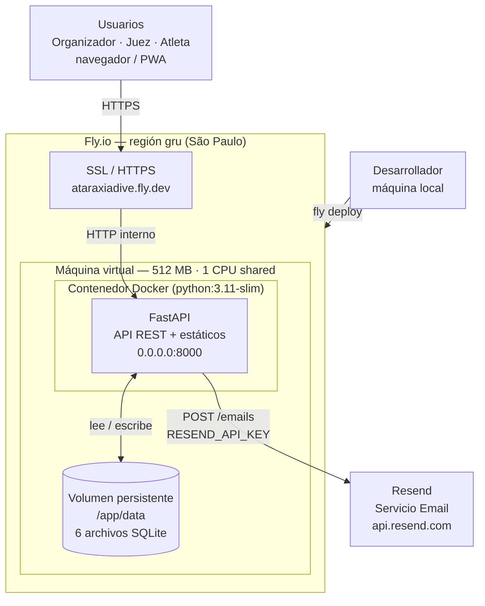
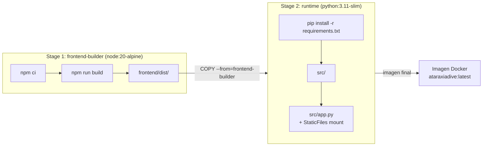

# 60 Deployment View

## Propósito

Describir la arquitectura de despliegue de AtaraxiaDive en producción:
dónde corre cada componente, cómo se relacionan en infraestructura y qué
decisiones operativas los sostienen.

## Alcance

Incluye:

- plataforma de hosting elegida y motivación;
- componentes del contenedor de producción;
- persistencia y estrategia de volúmenes;
- integración con servicios externos;
- variables de entorno relevantes.

No incluye configuración de CI/CD ni pipelines automatizados (fuera de
scope SP7).

## Fuentes

- `docs/adr/ADR-010-docker-produccion-cloud-run.md` (supersedida)
- `docs/adr/ADR-021-fly-io.md`
- `docs/adr/ADR-007-sqlite-persistencia-bc.md`
- `Dockerfile`
- `fly.toml`

## Decisión de plataforma

AtaraxiaDive se despliega en **Fly.io** (ADR-021), que reemplaza la
decisión original de Cloud Run (ADR-010). La motivación principal es la
simplificación operativa para el contexto de demo del experimento IEDD:

- **Volúmenes persistentes nativos** — los 6 archivos SQLite sobreviven
  entre deploys sin necesidad de Litestream ni bucket externo.
- **SSL y dominio automáticos** — `ataraxiadive.fly.dev` sin configuración
  de DNS ni certificados.
- **Scale-to-zero** — sin costo cuando no hay tráfico.
- **Un solo comando de deploy** — `fly deploy` desde el repositorio local.

## Arquitectura de despliegue

### Contenedor único

Backend (FastAPI) y frontend compilado corren en el mismo contenedor Docker.
FastAPI sirve la API REST en sus rutas registradas (`/auth/*`, `/torneos/*`,
`/registro/*`, `/competencia/*`, `/resultados/*`) y monta el build estático
de React (`frontend/dist/`) en la raíz `/`.

La construcción es multi-stage:

1. **Stage `frontend-builder`** (Node 20 Alpine): `npm ci` + `npm run build` → `frontend/dist/`
2. **Stage `runtime`** (Python 3.11 Slim): instala deps Python, copia `src/` y el `dist/` del stage anterior.

### Persistencia

Los 6 archivos SQLite (uno por BC) viven en un **volumen persistente** de
Fly.io montado en `/app/data`. El volumen sobrevive al ciclo de vida del
contenedor y a los deploys sucesivos.

### Servicios externos

- **Resend** — envío de emails transaccionales. Opcional: si `RESEND_API_KEY`
  no está configurada, el sistema usa `LoggingEmailAdapter` (emails en log).
- **Servicio Push** — no configurado en esta versión.

## Diagrama de despliegue

## Diagrama de construcción de imagen (multi-stage)

## Variables de entorno

| Variable | Obligatoria | Descripción |
|----------|:-----------:|-------------|
| `IDENTIDAD_JWT_SECRET` | ✅ | Clave de firma JWT. Generar con `secrets.token_hex(32)`. |
| `IDENTIDAD_JWT_EXPIRY_HOURS` | ❌ | Expiración del token. Default: 24h. |
| `RESEND_API_KEY` | ❌ | API key de Resend. Sin ella, emails van al log. |
| `NOTIFICACIONES_EMAIL_FROM` | ❌ | Dirección remitente. Solo si se usa Resend. |
| `FRONTEND_DIST_PATH` | ❌ | Path al build del frontend. Default: `frontend/dist`. |
| `*_DB_PATH` | ❌ | Paths a los SQLite por BC. Default: `data/xxx.db`. |

## Restricciones relevantes

- El frontend no puede tener rutas que colisionen con rutas de la API
  (`/auth`, `/torneos`, `/registro`, `/competencia`, `/resultados`, `/health`).
  El mount de `StaticFiles` se registra al final, después de todos los routers,
  por lo que las rutas API siempre tienen precedencia.
- `StaticFiles` con `html=True` sirve `index.html` para cualquier path no
  encontrado en `frontend/dist/`, lo que habilita el routing de React Router.
- Los archivos SQLite de desarrollo en `data/` no se incluyen en la imagen
  Docker (`.dockerignore`). En producción, el volumen de Fly.io empieza vacío
  y los esquemas se crean automáticamente al primer request (`_ensure_table`).

## Implicancias para otras vistas

- La vista de contenedores (`02-container-view.md`) describe la separación
  lógica frontend/backend. En producción, ambos corren en el mismo proceso
  Docker; la separación lógica se preserva, pero el transporte es en-proceso
  para los estáticos.
- El context map (`20-context-map-integrations.md`) permanece sin cambios:
  la integración con Resend sigue siendo la misma abstracción.

## Siguiente paso

`US-7.1.2`: ejecutar `fly deploy`, verificar flujos críticos y taggear `v1.0.1`.
