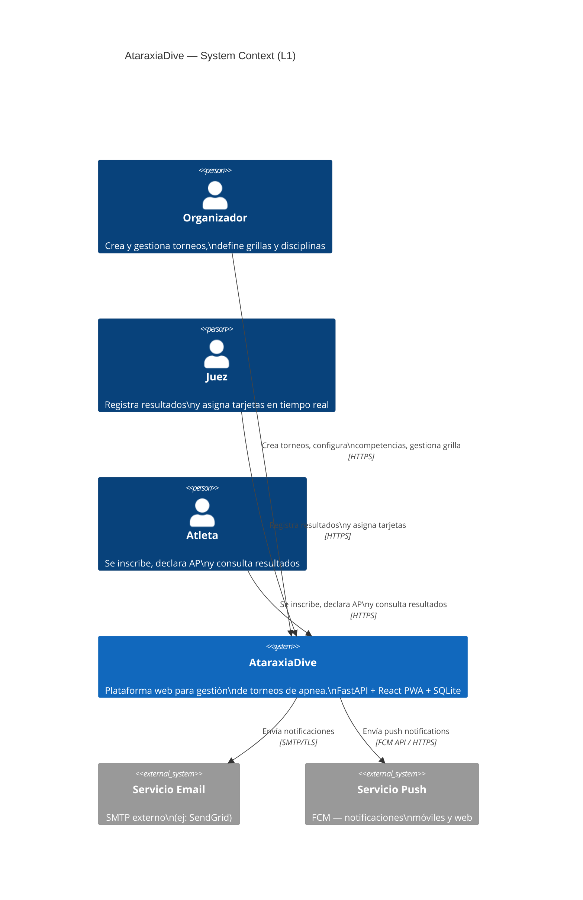
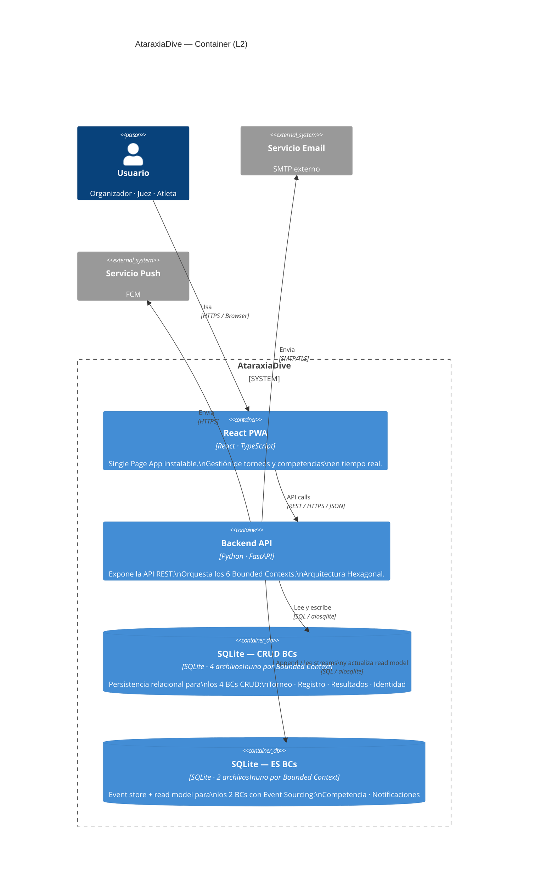
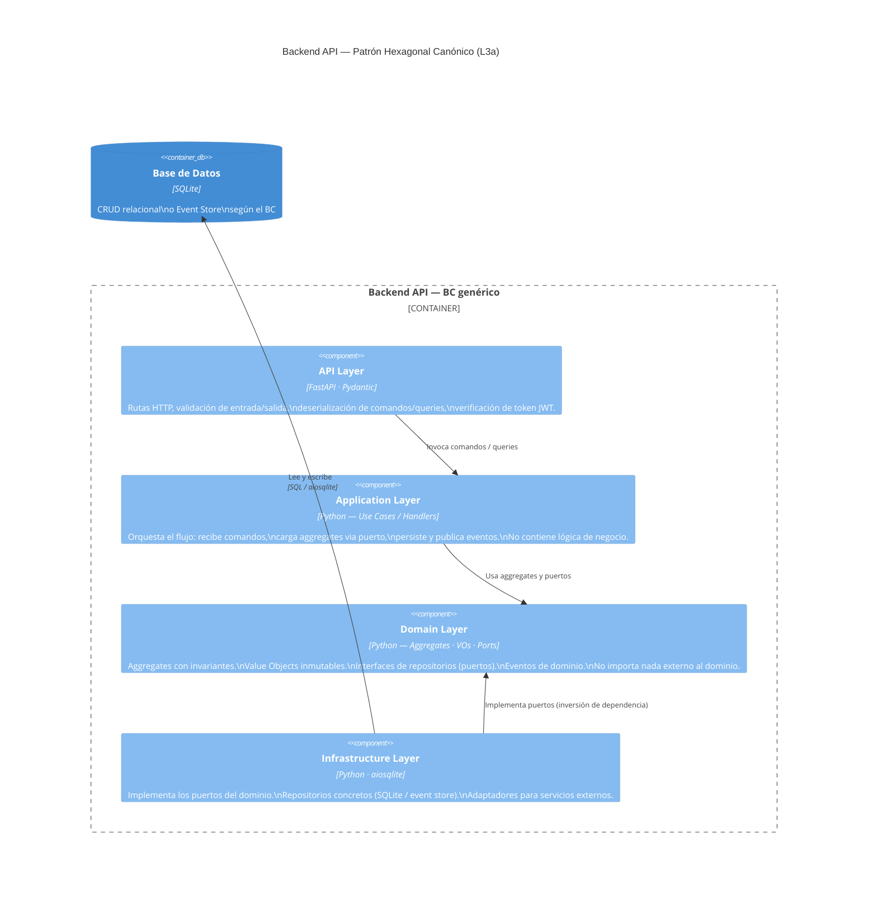
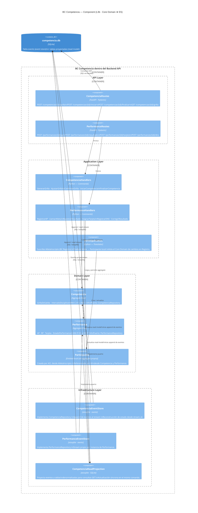

# Architecture — AtaraxiaDive

| Campo | Valor |
|-------|-------|
| **Documento** | architecture.md |
| **Modelo** | C4 (Simon Brown) — L1 Context · L2 Container · L3 Component |
| **Capa IEDD** | Capa 4 — Arquitectura |
| **Fecha** | 2026-03-20 |
| **Fuentes** | Context Map v1.1 · Domain Model v1.0 · ADR-001 a ADR-012 |
| **Estado** | ✅ v1.1 — SQLite por BC (ADR-007/008), proyección síncrona |

---

## 1. L1 — System Context

AtaraxiaDive como caja negra: actores que la usan y sistemas externos con los que se integra.



### Elementos

| Elemento o Componente | Responsabilidad asignada |
|-----------------------|--------------------------|
| Organizador | Actor humano que crea torneos, configura competencias y gestiona grillas. |
| Juez | Actor humano que opera durante la competencia: registra resultados y asigna tarjetas en tiempo real. |
| Atleta | Actor humano que interactúa antes y después de la competencia: inscripción, declaración de AP y consulta de resultados. |
| AtaraxiaDive | Sistema central. Gestiona el ciclo de vida completo de torneos de apnea. |
| Servicio Email | Sistema externo de envío de correos electrónicos. Recibe órdenes de envío desde AtaraxiaDive. |
| Servicio Push | Sistema externo de notificaciones push (FCM). Recibe órdenes de envío desde AtaraxiaDive. |

### Relaciones

| Tipo de relación | Nombre | Descripción |
|-----------------|--------|-------------|
| Uso | Organizador → AtaraxiaDive | El organizador opera el sistema para crear y gestionar torneos y competencias. |
| Uso | Juez → AtaraxiaDive | El juez opera el sistema durante la ejecución de competencias. |
| Uso | Atleta → AtaraxiaDive | El atleta accede para inscribirse, declarar su AP y consultar resultados. |
| Integración | AtaraxiaDive → Servicio Email | El sistema delega el envío de correos a un servicio externo vía SMTP/TLS. |
| Integración | AtaraxiaDive → Servicio Push | El sistema delega el envío de notificaciones push a FCM vía HTTPS. |

---

## 2. L2 — Container

Descompone AtaraxiaDive en sus contenedores técnicos y las tecnologías que los soportan.



> **Event Store sobre SQLite:** la tabla `events` actúa como append-only log (ADR-008).
> Cada fila es un evento inmutable con `stream_id`, `stream_pos`, `event_type` y `payload` JSON.
> Los aggregates con ES (Competencia, Notificaciones) reconstruyen su estado reproduciendo su stream.
> El event store convive en el mismo archivo SQLite del BC — sin motor de Event Sourcing externo (ADR-007).

### Elementos

| Elemento o Componente | Responsabilidad asignada |
|-----------------------|--------------------------|
| React PWA | Interfaz de usuario instalable. Renderiza las vistas de gestión de torneos, competencias y resultados. |
| Backend API | Núcleo del sistema. Expone la API REST y orquesta los 6 Bounded Contexts con arquitectura hexagonal. |
| SQLite — CRUD BCs | 4 archivos SQLite independientes (uno por BC). Almacena el estado de los BCs CRUD: Torneo, Registro, Resultados, Identidad. |
| SQLite — ES BCs | 2 archivos SQLite independientes (uno por BC). Almacena el event store y el read model de los BCs con Event Sourcing: Competencia y Notificaciones. |
| Servicio Email | Sistema externo para envío de emails. |
| Servicio Push | Sistema externo para notificaciones push (FCM). |

### Relaciones

| Tipo de relación | Nombre | Descripción |
|-----------------|--------|-------------|
| Uso | Usuario → React PWA | El usuario interactúa con la interfaz web/PWA desde el navegador. |
| Llamada API | React PWA → Backend API | El frontend realiza llamadas REST/JSON sobre HTTPS para todas las operaciones. |
| Persistencia | Backend API → SQLite CRUD BCs | El backend lee y escribe el estado de los BCs CRUD mediante SQL/aiosqlite. |
| Event Sourcing | Backend API → SQLite ES BCs | El backend hace append de eventos, lee streams para reconstruir aggregates con ES, y actualiza el read model síncronamente en el mismo comando. |
| Notificación | Backend API → Servicio Email | El backend delega el envío de emails al servicio externo mediante SMTP/TLS. |
| Notificación | Backend API → Servicio Push | El backend delega el envío de push notifications a FCM mediante HTTPS. |

---

## 3. L3a — Component: Patrón Hexagonal (Canónico)

Estructura interna que aplica a **todos los BCs** dentro del Backend API.
Las flechas de dependencia apuntan siempre hacia el dominio — nunca desde el dominio hacia afuera.



### Elementos

| Elemento o Componente | Responsabilidad asignada |
|-----------------------|--------------------------|
| API Layer | Adaptador de entrada. Expone rutas HTTP, valida entrada/salida con Pydantic y verifica el token JWT. Traduce requests HTTP en comandos/queries para la capa de aplicación. |
| Application Layer | Orquestador del flujo de negocio. Recibe comandos, carga aggregates via puertos, ejecuta la operación de dominio, persiste cambios y publica eventos. No contiene lógica de negocio. |
| Domain Layer | Núcleo del sistema. Contiene aggregates con invariantes, value objects inmutables, interfaces de repositorios (puertos) y definición de eventos de dominio. No depende de nada externo. |
| Infrastructure Layer | Adaptador de salida. Implementa los puertos definidos en el dominio: repositorios concretos para SQLite / event store y adaptadores para servicios externos. |
| Base de Datos | Almacenamiento persistente. CRUD relacional o Event Store según el BC que corresponda. |

### Relaciones

| Tipo de relación | Nombre | Descripción |
|-----------------|--------|-------------|
| Invocación | API Layer → Application Layer | La capa API deserializa el request y delega la ejecución al caso de uso correspondiente. |
| Uso de puertos | Application Layer → Domain Layer | La capa de aplicación usa los aggregates del dominio e invoca los puertos para cargar y persistir el estado. |
| Implementación de puerto | Infrastructure Layer → Domain Layer | La capa de infraestructura implementa las interfaces (puertos) definidas en el dominio (inversión de dependencia). El dominio no depende de la infraestructura. |
| Persistencia | Infrastructure Layer → Base de Datos | La capa de infraestructura lee y escribe en la base de datos mediante SQL/aiosqlite. |

### Regla de dependencias (Regla de Oro — §6 CLAUDE.md)

```
api/  →  application/  →  domain/
         infrastructure/  ↗  (implementa interfaces definidas en domain/)
```

| Capa | Puede importar | No puede importar |
|------|---------------|-------------------|
| `domain/` | Solo stdlib Python y tipos propios del dominio | Nada externo |
| `application/` | `domain/` | `infrastructure/`, `api/` |
| `infrastructure/` | `domain/`, libs externas (aiosqlite, etc.) | `application/`, `api/` |
| `api/` | `application/`, Pydantic | `domain/` directamente, `infrastructure/` |

> DesignReviewer detecta automáticamente las violaciones de estas reglas en cada merge.

---

## 4. L3b — Component: BC Competencia (Core Domain)

Instancia el patrón hexagonal con los componentes reales del Core Domain.
BC Competencia usa Event Sourcing — los aggregates reconstruyen su estado reproduciendo el stream.
Las proyecciones se actualizan síncronamente en el mismo comando (ADR-008 — sin subscriptions reactivas).



### Elementos

| Elemento o Componente | Responsabilidad asignada |
|-----------------------|--------------------------|
| CompetenciaRoutes | Expone los endpoints REST para operaciones sobre el aggregate Competencia: gestión de grilla, inicio y finalización. |
| PerformanceRoutes | Expone los endpoints REST para operaciones sobre el aggregate Performance: registro de AP, resultado, tarjeta y DNS. |
| CompetenciaHandlers | Maneja los comandos del ciclo de vida de Competencia: GenerarGrilla, AjustarGrilla, ConfirmarGrilla, IniciarCompetencia, FinalizarCompetencia. Actualiza el read model tras cada append. |
| PerformanceHandlers | Maneja los comandos del ciclo de vida de Performance: RegistrarAP, LlamarAtleta, RegistrarResultado, AsignarTarjeta, RegistrarDNS, CorregirResultado. Actualiza el read model tras cada append. |
| ParticipanteACL | Anti-Corruption Layer. Suscribe al evento AtletaInscripto de BC Registro y traduce el modelo de Atleta al modelo local de Participante. Aísla el Core Domain de cambios en BC Registro. |
| Competencia | Aggregate Root del ciclo de vida de la competencia. Contiene GrillaDeSalida e IntervaloDisciplina. Custodia los invariantes INV-C-01 a INV-C-04. |
| Performance | Aggregate Root del ciclo de vida de una performance individual. Contiene AP, RP y Tarjeta. Custodia los invariantes INV-P-01 a INV-P-14. |
| Participante | Entidad local sin aggregate propio. Representa al atleta dentro del contexto de Competencia. Creada y mantenida por el ParticipanteACL a partir de eventos de BC Registro. |
| CompetenciaEventStore | Implementa CompetenciaRepository. Persiste eventos de Competencia en la tabla `events` y reconstruye el aggregate desde el stream_id. |
| PerformanceEventStore | Implementa PerformanceRepository. Cada instancia de Performance tiene su propio stream en la tabla `events`. |
| CompetenciaReadProjection | Proyecta los eventos de dominio a tablas desnormalizadas en SQLite para servir consultas GET eficientes. La actualización es síncrona: el handler llama a la proyección tras cada append al event store. |
| competencia.db | Archivo SQLite del BC Competencia. Contiene la tabla `events` (event store) y las tablas proyectadas (read model). Es la única fuente de persistencia del BC. |

### Relaciones

| Tipo de relación | Nombre | Descripción |
|-----------------|--------|-------------|
| Invocación | CompetenciaRoutes → CompetenciaHandlers | La ruta deserializa el request y delega la operación al handler de comando correspondiente. |
| Invocación | PerformanceRoutes → PerformanceHandlers | Ídem para operaciones sobre el aggregate Performance. |
| Uso de aggregate | CompetenciaHandlers → Competencia | El handler carga el aggregate desde el repositorio, invoca el método de negocio y persiste los eventos generados. |
| Uso de aggregate | PerformanceHandlers → Performance | Ídem para el aggregate Performance. |
| Traducción ACL | ParticipanteACL → Participante | El ACL crea o actualiza la entidad Participante a partir del evento AtletaInscripto recibido desde BC Registro. |
| Implementación de puerto | CompetenciaEventStore → Competencia | Implementa CompetenciaRepository: append al stream y reconstrucción del aggregate desde la secuencia de eventos. |
| Implementación de puerto | PerformanceEventStore → Performance | Implementa PerformanceRepository con stream propio por instancia de Performance. |
| Event Sourcing | CompetenciaEventStore → competencia.db | Escribe eventos de Competencia en la tabla `events` y los lee para reconstruir el aggregate. |
| Event Sourcing | PerformanceEventStore → competencia.db | Escribe y lee el stream propio de cada Performance en la tabla `events`. |
| Proyección síncrona | CompetenciaHandlers → CompetenciaReadProjection | El handler invoca la proyección síncronamente tras cada append al event store. No hay subscripción reactiva ni polling. |
| Proyección síncrona | PerformanceHandlers → CompetenciaReadProjection | Ídem para eventos de Performance que afecten el read model de grilla/estado. |
| Persistencia | CompetenciaReadProjection → competencia.db | Escribe las proyecciones desnormalizadas en las tablas del read model. |
| Consulta | CompetenciaRoutes → competencia.db | Las consultas GET de grilla y estado de competencia se resuelven contra el read model, no contra el event store. |

### Notas de diseño — BC Competencia

**Performance como aggregate separado**
`Performance` tiene su propio stream de eventos (no está anidado en `Competencia`).
Esto permite auditar el ciclo de vida de cada performance de forma independiente,
y reconstruir el estado de una performance sin cargar toda la competencia.

**Read Model y Event Store en el mismo archivo SQLite**
`competencia.db` contiene tanto la tabla `events` (append-only) como las tablas proyectadas.
No hay base de datos separada para el read model — es el mismo archivo SQLite del BC (ADR-007).
Las proyecciones se actualizan síncronamente en el mismo comando que produce los eventos (ADR-008).

**ACL en Application Layer**
El Anti-Corruption Layer vive en `application/` — no en `domain/`.
El dominio no sabe que existe Registro; solo conoce `Participante`.

---

## 5. BCs CRUD — Referencia de estructura

Los BCs Torneo, Registro, Resultados e Identidad siguen el patrón hexagonal canónico (§3)
con persistencia relacional estándar en SQLite. No requieren L3 detallado en Fase 0
— se elabora al diseñar cada BC en su SP correspondiente.

| BC | Tipo | SP | Persistencia | Notas |
|----|------|:--:|-------------|-------|
| Torneo | Supporting | SP3 | SQLite CRUD | Incluye catálogos EntidadOrganizadora y Sede |
| Registro | Supporting | SP3 | SQLite CRUD | ACL de salida hacia Competencia |
| Resultados | Supporting | SP2 | SQLite CRUD | Alimentado por CompetenciaFinalizada |
| Identidad | Generic | SP3 | SQLite CRUD | JWT cross-cutting; candidato a solución externa en H2-H3 |
| Notificaciones | Generic | SP4 | SQLite + ES | Idempotencia exactly-once; suscribe a todos los BCs |

---

## 6. Decisiones de Arquitectura — Referencia

| ADR | Decisión |
|-----|----------|
| ADR-001 | Event Sourcing para BC Competencia (aggregates Performance y Competencia) |
| ADR-002 | FastAPI como framework backend |
| ADR-003 | PWA offline-first con Service Worker + IndexedDB para el juez |
| ADR-004 | Reglas de competencia (disciplinas, categorías, tarjetas) como datos configurables en SQLite |
| ADR-005 | 6 Bounded Contexts definitivos + Event Sourcing en Competencia y Notificaciones |
| ADR-006 | Estructura de código BC-first — cada BC como paquete Python independiente |
| ADR-007 | SQLite como motor de persistencia — un archivo `.db` por Bounded Context |
| ADR-008 | Event Store como tabla `events` append-only en el SQLite del BC |
| ADR-009 | Migraciones Alembic independientes por BC |
| ADR-010 | Docker solo para producción — Cloud Run (GCP) + Litestream para backup de SQLite |
| ADR-011 | structlog para logging estructurado (JSON en prod, texto en dev) |
| ADR-012 | RFC 7807 (Problem Details) como convención de errores HTTP |

Ver `docs/adr/` para justificación completa de cada decisión.

---

## 7. Próximo Paso

Este documento es insumo directo para:

1. **`docs/design/estrategia-desarrollo-bc.md`** — mapear los BCs a los incrementos de SP1–SP5
2. **`docs/traceability/matrix.md`** — trazabilidad RFs → BCs → US-IEDD
3. **US-IEDD de SP1** — las rutas y handlers del L3b definen el contrato de las primeras historias

---

*Documento creado: 2026-03-19 — Semana 0, Fase 0*
*v1.1 (2026-03-20): SQLite por BC (ADR-007/008), proyección síncrona sin NOTIFY, ADR-001..ADR-012*
*Modelo: C4 (Simon Brown) — diagramas Mermaid*
*Fuentes: Context Map v1.1 · Domain Model v1.0 · ADR-001 a ADR-012*
*Mantenido por: Claude Cowork + Victor Valotto*
