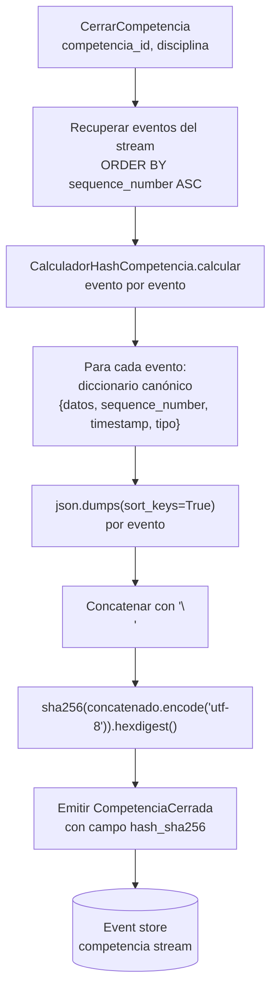
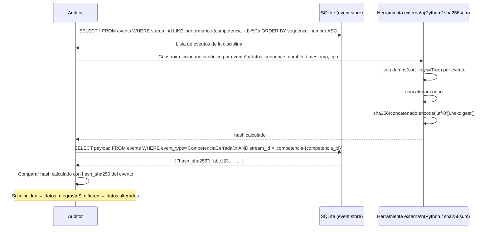

# Auditoría e integridad de resultados

**Versión:** 1.0 — INC-4.6 (2026-04-16)
**Aplica a:** `src/competencia/`, `src/resultados/`
**ADRs relacionados:** ADR-001 (Event Sourcing), ADR-008 (event store SQLite), ADR-018 (hash SHA-256)

---

## 1. Por qué el event store es el audit log

El BC Competencia usa Event Sourcing (ADR-001). En ES, el estado de cualquier aggregate
se deriva íntegramente de su secuencia de eventos. Como consecuencia directa:

> El event store ya contiene el historial completo y cronológico de cada performance.
> El audit log no es una funcionalidad diseñada separadamente — es una propiedad
> emergente del modelo.

No existe una tabla `audit_log` separada ni un sistema de logging adicional. Cualquier
lectura del event store para un stream de performance es, por definición, el audit log
de esa performance.

**Alternativa descartada:** tabla `audit_log` separada, poblada por triggers o listeners
que replicaran los eventos. Problemas: duplicación de datos, posibilidad de divergencia
entre el log y el estado real del aggregate, superficie adicional de mantenimiento.

---

## 2. Qué contiene el audit log de una performance

Cada performance en el BC Competencia genera un stream de eventos identificado por:

```
performance-{competencia_id}-{atleta_id}-{disciplina}
```

Los eventos que puede contener ese stream son:

| Evento | Qué registra para auditoría | Cuándo ocurre |
|--------|----------------------------|--------------|
| `APRegistrado` | AP anunciada, unidad de medida, `competencia_id`, `participante_id` | Al crear la performance |
| `AtletaLlamado` | OT programado, posición en grilla, andarivel asignado | Al llamar al atleta |
| `ResultadoRegistrado` | RP medido, unidad, usuario que lo registró (`registrado_por`), timestamp | Al registrar el resultado |
| `TarjetaAsignada` | Tipo de tarjeta (Blanca/Roja/Amarilla), penalizaciones, usuario, `MotivoDQ` si aplica | Al asignar tarjeta |
| `DNSRegistrado` | OT programado, usuario, timestamp de registro | Al marcar no-presentación |
| `ResultadoCorregido` | RP anterior, RP nuevo, motivo de corrección, usuario, timestamp | Al corregir un resultado (no borra el evento anterior) |
| `RevisionResuelta` | Resolución de tarjeta amarilla → Blanca, Blanca con penalizaciones o Roja | Al cerrar revisión |

La inmutabilidad es estructural: no existe endpoint ni comando en la aplicación que
permita eliminar o modificar eventos. Las correcciones generan un evento adicional
(`ResultadoCorregido`) — la traza completa siempre queda.

---

## 3. Acceso al audit log desde la API

```
GET /competencias/{competencia_id}/performances/{atleta_id}/audit-log
```

Responde con la lista de eventos del stream ordenados por `sequence_number` ASC,
incluyendo `tipo`, `timestamp`, `sequence` y `datos` (payload del evento).

La implementación en `ObtenerAuditLogHandler` carga todos los eventos del prefijo
`performance-{competencia_id}-{atleta_id}-` del event store y los retorna como DTOs.

---

## 4. El mecanismo de hash SHA-256

El hash actúa como sello de integridad de la disciplina al momento del cierre.

### Flujo de cálculo



### Definición del diccionario canónico por evento

```python
{
    "datos": evento["payload"],        # payload completo del evento (dict)
    "sequence_number": evento["sequence"],
    "timestamp": evento["occurred_at"],
    "tipo": evento["event_type"],
}
```

Los campos están en orden alfabético (`datos`, `sequence_number`, `timestamp`, `tipo`).
`sort_keys=True` en `json.dumps` garantiza serialización determinística incluso si
el diccionario `datos` tiene claves en orden variable.

### Dónde se persiste

El hash queda como campo `hash_sha256` en el payload del evento `CompetenciaCerrada`,
en el mismo event store. Cualquier lectura del stream de la competencia incluye el hash.

---

## 5. Cómo verificar la integridad externamente

Un auditor externo (ej. representante FAAS) puede verificar que los resultados no
fueron alterados siguiendo estos pasos sin ejecutar la aplicación:



**Ejemplo en Python (script de verificación):**

```python
import hashlib, json, sqlite3

conn = sqlite3.connect("competencia.db")
eventos = conn.execute(
    "SELECT event_type, occurred_at, sequence, payload FROM events "
    "WHERE stream_id LIKE 'performance-?-%' ORDER BY sequence ASC",
    (competencia_id,)
).fetchall()

canonicos = [
    json.dumps({
        "datos": json.loads(row[3]),
        "sequence_number": row[2],
        "timestamp": row[1],
        "tipo": row[0],
    }, sort_keys=True)
    for row in eventos
]
hash_calculado = hashlib.sha256("\n".join(canonicos).encode("utf-8")).hexdigest()

# Leer hash del evento CompetenciaCerrada
row = conn.execute(
    "SELECT payload FROM events WHERE event_type='CompetenciaCerrada' LIMIT 1"
).fetchone()
hash_almacenado = json.loads(row[0])["hash_sha256"]

print("OK" if hash_calculado == hash_almacenado else "ALTERADO")
```

---

## 6. Exportación de resultados

```
GET /resultados/{torneo_id}/export?format=csv|json
```

### JSON

El resultado exportado incluye el `hash_sha256` de cada disciplina que fue cerrada.
Esto vincula el documento exportado con la integridad del event store: si el hash
del JSON coincide con el hash en el event store, los resultados son auténticos.

```json
{
  "torneo_id": "...",
  "disciplinas": [
    {
      "disciplina": "STA",
      "cerrada": true,
      "hash_sha256": "abc123...",
      "rankings": [...]
    }
  ]
}
```

Las disciplinas en ejecución se exportan con resultados parciales y sin hash.

### CSV

Separador: `;` (convención Excel España/Latinoamérica y convención FAAS).
El hash no se incluye en el CSV por limitación del formato tabular.

---

## 7. Límites del diseño

| Límite | Descripción |
|--------|-------------|
| **Protección post-cierre** | El hash protege contra alteraciones **después** de cerrar la disciplina. Antes del cierre, el organizador puede corregir performances — eso es comportamiento esperado del dominio. |
| **Adversario con acceso a DB** | Si alguien modifica los eventos y también el evento `CompetenciaCerrada` en SQLite, el hash no detectará la alteración. Mitigación: firma digital (SP5). |
| **API de solo lectura** | La API no expone ningún endpoint para modificar o eliminar eventos. La protección primaria sigue siendo la inmutabilidad arquitectónica. |
| **Auditoría offline** | Sin conexión al organizador ni auditoría disponible offline — el event store es backend-only. |

---

## 8. Evolución futura (SP5)

- **Firma digital del hash:** firmar con la clave privada del organizador. Permite verificar integridad incluso con acceso físico a la DB, ya que la firma no puede falsificarse sin la clave.
- **Publicación en registro externo:** enviar el hash al sistema de la FAAS o a un registro público inmutable (blockchain, timestamp RFC 3161). El hash externo no puede alterarse retroactivamente.
- **UI de verificación pública:** página donde cualquier atleta o juez pueda ingresar el ID de competencia y ver si el hash coincide, sin necesitar acceso de administrador.

---

## Referencias

- [ADR-001](../adr/ADR-001-event-sourcing-competencia.md) — Event Sourcing en BC Competencia (fundamento del audit log)
- [ADR-008](../adr/ADR-008-sqlite-event-store.md) — Event store SQLite
- [ADR-018](../adr/ADR-018-hash-sha256-auditoria.md) — Decisión SHA-256 para integridad
- `src/competencia/domain/services/calculador_hash_competencia.py` — Algoritmo canónico
- `src/competencia/application/queries/obtener_audit_log.py` — Query del audit log por performance
- US-4.6.1 (API audit log), US-4.6.2 (hash SHA-256), US-4.6.3 (UI auditoría), US-4.6.4 (exportación)
- RF-CO-09: trazabilidad de resultados para la federación
