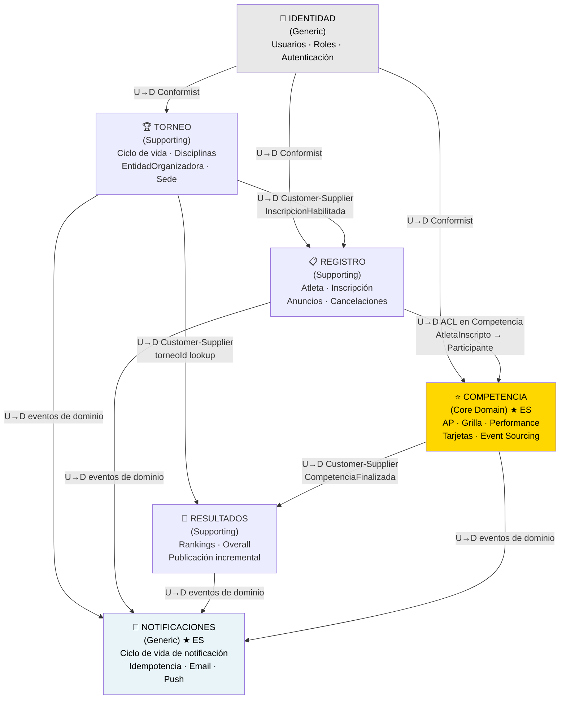

# Context Map — AtaraxiaDive

| Campo | Valor |
|-------|-------|
| **Documento** | context-map.md |
| **Capa IEDD** | Capa 2 — Modelo DDD (diseño estratégico) |
| **Fecha** | 2026-03-18 |
| **Fuente** | Event Storming Big Picture (`docs/design/event-storming-big-picture.md`) |
| **Estado** | ✅ v1.1 — Notificaciones promovido a BC Generic con Event Sourcing |

---

## 1. Bounded Contexts

El ES Big Picture identificó 4 BCs de dominio + 1 genérico. El análisis del Context Map
incorporó `Notificaciones` como BC Generic adicional con Event Sourcing.
Resultado final: **4 BCs de dominio + 2 genéricos**.

| BC | Tipo DDD | Event Sourcing | Descripción |
|----|----------|:--------------:|-------------|
| **Torneo** | Supporting | — | Ciclo de vida del torneo: creación, disciplinas, organización, sede, estados (Abierto → Cerrado/Cancelado). Incluye catálogos de `EntidadOrganizadora` y `Sede`. |
| **Registro** | Supporting | — | Atleta como persona (datos personales, brevet). Inscripción al torneo: habilitación, anuncios de participación, cancelaciones. |
| **Competencia** | **Core Domain** | ✅ | Announced Performance, grilla de salida, ejecución de performances, asignación de tarjetas. Modela el corazón del deporte. |
| **Resultados** | Supporting | — | Cálculo de rankings por disciplina y género, Overall multi-disciplina, publicación incremental. |
| **Identidad** | Generic | — | Usuarios del sistema, roles (organizador, juez, atleta), autenticación/autorización. Cross-cutting. |
| **Notificaciones** | Generic | ✅ | Suscribe a eventos de todos los BCs. Gestiona el ciclo de vida de cada notificación (solicitada → enviada → fallida). Idempotencia por Event Sourcing. |

> **Nota — Configuración:** no emergió como BC propio en el ES. Los conceptos de
> disciplinas y reglas de tarjetas son datos de configuración que residen en los BCs
> que los usan (`Torneo` para disciplinas, `Competencia` para reglas de tarjetas).
> Ver §7 — Datos Experimentales.

---

## 2. Diagrama de Relaciones



> **★ ES** = BC implementado con Event Sourcing

---

## 3. Relaciones entre BCs

### 3.1 Identidad → Torneo, Registro, Competencia
**Patrón:** Customer-Supplier con Conformist downstream

`Identidad` es upstream. Los BCs downstream adaptan sus modelos a lo que `Identidad`
provee (token JWT con userId y rol). No hay negociación — los downstream se conforman.

- **Integración:** validación de token en cada request (síncrona)
- **Contrato:** JWT con claims `{ userId, role: organizador|juez|atleta|admin }`
- **En runtime:** cada BC verifica el token localmente; no consulta a Identidad

---

### 3.2 Torneo → Registro
**Patrón:** Customer-Supplier

`Torneo` es upstream. El evento `InscripcionHabilitada` habilita a `Registro` a
aceptar inscripciones. Sin ese evento, las inscripciones no tienen torneo al que
referenciarse.

- **Integración:** evento de dominio `InscripcionHabilitada` (async)
- **Datos que cruzan:** `torneoId`, `fechaFinInscripcion`, `disciplinasDisponibles`
- **Dependency direction:** Registro depende de Torneo, no al revés

---

### 3.3 Registro → Competencia (ACL)
**Patrón:** Anti-Corruption Layer en Competencia

`Competencia` protege su modelo de dominio de los conceptos de `Registro`. Cuando un
atleta se inscribe (`AtletaInscripto`), `Competencia` traduce ese evento a su propio
modelo: crea un `Participante` local con solo los datos que necesita.

```
Registro::Atleta            →  ACL  →  Competencia::Participante
─────────────────────────────────────────────────────────────────
nombre, apellido                        nombre completo (display)
fechaNacimiento                         categoría (derivada de edad)
género                                  género
brevet                                  [descartado]
teléfono                                [descartado]
disciplinasInscriptas                   disciplinas (lista)
constanciaPago                          [descartado]
aptoMedico                              [descartado]
```

- **Integración:** evento `AtletaInscripto` (async) → ACL traduce → `ParticipanteHabilitado`
- **Runtime:** Competencia nunca consulta a Registro; opera sobre su copia local
- **Cambios en Registro:** si el atleta modifica datos relevantes, `Registro` emite
  `DatosAtletaActualizados` → ACL actualiza `Participante` en Competencia

---

### 3.4 Competencia → Resultados
**Patrón:** Customer-Supplier

`Competencia` es upstream. Los eventos de cierre de competencia son la fuente de
verdad para `Resultados`.

- **Integración:** evento `CompetenciaFinalizada` (async) con payload completo
- **Datos que cruzan:** disciplina, lista de `{ participante, resultado, tarjeta }`
- **Resultados** no tiene lógica de validación — confía en que los datos de Competencia
  son correctos (tarjetas ya asignadas, DNS ya registrados)

---

### 3.5 Torneo → Resultados
**Patrón:** Customer-Supplier

`Torneo` provee el contexto para publicar resultados (nombre del torneo, datos de la
sede, fecha).

- **Integración:** referencia a `torneoId` — Resultados consulta a Torneo para
  enriquecer la publicación (síncrona, read-only)

---

### 3.6 Todos los BCs → Notificaciones
**Patrón:** Customer-Supplier (cada BC es upstream de Notificaciones)

`Notificaciones` suscribe al bus de eventos y reacciona a eventos de todos los BCs.
Es downstream de todos — ningún BC depende de Notificaciones en runtime.

- **Integración:** bus de eventos (async) — Notificaciones consume, nunca produce hacia otros BCs
- **Idempotencia:** antes de enviar, verifica en su event store si `NotificacionEnviada`
  ya existe para ese evento fuente. Garantiza exactly-once delivery.
- **Contrato de entrada:** cualquier evento de dominio publicado en el bus
- **Contrato de salida:** hacia canales externos (SMTP, FCM) — no hacia otros BCs

**Eventos de dominio que disparan notificaciones (v1):**

| Evento fuente | BC | Destinatario | Canal |
|--------------|-----|-------------|-------|
| `InscripcionConfirmada` | Registro | Atleta | Email |
| `TorneoCancelado` | Torneo | Todos los inscriptos | Email |
| `ResultadosPublicados` | Resultados | Atletas de esa disciplina | Email/Push |
| `TorneoCerrado` | Torneo | Atletas y jueces | Email/Push (HS-25: ⏳) |
| `PremiosEntregados` | Resultados | — | ⏳ (HS-22 pendiente) |

---

## 4. BC Notificaciones — Detalle

### Por qué es BC (no solo infraestructura)

| Criterio | Evaluación |
|----------|-----------|
| Lenguaje ubicuo propio | ✅ `Notificacion`, `Destinatario`, `Plantilla`, `Canal`, `PreferenciasAtleta` |
| Invariantes de negocio | ✅ Exactly-once: una notificación no se envía dos veces por el mismo evento |
| Aggregate propio | ✅ `Notificacion` con ciclo de vida: Solicitada → Enviada / Fallida |
| Justifica Event Sourcing | ✅ Idempotencia natural: buscar `NotificacionEnviada` en el store antes de enviar |

### Eventos propios del BC

```
NotificacionSolicitada  → intento de envío registrado
NotificacionEnviada     → canal externo confirmó entrega
NotificacionFallida     → canal externo rechazó / timeout
PreferenciasActualizadas → atleta cambió canal preferido (email/push)
```

### Trade-off documentado

> **Riesgo:** Notificaciones es un BC Generic. Si en el futuro se decide reemplazarlo
> por un SaaS (SendGrid + Firebase con reglas propias), la migración desde ES es más
> costosa que desde un store tradicional. Se acepta este trade-off porque la
> idempotencia que otorga ES tiene valor operativo real en el contexto de una
> competencia deportiva. Ver **ADR-005**.

---

## 5. Entidades del BC Torneo — Catálogos

Durante el análisis del Context Map emergió que `Torneo` contiene dos entidades con
ciclo de vida independiente al torneo en sí:

### 5.1 EntidadOrganizadora
La federación, club o institución **responsable** del torneo ante el reglamento deportivo.
Ejemplo: FAAS (Federación Argentina de Actividades Subacuáticas).

- **Gestión:** CRUD administrativo independiente de torneos
- **Uso:** al crear un torneo, el organizador selecciona del catálogo
- **Atributos relevantes:** nombre, tipo (federación/club/asociación), país, contacto

### 5.2 Sede
El lugar físico donde se realiza el torneo (club, pileta, institución).

- **Gestión:** CRUD administrativo independiente de torneos
- **Uso:** al crear un torneo, el organizador selecciona del catálogo
- **Atributos relevantes:** nombre, dirección, ciudad, tipo de pileta (interior/exterior),
  cantidad de andariveles

> **Distinción semántica:** `EntidadOrganizadora` es quien avala y responde legalmente.
> `Sede` es donde ocurre físicamente. En un torneo pueden ser la misma institución o
> instituciones distintas (ej: FAAS organiza, Club Náutico presta su pileta).

---

## 6. Hot Spots Pendientes con Impacto en el Context Map

| HS | Descripción | Impacto |
|----|-------------|---------|
| HS-02 | Entidad organizadora: ¿catálogo preconfigurado o libre? | ✅ Resuelto: catálogo persistido con CRUD propio en BC Torneo |
| HS-25 | ¿`TorneoCerrado` dispara notificaciones? | Afecta tabla de eventos de Notificaciones — a resolver antes de implementar ese flujo |
| HS-22 | `PremiosEntregados`: ¿genera certificado/notificación? | Idem |
| HS-19 | Cálculo por puntos o por marca absoluta | Afecta internamente a BC Resultados — no al mapa |

---

## 7. Datos Experimentales

### 7.1 Evolución del mapa de BCs

| CLAUDE.md §7 (preliminar, 7 BCs) | Context Map v1.1 | Destino |
|----------------------------------|------------------|---------|
| Competencia | **Competencia** ★ ES | ✅ Core Domain — conservado |
| Gestión de Torneo | **Torneo** | ✅ Conservado (renombrado) |
| Registro | **Registro** | ✅ Conservado |
| Resultados | **Resultados** | ✅ Conservado |
| Configuración | — | ❌ Absorbido: disciplinas → Torneo; reglas → Competencia |
| Identidad | **Identidad** | ✅ Conservado |
| Notificaciones | **Notificaciones** ★ ES | ↑ Promovido a BC Generic con Event Sourcing |

### 7.2 Descubrimiento: EntidadOrganizadora + Sede

El análisis del Context Map reveló dos entidades con CRUD independiente que no
aparecieron explícitamente en el ES Big Picture. Esto confirma que el ES Big Picture
captura el comportamiento principal pero puede no capturar entidades de soporte
(catálogos, maestros de datos).

**Implicación para IEDD:** las US-IEDD de SP1 deben incluir el mantenimiento CRUD
de `EntidadOrganizadora` y `Sede` como incremento previo a la creación de torneos.

### 7.3 Validez del ACL en Registro → Competencia

`Participante` en Competencia es semánticamente distinto de `Atleta` en Registro:
el primero es un competidor activo en una disciplina específica; el segundo es una
persona con datos personales y membresía. Esta diferencia justifica el ACL y protege
el Core Domain de cambios en el BC de soporte.

### 7.4 Notificaciones como BC Generic con ES

La decisión de promover Notificaciones de infraestructura a BC fue tomada durante
el análisis del Context Map, motivada por la idempotencia que garantiza ES:
no duplicar notificaciones en una competencia deportiva tiene valor operativo claro.
El trade-off (costo de migración futura a SaaS) se acepta conscientemente.
Esta decisión es material experimental para el paper IEDD: ¿cuándo vale la pena
aplicar ES a un BC Generic?

---

## 8. Notas del Experimento

El Context Map no es solo un artefacto de organización — es una sesión de análisis
con decisiones reales. Estos aprendizajes alimentan directamente el paper IEDD y la
retrospectiva BL-000.

### Aprendizajes — sesión 2026-03-18

**1. El Context Map descubre lo que el ES Big Picture no captura**

`EntidadOrganizadora` y `Sede` no generan eventos de dominio propios, por eso no
aparecieron en el ES Big Picture. El Context Map los hizo emerger al preguntarse
"¿qué necesita cada BC para funcionar?". Las entidades sin comportamiento de dominio
propio son invisibles para el ES pero visibles para el Context Map.

Esto confirma que ES Big Picture y Context Map son técnicas **complementarias**, no
redundantes. El ES captura el comportamiento; el Context Map captura las dependencias
y los contratos. Ninguno reemplaza al otro.

**2. La tensión BC vs. infraestructura es real y no trivial**

`Notificaciones` tenía argumentos válidos en ambas direcciones. No es un caso obvio.
La resolución requirió evaluar criterios DDD concretos: ¿tiene lenguaje ubicuo propio?
¿tiene aggregate con ciclo de vida real? ¿tiene invariantes de negocio propios?

El proceso de evaluación en sí tiene valor metodológico: los criterios DDD de BC
(lenguaje ubicuo, aggregate, invariantes) son más discriminantes que la pregunta
intuitiva "¿es esto infraestructura?".

**3. El criterio para ES en un BC Generic no es el tipo de BC, es el requerimiento de integridad**

La decisión de ES en `Notificaciones` no surgió de que sea Generic — surgió de un
requerimiento operativo específico: garantizar exactly-once delivery sin lógica ad-hoc.

**Principio emergente:**
> Event Sourcing se justifica cuando existe un requerimiento de integridad que CRUD
> no puede satisfacer estructuralmente — solo con lógica ad-hoc propensa a errores.

Este principio aplica independientemente del tipo de BC (Core, Supporting o Generic).
En este proyecto, Competencia y Notificaciones lo cumplen por razones distintas:
Competencia por auditoría regulatoria; Notificaciones por idempotencia operativa.

**4. La diferencia semántica justifica el ACL por sí sola**

La decisión de ACL en Registro→Competencia no fue una decisión técnica de conveniencia
— fue la consecuencia directa de reconocer que `Atleta` y `Participante` son conceptos
distintos del dominio:

- `Atleta` (Registro): persona con datos personales, brevet, membresía en FAAS
- `Participante` (Competencia): competidor activo en una disciplina específica, con AP registrado

El ACL no traduce datos — traduce semántica. Esto es coherente con el principio de
que el Core Domain define sus propios conceptos, incluso para entidades que existen
en otros BCs.

**Hipótesis a evaluar en retrospectiva BL-000:**
> La secuencia ES Big Picture → Context Map produce contratos de integración más
> fundamentados que derivar el Context Map directamente de los RFs, porque el ES
> hace explícitas las fronteras de consistencia antes de que el Context Map las formalice.

---

## 9. Próximo Paso

Este Context Map es insumo directo para:

1. **ADR-005** — Decisión formal sobre BCs, diseño estratégico DDD y justificación de ES en Notificaciones
2. **Event Storming Nivel 2** — Process Modeling del BC Competencia (Core Domain)
3. **Domain Model** — agregados, value objects e invariantes de cada BC

---

*Documento creado: 2026-03-18 — Semana 0, Fase 0*
*v1.1: Notificaciones promovido a BC Generic con Event Sourcing*
*Fuente: Event Storming Big Picture + análisis Context Map con Victor Valotto*
*Mantenido por: Claude Cowork + Victor Valotto*
