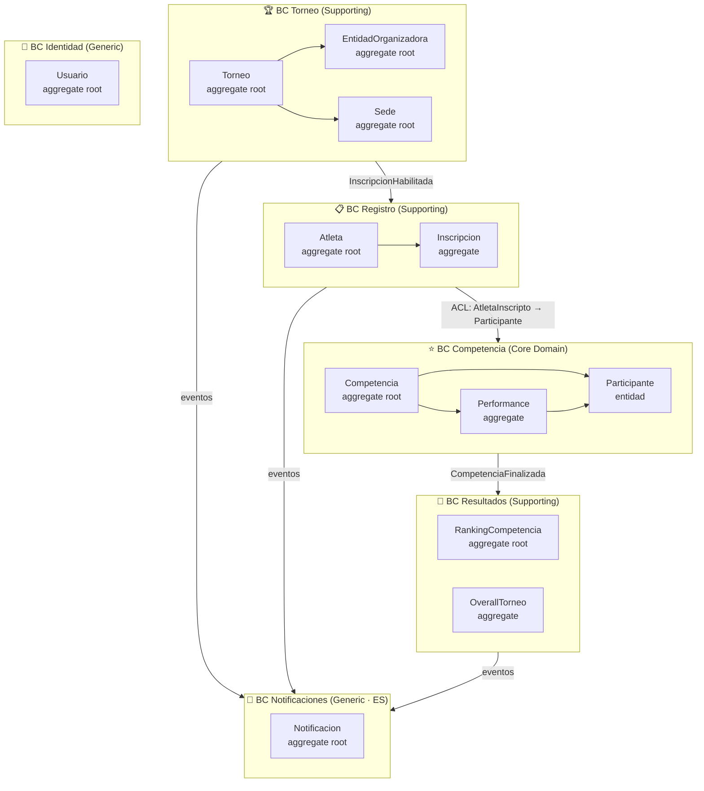
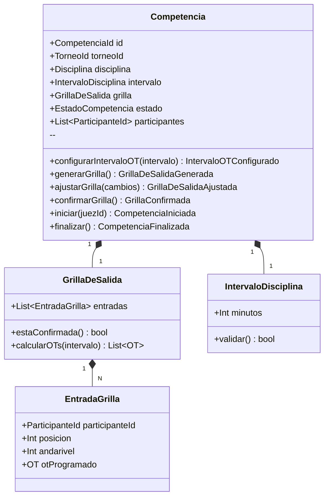
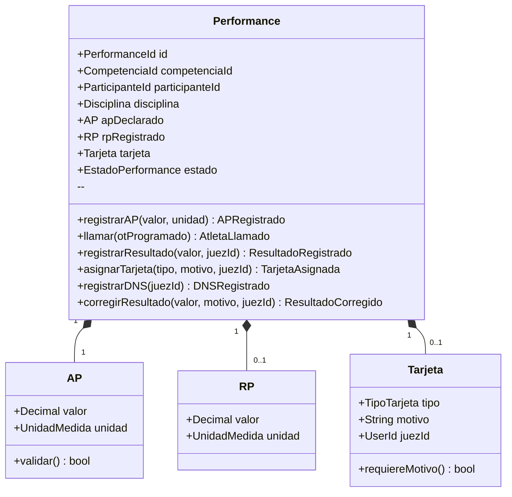
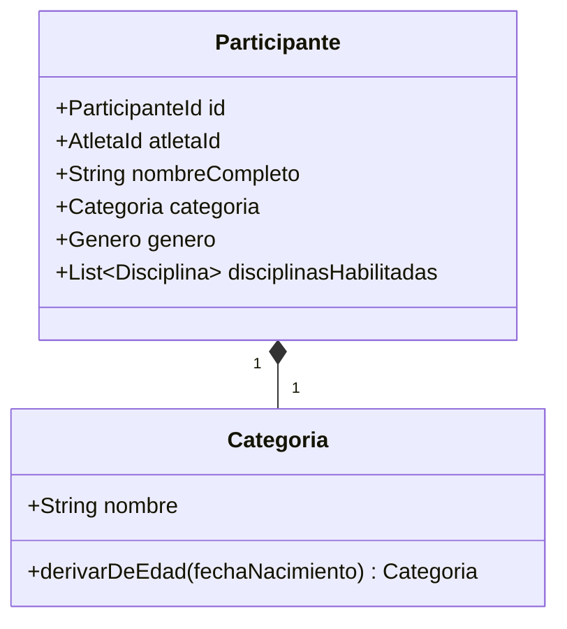

# Domain Model — AtaraxiaDive

| Campo | Valor |
|-------|-------|
| **Documento** | domain-model.md |
| **Capa IEDD** | Capa 2 — Modelo DDD |
| **Fecha** | 2026-03-18 |
| **Fuentes** | ES Big Picture · ES Competencia · Context Map v1.1 |
| **Estado** | ✅ v1.0 — Competencia completo; otros BCs en modelo de referencia |

---

## 1. Mapa General

---

## 2. BC Competencia — Core Domain (detalle completo)

### 2.1 Aggregate: Competencia

**Eventos de dominio:**

| Evento | Disparado por |
|--------|--------------|
| `IntervaloOTConfigurado` | `configurarIntervaloOT()` |
| `GrillaDeSalidaGenerada` | `generarGrilla()` |
| `GrillaDeSalidaAjustada` | `ajustarGrilla()` |
| `GrillaConfirmada` | `confirmarGrilla()` |
| `CompetenciaIniciada` | `iniciar()` |
| `CompetenciaFinalizada` | `finalizar()` — disparado por política P-08 |

**Invariantes:** INV-C-01 a INV-C-04 (ver `event-storming-competencia.md`)

---

### 2.2 Aggregate: Performance

**Eventos de dominio:**

| Evento | Disparado por |
|--------|--------------|
| `APRegistrado` | `registrarAP()` |
| `AtletaLlamado` | `llamar()` |
| `ResultadoRegistrado` | `registrarResultado()` |
| `TarjetaAsignada` | `asignarTarjeta()` |
| `DNSRegistrado` | `registrarDNS()` |
| `ResultadoCorregido` | `corregirResultado()` |

**Invariantes:** INV-P-01 a INV-P-14 (ver `event-storming-competencia.md`)

---

### 2.3 Entidad: Participante

`Participante` es una entidad dentro del BC Competencia, creada mediante el ACL
que traduce `AtletaInscripto` (BC Registro) al modelo local.

> `Participante` no tiene aggregate propio. Es una entidad de consulta dentro de
> Competencia — los aggregates `Competencia` y `Performance` la referencian por id.
> Se actualiza cuando llega `DatosAtletaActualizados` desde Registro.

---

### 2.4 Enumeraciones y Value Objects compartidos

| Tipo | Valores / Descripción |
|------|-----------------------|
| `Disciplina` | STA, DNF, DYN, DBF, SPE, CNF, CWT, FIM, VWT |
| `EstadoCompetencia` | Preparacion, Confirmada, EnEjecucion, Finalizada |
| `EstadoPerformance` | AnunciadaAP, Llamada, Ejecutada, DNS |
| `TipoTarjeta` | Blanca, Amarilla, Roja |
| `UnidadMedida` | Metros, Segundos |
| `OT` | DateTime con precisión de segundos |

---

## 3. BC Torneo — Supporting

> Modelo de referencia — detalle completo en ES Nivel 2 de Torneo (pendiente para SP3)

### Aggregates

| Aggregate | Tipo | Responsabilidad |
|-----------|------|-----------------|
| `Torneo` | Aggregate root | Ciclo de vida: Abierto → EnInscripcion → EnPreparacion → EnEjecucion → Cerrado / Cancelado |
| `EntidadOrganizadora` | Aggregate root | Catálogo de federaciones/clubs organizadores (CRUD) |
| `Sede` | Aggregate root | Catálogo de sedes físicas con datos de pileta (CRUD) |

### Value Objects de configuración del Torneo

| Value Object | Descripción |
|-------------|-------------|
| `FormulaPuntos` | Fórmula deportiva para calcular puntos por disciplina. Configurable por torneo (AIDA / CMAS / genérica). Consumida por BC Resultados para calcular el Overall. |
| `VentanaImpugnacion` | Lapso en minutos desde `CompetenciaFinalizada` durante el cual se permite `CorregirResultado`. Configurable por torneo. Consumida por BC Competencia como INV-P-15. |

### Eventos principales

| Evento | Descripción |
|--------|-------------|
| `TorneoCreado` | Torneo inicializado con EntidadOrganizadora y Sede seleccionadas |
| `DisciplinasSeleccionadas` | Lista de disciplinas del torneo definida |
| `FormulaPuntosConfigurada` | Fórmula de cálculo de Overall seleccionada para el torneo |
| `VentanaImpugnacionConfigurada` | Lapso de corrección de resultados establecido |
| `InscripcionHabilitada` | Publicado al bus → BC Registro puede aceptar inscripciones |
| `InscripcionCerrada` | Automática (fecha) o manual (organizador) |
| `TorneoCerrado` | Torneo finalizado — dispara notificaciones con resumen individual a todos los participantes |
| `TorneoCancelado` | Cancelación en cualquier fase — datos preservados |

---

## 4. BC Registro — Supporting

> Modelo de referencia — detalle completo en ES Nivel 2 de Registro (pendiente para SP3)

### Aggregates

| Aggregate | Tipo | Responsabilidad |
|-----------|------|-----------------|
| `Atleta` | Aggregate root | Datos personales, club, brevet, cuenta de usuario |
| `Inscripcion` | Aggregate | Participación de un atleta en un torneo específico |

### Eventos principales

| Evento | Descripción |
|--------|-------------|
| `AtletaRegistrado` | Primera vez que el atleta crea su perfil en el sistema |
| `AtletaInscripto` | Atleta se inscribe en un torneo — publicado al bus → ACL en Competencia |
| `InscripcionCancelada` | Atleta cancela su participación |
| `DatosAtletaActualizados` | Cambio en datos relevantes → ACL actualiza `Participante` en Competencia |

---

## 5. BC Resultados — Supporting

> Modelo de referencia — detalle completo en ES Nivel 2 de Resultados (pendiente para SP3)

### Aggregates

| Aggregate | Tipo | Responsabilidad |
|-----------|------|-----------------|
| `RankingCompetencia` | Aggregate root | Ranking por disciplina y categoría/género, derivado de `CompetenciaFinalizada` |
| `OverallTorneo` | Aggregate | Ranking general multi-disciplina del torneo por categoría/género |

### Eventos principales

| Evento | Descripción |
|--------|-------------|
| `ResultadosCalculados` | Ranking por disciplina calculado |
| `OverallCalculado` | Ranking general calculado (después de todas las disciplinas) |
| `ResultadosPublicados` | Publicación incremental por disciplina |
| `PremiosEntregados` | Registro administrativo del hecho de entrega — sin efectos secundarios ni notificaciones (HS-22: ✅) |

---

## 6. BC Identidad — Generic

> Modelo mínimo — candidato a solución externa en horizontes 2-3

### Aggregate

| Aggregate | Responsabilidad |
|-----------|-----------------|
| `Usuario` | Credenciales, roles (organizador, juez, atleta, admin), perfil básico |

**Contrato de salida:** JWT con `{ userId, role, exp }` — consumido por todos los BCs.

---

## 7. BC Notificaciones — Generic (Event Sourcing)

> Modelo de referencia — implementación en SP4

### Aggregate

| Aggregate | Tipo | Responsabilidad |
|-----------|------|-----------------|
| `Notificacion` | Aggregate root | Ciclo de vida de un intento de comunicación: Solicitada → Enviada / Fallida |

### Value Objects

| Tipo | Descripción |
|------|-------------|
| `Destinatario` | userId + canal preferido (Email / Push) |
| `PlantillaId` | Referencia a template de mensaje por tipo de evento |
| `EventoFuenteId` | Id del evento de dominio que originó la notificación — clave de idempotencia |

### Eventos propios

| Evento | Descripción |
|--------|-------------|
| `NotificacionSolicitada` | Intento registrado — incluye `eventoFuenteId` para idempotencia |
| `NotificacionEnviada` | Canal externo confirmó entrega |
| `NotificacionFallida` | Canal externo rechazó o timeout |
| `NotificacionReintentada` | Reintento programado tras fallo |
| `PreferenciasActualizadas` | Atleta cambió canal preferido |

---

## 8. Repositorios (Puertos)

Por cada aggregate root se define un puerto de repositorio en el dominio.
La implementación vive en `infrastructure/`.

| BC | Aggregate Root | Repositorio (puerto) |
|----|---------------|----------------------|
| Competencia | `Competencia` | `CompetenciaRepository` |
| Competencia | `Performance` | `PerformanceRepository` |
| Torneo | `Torneo` | `TorneoRepository` |
| Torneo | `EntidadOrganizadora` | `EntidadOrganizadoraRepository` |
| Torneo | `Sede` | `SedeRepository` |
| Registro | `Atleta` | `AtletaRepository` |
| Registro | `Inscripcion` | `InscripcionRepository` |
| Resultados | `RankingCompetencia` | `RankingRepository` |
| Identidad | `Usuario` | `UsuarioRepository` |
| Notificaciones | `Notificacion` | `NotificacionRepository` |

> **Regla de Oro (§6 CLAUDE.md):** Los repositorios son interfaces definidas en
> `domain/`. Las implementaciones concretas (SQLite, event store) viven en
> `infrastructure/`. El dominio no conoce la implementación.

---

## 9. Próximo Paso

Este Domain Model es insumo directo para:

1. **Architecture doc** (`docs/design/architecture.md`) — estructura de capas, event store, bus
2. **US-IEDD de SP1** — los invariantes de Competencia son las precondiciones/postcondiciones

---

*Documento creado: 2026-03-18 — Semana 0, Fase 0*
*v1.0: Competencia completo; otros BCs en modelo de referencia*
*Fuentes: ES Big Picture + ES Competencia + Context Map v1.1*
*Mantenido por: Claude Cowork + Victor Valotto*
