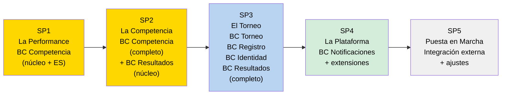
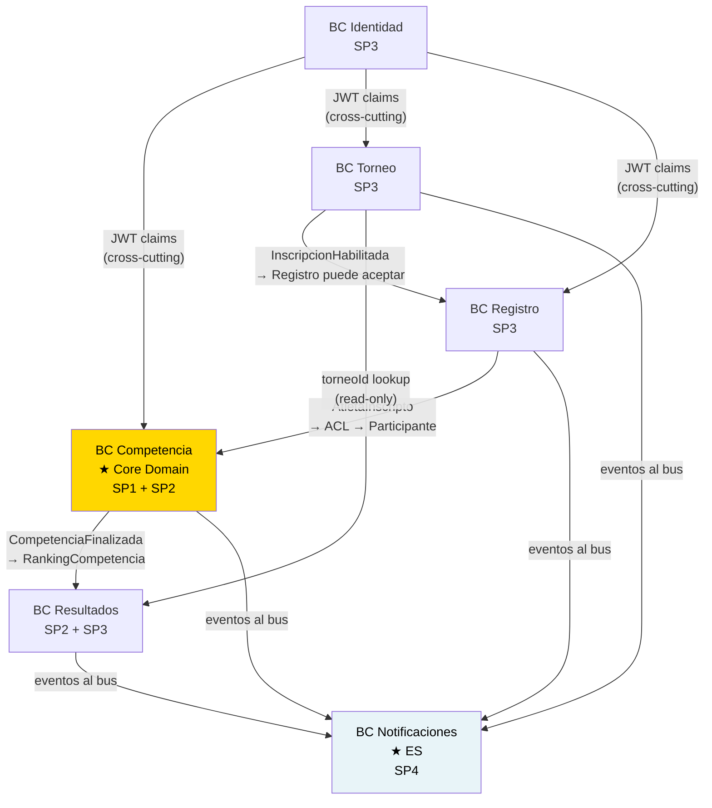

# Estrategia de Desarrollo por Bounded Context — AtaraxiaDive

| Campo | Valor |
|-------|-------|
| **Documento** | estrategia-desarrollo-bc.md |
| **Capa IEDD** | Capa 4 — Arquitectura (puente con Implementación) |
| **Fecha** | 2026-03-19 |
| **Fuentes** | `docs/dominio/04-estrategia_desarrollo.md` · Context Map v1.1 · Domain Model v1.0 |
| **Estado** | ✅ v1.0 — Fase 0 |

---

## 1. Propósito

Este documento mapea los 6 Bounded Contexts al plan de subproyectos (SP1–SP5).
Responde tres preguntas:

1. **¿En qué SP se implementa cada BC?**
2. **¿En qué orden y por qué?**
3. **¿Qué partes de cada BC se construyen en cada SP?**

Es el puente entre el diseño estratégico DDD (Context Map, Domain Model)
y la ejecución incremental (22 incrementos de `04-estrategia_desarrollo.md`).

---

## 2. Resumen: BC × Subproyecto

| Bounded Context | Tipo | SP1 | SP2 | SP3 | SP4 | SP5 |
|----------------|------|:---:|:---:|:---:|:---:|:---:|
| **Competencia** | Core Domain ★ ES | ✅ núcleo | ✅ completo | ⚙️ offline | ⚙️ penalizaciones | — |
| **Resultados** | Supporting CRUD | — | ✅ núcleo | ✅ completo | — | — |
| **Torneo** | Supporting CRUD | — | — | ✅ completo | ⚙️ config | — |
| **Registro** | Supporting CRUD | — | — | ✅ completo | — | ⚙️ integración |
| **Identidad** | Generic CRUD | — | — | ✅ básico | — | — |
| **Notificaciones** | Generic ★ ES | — | — | — | ✅ completo | — |

> ✅ implementación principal · ⚙️ extensión o mejora en ese SP

---

## 3. Secuencia de Implementación

**Criterio de ordenamiento:**
- El **Core Domain primero** (BC Competencia): valida la arquitectura con la lógica más compleja.
- Los **BCs Supporting** después (Resultados → Torneo + Registro): cada uno depende del anterior.
- Los **BCs Generic** al final (Identidad en SP3 mínimo, Notificaciones en SP4): cross-cutting sin dependencias de dominio.

---

## 4. SP1 — La Performance (BC Competencia: núcleo)

**Objetivo:** Walking skeleton. Una performance registrada de punta a punta.

**BCs activos:** Competencia (único)

| Inc. | Nombre | Partes del BC Competencia |
|------|--------|--------------------------|
| 1.1 | Fundación técnica | Estructura de capas hexagonales · tabla `domain_events` · health-check |
| 1.2 | El dominio habla | Aggregate `Performance` con invariantes INV-P-01..14 · `PerformanceEventStore` · Read Model básico |
| 1.3 | El juez ve y toca | `PerformanceRoutes` · `PerformanceHandlers` · interfaz mobile-first |
| 1.4 | Todo conectado | Flujo end-to-end: AP → llamar → resultado → tarjeta · casos DNS y black-out |

**Qué queda fuera de BC Competencia en SP1:**
- Aggregate `Competencia` (grilla, secuencia) → SP2
- `ParticipanteACL` (depende de BC Registro) → SP3
- Aggregate `Participante` real (datos hardcodeados en SP1) → SP3

**DoD del SP1:** 5 performances registradas desde el celular. Event Store muestra la traza completa.

---

## 5. SP2 — La Competencia (BC Competencia: completo + BC Resultados: núcleo)

**Objetivo:** Disciplina completa con grilla y ranking.

**BCs activos:** Competencia (completa el aggregate), Resultados (núcleo)

| Inc. | Nombre | BCs y componentes |
|------|--------|-------------------|
| 2.1 | La grilla de salida | **Competencia:** aggregate `Competencia` · `GrillaDeSalida` · `CompetenciaHandlers` |
| 2.2 | Dos mecánicas, un modelo | **Competencia:** `Disciplina` (STA/DNF) · `IntervaloDisciplina` · invariantes INV-C-01..04 |
| 2.3 | Andariveles simultáneos | **Competencia:** `EntradaGrilla.andarivel` · concurrencia sin conflictos |
| 2.4 | El ranking | **Resultados:** aggregate `RankingCompetencia` · `ResultadosCalculados` · pantalla de podio |

**Estado de BCs al cerrar SP2:**
- **Competencia:** ✅ completo — ambos aggregates (`Competencia` + `Performance`) implementados con ES
- **Resultados:** ⚙️ parcial — solo ranking por disciplina; Overall y publicación incremental en SP3

**DoD del SP2:** Disciplina STA y DNF ejecutables con 10 atletas, grilla, DNS y ranking final.

---

## 6. SP3 — El Torneo (BC Torneo + Registro + Identidad + Resultados: completo)

**Objetivo:** Ciclo de vida completo del torneo con multi-rol.

**BCs activos:** Torneo, Registro, Identidad (los tres se implementan), Resultados (se completa)

| Inc. | Nombre | BCs y componentes |
|------|--------|-------------------|
| 3.1 | Máquina de estados | **Torneo:** aggregate `Torneo` · estados · catálogos `EntidadOrganizadora` + `Sede` · **Identidad:** auth básico + rol organizador |
| 3.2 | La inscripción | **Registro:** aggregates `Atleta` + `Inscripcion` · **Identidad:** rol atleta |
| 3.3 | Anuncios y grillas automáticas | **Registro:** AP · **Competencia:** `ParticipanteACL` (primer uso real del ACL) · grilla automática |
| 3.4 | Multi-disciplina y jueces | **Torneo:** 5 disciplinas · **Identidad:** rol juez · asignación juez→disciplina |
| 3.5 | Premiación y Overall | **Resultados:** `OverallTorneo` · publicación incremental · `ResultadosPublicados` |

**Hito clave del SP3 — inc. 3.3:**
El `ParticipanteACL` entra en producción: por primera vez `Registro → Competencia`
cruzan la frontera de BC con traducción real. Primer test de la integración async.

**Estado de BCs al cerrar SP3:**
- **Torneo, Registro, Identidad:** ✅ completos para el alcance v1
- **Resultados:** ✅ completo (ranking por disciplina + Overall)
- **Notificaciones:** ❌ aún no implementado (eventos se emiten pero nadie los consume)

**DoD del SP3:** Simulación de torneo completo con 5 disciplinas, 20 atletas y 3 roles.

---

## 7. SP4 — La Plataforma (BC Notificaciones + extensiones)

**Objetivo:** Sistema operativo. Offline, notificaciones, configuración, auditoría.

**BCs activos:** Notificaciones (implementación completa), extensiones en Competencia y Torneo

| Inc. | Nombre | BCs y componentes |
|------|--------|-------------------|
| 4.1 | El juez se desconecta | **Competencia:** offline-first · IndexedDB · sincronización |
| 4.2 | El sistema habla | **Notificaciones:** BC completo — aggregate `Notificacion` + ES + Email/Push · resuelve HS-25 y HS-22 |
| 4.3 | Configuración sin código | **Torneo:** panel admin · JSONB para disciplinas, categorías, reglas |
| 4.4 | Tarjetas y penalizaciones | **Competencia:** tarjeta amarilla configurable · `CorregirResultado` · rankings por categoría/género |
| 4.5 | Confianza y auditoría | Cross-cutting: log de auditoría · hash SHA-256 · inmutabilidad post-cierre · exportación CSV/JSON |

**Hito clave del SP4 — inc. 4.2:**
BC Notificaciones es el primer BC Generic con Event Sourcing en activarse.
Los hot spots HS-25 (`TorneoCerrado`) y HS-22 (`PremiosEntregados`) deben estar
resueltos antes de este incremento.

**Estado de BCs al cerrar SP4:**
- **Notificaciones:** ✅ completo con idempotencia exactly-once
- **Todos los BCs:** sistema operativo listo para uso real

**DoD del SP4:** Disciplina offline, emails reales enviados, traza de auditoría visible.

---

## 8. SP5 — La Puesta en Marcha (integración externa + primer torneo real)

**Objetivo:** Transición de software que funciona a software que se usa.

**BCs activos:** Registro (extensión con integración externa), cross-cutting

| Inc. | Nombre | BCs y componentes |
|------|--------|-------------------|
| 5.1 | El mundo externo | **Registro:** integración FAZ o importación CSV de atletas |
| 5.2 | Prueba de fuego simulada | Todos los BCs — simulacro con usuarios reales de la federación |
| 5.3 | Ajustes del mundo real | Correcciones según feedback del simulacro |
| 5.4 | El primer torneo | Primer torneo real — todos los BCs en producción |

---

## 9. Dependencias entre BCs — Orden de implementación justificado

**Por qué Competencia primero:**
Es el Core Domain con la lógica más compleja (Event Sourcing, 14 invariantes).
Si la arquitectura hexagonal y el Event Store funcionan para Competencia, funcionan para todo.
Además, Competencia no depende de ningún otro BC — es el receptor de dependencias.

**Por qué Resultados antes de Torneo:**
Resultados depende de Competencia (recibe `CompetenciaFinalizada`) pero no de Torneo directamente.
Se puede implementar el cálculo de ranking con datos de prueba antes de tener el torneo completo.

**Por qué Identidad en SP3 (no antes):**
En SP1 y SP2 se trabaja con datos hardcodeados o un usuario único de prueba.
La autenticación real (multi-rol) se necesita recién cuando Torneo y Registro entran en juego.

**Por qué Notificaciones al final (SP4):**
Notificaciones es downstream de todos los BCs — consume eventos pero no produce hacia ninguno.
Los BCs upstream emiten eventos al bus desde SP3; Notificaciones los consume en SP4.
Implementarlo antes sería construir el consumidor sin productores estables.

---

## 10. Hot Spots pendientes con impacto en esta estrategia

| HS | Descripción | BC afectado | SP donde se resuelve |
|----|-------------|-------------|----------------------|
| HS-19 | ¿Cálculo de Overall por puntos o marca absoluta? | Resultados | ✅ Fórmula configurable por torneo. `FormulaPuntos` VO en BC Torneo. Overall por categoría. |
| HS-22 | `PremiosEntregados` — ¿genera certificado/notificación? | Notificaciones | ✅ Solo registro administrativo — sin efectos secundarios. |
| HS-25 | ¿`TorneoCerrado` dispara notificaciones? | Notificaciones | ✅ Sí — email/push a todos los participantes con resumen individual. |
| HS-P2 | ¿Hasta cuándo se puede corregir un resultado? | Competencia | ✅ Ventana de impugnación configurable por torneo (minutos desde `CompetenciaFinalizada`). INV-P-15. |

---

## 11. Próximo Paso

Este documento es insumo directo para:

1. **`docs/traceability/matrix.md`** — trazabilidad RF → BC → incremento → US-IEDD
2. **US-IEDD de SP1** — los incrementos 1.1 a 1.4 se descomponen en historias con pre/post/invariantes

---

*Documento creado: 2026-03-19 — Semana 0, Fase 0*
*v1.0: mapeo BC × SP, secuencia justificada, dependencias, hot spots con impacto*
*Fuentes: estrategia_desarrollo.md · Context Map v1.1 · Domain Model v1.0*
*Mantenido por: Claude Cowork + Victor Valotto*
