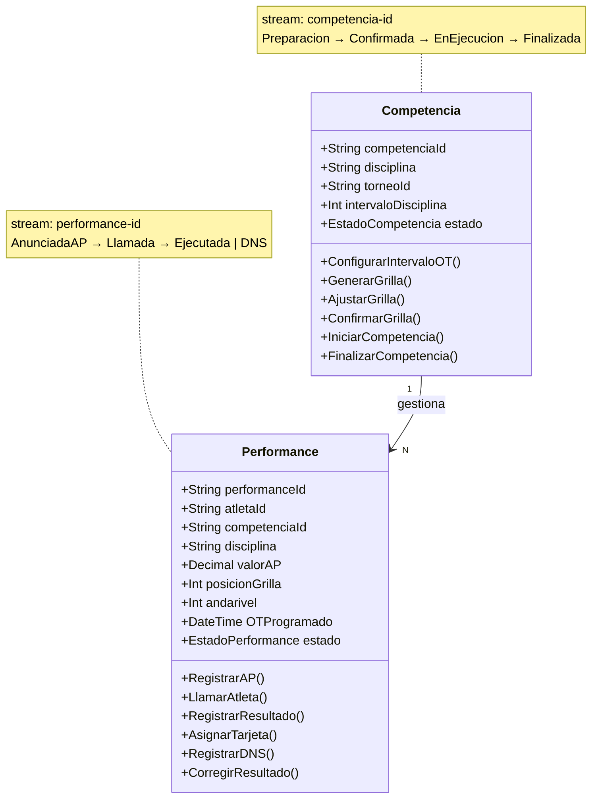
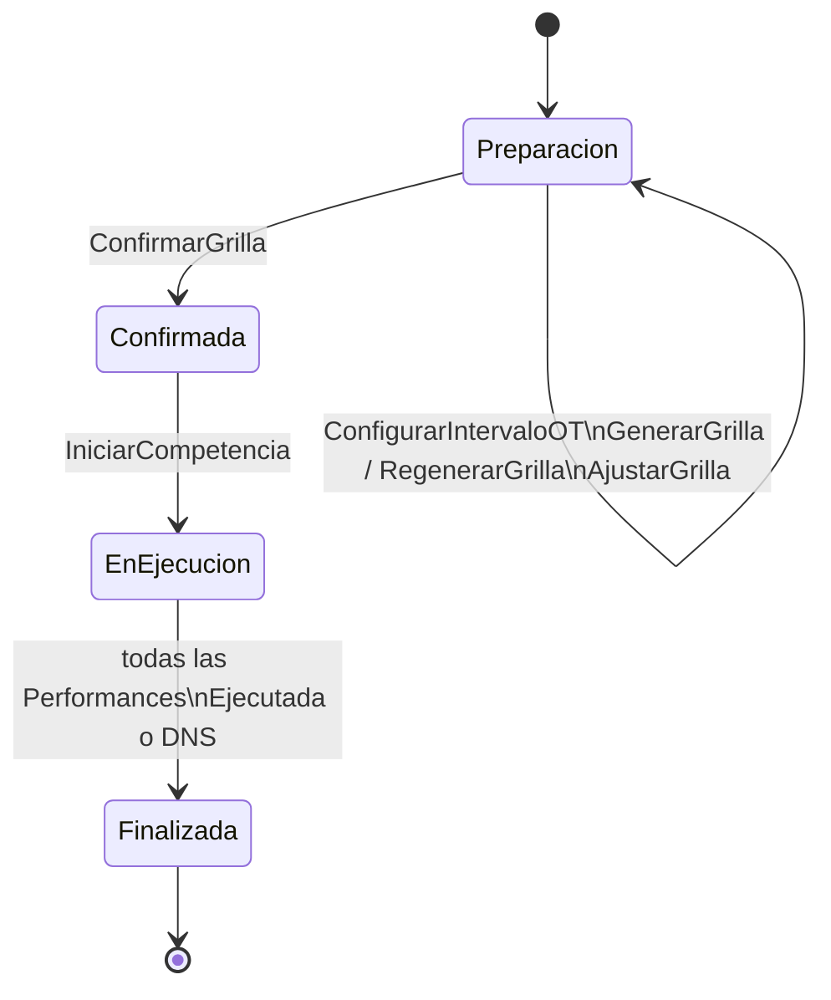
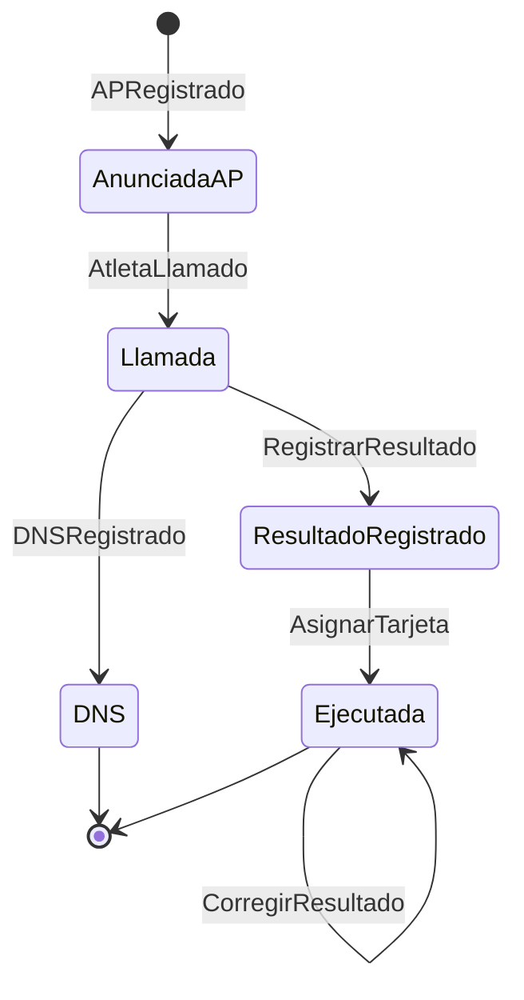

# Event Storming — Process Modeling
## BC Competencia (Core Domain)

| Campo | Valor |
|-------|-------|
| **Documento** | event-storming-competencia.md |
| **Tipo ES** | Process Modeling — Nivel 2 |
| **Capa IEDD** | Entre Capa 2 (Modelo DDD) y Capa 3 (Especificación) |
| **Fecha** | 2026-03-18 |
| **Modalidad** | Solo-asincrónica — Victor Valotto (experto dominio) + Claude (facilitador) |
| **Estado** | ✅ Completo |

---

## Convención de Notación

| Símbolo | Significado |
|---------|-------------|
| 🟠 | Evento de dominio |
| 🔵 | Comando |
| 🟡 | Actor |
| 🟣 | Política |
| 🔴 | Hot Spot |
| 🟢 | Read Model |
| 🟨 | Aggregate |

---

## Alcance

BC Competencia cubre desde el registro de AP (Announced Performance) hasta la
finalización de la competencia por disciplina. Es el Core Domain del sistema.

```
Registro AP → Configuración Grilla → Confirmación → Ejecución → Finalización
```

**Fuera de alcance de este ES:**
- Inscripción de atletas (BC Registro)
- Cálculo de rankings (BC Resultados)
- Eventos v2+ documentados en ES Big Picture (HS-18)

---

## Aggregates del BC

El BC Competencia tiene **dos aggregates** con Event Sourcing:



---

## Flujo 1 — Preparación de la Competencia

> Actors: Organizador, Sistema
> Aggregate: Competencia

### Línea de Eventos

```
🔵 ConfigurarIntervaloOT    🔵 GenerarGrilla          🔵 AjustarGrilla
🟡 Organizador/Juez          🟡 Organizador/Sistema    🟡 Organizador
         ↓                           ↓                        ↓
🟠 IntervaloOT           →  🟠 GrillaDeSalida     →  🟠 GrillaDeSalida
   Configurado               Generada                  Ajustada
         ↑
   (repetible hasta
    conformidad)
                                    ↑
                          (regenerable mientras
                           grilla no confirmada)
```

```
🔵 ConfirmarGrilla
🟡 Organizador
         ↓
🟠 GrillaConfirmada   ← hito de bloqueo: grilla congelada
```

### Datos significativos por evento

| Evento | Datos que transporta |
|--------|---------------------|
| `IntervaloOTConfigurado` | competenciaId, intervaloDisciplina (minutos), configuradoPor |
| `GrillaDeSalidaGenerada` | disciplina, lista `[{ performanceId, atleta, posición, andarivel, OT calculado }]` |
| `GrillaDeSalidaAjustada` | disciplina, cambios `[{ performanceId, campoModificado, valorAnterior, valorNuevo }]` |
| `GrillaConfirmada` | competenciaId, disciplina, totalPerformances, confirmadaPor, timestamp |

### Políticas

| Política | Descripción |
|----------|-------------|
| 🟣 P-01 | Orden grilla: DNF/DYN/DBF/STA → AP ascendente (menor a mayor); SPE y variantes SPE_2X50/4X50/8X50/16X50 → AP descendente (mayor a menor, per reglamento CMAS/FAAS) |
| 🟣 P-02 | OT de cada atleta = OT_inicio + (posición × intervaloDisciplina) |
| 🟣 P-03 | Si se modifica `IntervaloOTConfigurado` → los OTs de la grilla quedan desactualizados hasta regenerar |
| 🟣 P-04 | `GrillaConfirmada` → grilla congelada; `GenerarGrilla` y `ConfigurarIntervaloOT` no permitidos |

### Invariantes del Aggregate Competencia

```
INV-C-01: intervaloDisciplina debe estar configurado antes de GenerarGrilla
INV-C-02: GrillaConfirmada es unidireccional — no puede revertirse (v1)
INV-C-03: IniciarCompetencia solo permitido si estado = Confirmada (GrillaConfirmada)
INV-C-04: CompetenciaFinalizada solo cuando todas las Performances están en estado
          Ejecutada o DNS — sin excepciones
```

### Read Models

| Read Model | Consumidor | Información |
|-----------|------------|-------------|
| 🟢 GrillaDeSalida | Organizador | Lista ordenada con atleta, posición, andarivel, OT |
| 🟢 EstadoPreparacion | Organizador | Intervalo configurado, grilla generada, confirmada |

### Hot Spots

| ID | Descripción | Estado |
|----|-------------|--------|
| 🔴 HS-10 | ¿La grilla puede regenerarse? | ✅ Sí, mientras no esté `GrillaConfirmada`. Después, solo ajuste manual. |
| 🔴 HS-12 | Intervalo entre OTs: ¿antes o después de la grilla? | ✅ Se configura por competencia, repetible. Los OTs se calculan al generar/regenerar la grilla. |
| 🔴 HS-P1 | ¿`AjustarGrilla` después de `GrillaConfirmada` está permitido? | ✅ No — `GrillaConfirmada` congela la grilla completamente (v1) |

---

## Flujo 2 — Registro de AP

> Actors: Atleta, Sistema
> Aggregate: Performance (creación)

### Línea de Eventos

```
🔵 RegistrarAP                          🔵 CerrarPlazoAP
🟡 Atleta                               🟡 Sistema (fecha configurada)
        ↓                                        ↓
🟠 APRegistrado                →      🟠 PlazoAPVencido
   (crea Performance aggregate)           (atletas sin AP → NoCompite)
```

Variante — atleta sin AP al vencer el plazo:
```
🟣 P-05: PlazoAPVencido → Performances sin AP → estado NoCompite
         (no aparecen en la grilla generada)
```

### Datos significativos por evento

| Evento | Datos que transporta |
|--------|---------------------|
| `APRegistrado` | performanceId, atletaId, competenciaId, disciplina, valorAP, unidad, registradoEn |
| `PlazoAPVencido` | competenciaId, disciplina, atletasSinAP `[atletaId]` |

### Invariantes del Aggregate Performance — estado AnunciadaAP

```
INV-P-01: valorAP debe ser > 0
INV-P-02: Un atleta solo puede tener un AP activo por disciplina por competencia
INV-P-03: APRegistrado no permitido después de PlazoAPVencido (plazo cerrado)
INV-P-04: APRegistrado no permitido después de GrillaConfirmada
```

### Read Models

| Read Model | Consumidor | Información |
|-----------|------------|-------------|
| 🟢 APRegistrado | Atleta | Confirmación de su AP para cada disciplina |
| 🟢 AtletasSinAP | Organizador | Lista de atletas inscriptos sin AP registrado |

---

## Flujo 3 — Ejecución de la Competencia

> Actors: Juez, Sistema
> Aggregates: Competencia + Performance

### Línea de Eventos — Nivel Competencia

```
🔵 IniciarCompetencia
🟡 Juez
        ↓
🟠 CompetenciaIniciada
        ↓
🟣 P-06: CompetenciaIniciada → habilita ejecución secuencial de Performances según grilla
```

### Línea de Eventos — Nivel Performance (se repite N veces según grilla)

```
🔵 LlamarAtleta          🔵 RegistrarResultado    🔵 AsignarTarjeta
🟡 Sistema (grilla)      🟡 Juez                  🟡 Juez
        ↓                        ↓                        ↓
🟠 AtletaLlamado    →  🟠 ResultadoRegistrado  →  🟠 TarjetaAsignada
                                                          ↓
                                               Performance = Ejecutada
```

Variante DNS:
```
🔵 RegistrarDNS
🟡 Juez
        ↓
🟠 DNSRegistrado
        ↓
🟣 P-07: DNSRegistrado → Performance = DNS (descalificación automática, sin tarjeta)
```

### Cierre automático

```
🟣 P-08: Cuando todas las Performances en estado Ejecutada o DNS →
         sistema dispara CompetenciaFinalizada
         ↓
🟠 CompetenciaFinalizada
```

### Datos significativos por evento

| Evento | Datos que transporta |
|--------|---------------------|
| `CompetenciaIniciada` | competenciaId, disciplina, totalPerformances, juezId, iniciadaEn |
| `AtletaLlamado` | performanceId, atletaId, disciplina, posicionGrilla, OTProgramado, llamadoEn |
| `DNSRegistrado` | performanceId, atletaId, disciplina, OTProgramado, registradoPor |
| `ResultadoRegistrado` | performanceId, atletaId, disciplina, valorRP, unidad, registradoPor |
| `TarjetaAsignada` | performanceId, atletaId, disciplina, tipo (Blanca/BlancaConPenalizaciones/Amarilla/Roja), motivo_dq_codigo?, motivo_texto?, penalizaciones[], rp_final?, asignadaPor, juezId |
| `CompetenciaFinalizada` | competenciaId, disciplina, totalEjecutadas, totalDNS, finalizadaEn |

### Políticas

| Política | Descripción |
|----------|-------------|
| 🟣 P-06 | `CompetenciaIniciada` → habilita ejecución de Performances en orden de grilla |
| 🟣 P-07 | `DNSRegistrado` → Performance pasa a estado DNS; no requiere tarjeta |
| 🟣 P-08 | Cuando todas Performances = Ejecutada o DNS → `CompetenciaFinalizada` (automático) |

### Invariantes del Aggregate Performance — estados Llamada / Ejecutada / DNS

```
INV-P-05: AtletaLlamado solo permitido si Competencia en estado EnEjecucion
INV-P-06: RegistrarResultado solo permitido si Performance en estado Llamada
INV-P-07: AsignarTarjeta solo permitido si ResultadoRegistrado (estado previo)
INV-P-08: RegistrarDNS solo permitido si Performance en estado Llamada
INV-P-09: DNSRegistrado y ResultadoRegistrado son mutuamente excluyentes
INV-P-10: TarjetaAsignada es el estado final de Ejecutada — no modificable
          (excepto por flujo de Corrección — ver Flujo 4)
INV-P-11: MotivoDQ obligatorio si tarjeta = Roja (catálogo formal — ver MotivoDQ en domain-model.md)
INV-P-11b: PenalizacionTecnica obligatoria (≥1) si tarjeta = BlancaConPenalizaciones
INV-P-11c: BlancaConPenalizaciones solo válida para disciplinas dinámicas (DNF, DYN, DBF, SPE y variantes)
```

### Read Models

| Read Model | Consumidor | Información |
|-----------|------------|-------------|
| 🟢 PerformanceActual | Juez | Atleta en curso: nombre, AP declarado, categoría, andarivel |
| 🟢 ProximosAtletas | Juez | Siguientes 3 atletas según grilla (con OT y AP) |
| 🟢 ProgressoCompetencia | Juez | Performances completadas / total, DNS acumulados |

---

## Flujo 4 — Corrección de Resultado

> Actor: Juez
> Aggregate: Performance
> Restricción: dentro de la **ventana de impugnación** configurada en el torneo.
> La ventana se define como un lapso en minutos desde `CompetenciaFinalizada`.
> Vencida la ventana, `CorregirResultado` queda bloqueado — el resultado es inmutable.
> (HS-P2 ✅ resuelto — 2026-03-19)

### Línea de Eventos

```
🔵 CorregirResultado
🟡 Juez (con motivo obligatorio)
        ↓
🟠 ResultadoCorregido   ← nuevo evento, no reemplaza ResultadoRegistrado
        ↓
🟣 P-09: ResultadoCorregido → el Read Model proyecta el valor corregido como RP actual
```

### Datos significativos por evento

| Evento | Datos que transporta |
|--------|---------------------|
| `ResultadoCorregido` | performanceId, valorRPAnterior, valorRPCorregido, motivo (obligatorio), corregidoPor, corregidoEn |

### Invariantes

```
INV-P-12: motivo es obligatorio en ResultadoCorregido — sin excepción
INV-P-13: CorregirResultado no permitido si Performance en estado DNS
INV-P-14: CorregirResultado solo sobre el resultado más reciente (no se puede corregir
          una corrección anterior — siempre se corrige sobre el estado actual proyectado)
INV-P-15: CorregirResultado solo permitido dentro de la ventanaImpugnacion del torneo
          medida desde CompetenciaFinalizada. Vencida la ventana → excepción de dominio.
```

### Hot Spots

| ID | Descripción | Estado |
|----|-------------|--------|
| ✅ HS-P2 | ¿Hasta cuándo se puede corregir un resultado? | Resuelto: ventana de tiempo configurable por torneo (minutos desde `CompetenciaFinalizada`). Ver INV-P-15. |

---

## Resumen de Invariantes por Aggregate

### Aggregate Competencia

| ID | Invariante |
|----|-----------|
| INV-C-01 | `intervaloDisciplina` configurado antes de `GenerarGrilla` |
| INV-C-02 | `GrillaConfirmada` es unidireccional — no reversible (v1) |
| INV-C-03 | `IniciarCompetencia` solo si estado = `Confirmada` |
| INV-C-04 | `CompetenciaFinalizada` solo cuando todas las Performances = Ejecutada o DNS |

### Aggregate Performance

| ID | Invariante |
|----|-----------|
| INV-P-01 | `valorAP > 0` |
| INV-P-02 | Un AP activo por (atleta, disciplina, competencia) |
| INV-P-03 | `APRegistrado` no permitido después de `PlazoAPVencido` |
| INV-P-04 | `APRegistrado` no permitido después de `GrillaConfirmada` |
| INV-P-05 | `AtletaLlamado` solo si Competencia = `EnEjecucion` |
| INV-P-06 | `RegistrarResultado` solo si Performance = `Llamada` |
| INV-P-07 | `AsignarTarjeta` solo si `ResultadoRegistrado` previo |
| INV-P-08 | `RegistrarDNS` solo si Performance = `Llamada` |
| INV-P-09 | `DNSRegistrado` y `ResultadoRegistrado` mutuamente excluyentes |
| INV-P-10 | `TarjetaAsignada` es estado final — solo modificable vía `CorregirResultado` |
| INV-P-11 | `MotivoDQ` obligatorio si tarjeta = Roja (catálogo formal en `MotivoDQ` StrEnum) |
| INV-P-11b | `PenalizacionTecnica` (≥1) obligatoria si tarjeta = `BlancaConPenalizaciones` |
| INV-P-11c | `BlancaConPenalizaciones` solo válida para disciplinas dinámicas (DNF, DYN, DBF, SPE y variantes) |
| INV-P-12 | `motivo` obligatorio en `ResultadoCorregido` — sin excepción |
| INV-P-13 | `CorregirResultado` no permitido si Performance = DNS |
| INV-P-14 | Se corrige sobre el estado actual proyectado — no sobre eventos anteriores |
| INV-P-15 | `CorregirResultado` solo dentro de la ventana de impugnación del torneo desde `CompetenciaFinalizada` |

---

## Máquina de Estados

### Competencia



### Performance



---

## Candidatos a US-IEDD

Derivados directamente de los comandos y sus invariantes:

| US candidata | Comando principal | Invariantes clave |
|-------------|------------------|------------------|
| US-C-01 | ConfigurarIntervaloOT | INV-C-01 |
| US-C-02 | GenerarGrilla / RegenerarGrilla | INV-C-01, P-01, P-02 |
| US-C-03 | AjustarGrilla | INV-C-02 (solo antes de GrillaConfirmada) |
| US-C-04 | ConfirmarGrilla | INV-C-02 |
| US-C-05 | IniciarCompetencia | INV-C-03 |
| US-C-06 | CompetenciaFinalizada (automático) | INV-C-04 |
| US-P-01 | RegistrarAP | INV-P-01, INV-P-02, INV-P-03, INV-P-04 |
| US-P-02 | LlamarAtleta | INV-P-05 |
| US-P-03 | RegistrarResultado | INV-P-06 |
| US-P-04 | AsignarTarjeta | INV-P-07, INV-P-11 |
| US-P-05 | RegistrarDNS | INV-P-08, INV-P-09 |
| US-P-06 | CorregirResultado | INV-P-12, INV-P-13, INV-P-14 |

---

## Hot Spots — Estado Final

| ID | Descripción | Estado | Resolución |
|----|-------------|--------|-----------|
| ✅ HS-P2 | ¿Hasta cuándo se puede corregir un resultado? | Resuelto — 2026-03-19 | Ventana de impugnación configurable por torneo (minutos desde `CompetenciaFinalizada`). Se almacena en BC Torneo y se aplica como INV-P-15 en `CorregirResultado`. |

---

## Notas del Experimento

### Aprendizajes — sesión 2026-03-18

**1. El Process Modeling produce invariantes que el Big Picture no puede capturar**

El ES Big Picture identificó los eventos. El Process Modeling los organizó en ciclos
de vida de aggregates con invariantes formales. El salto de calidad entre ambos niveles
es significativo: los invariantes son directamente las precondiciones de las US-IEDD.
Sin este nivel, las US quedarían con precondiciones incompletas o implícitas.

**2. `GrillaConfirmada` como hito de bloqueo emergió del Process Modeling**

En el ES Big Picture la grilla aparecía como un resultado de `GenerarGrilla`. El
Process Modeling reveló que se necesita un hito explícito de cierre (`GrillaConfirmada`)
para separar la fase de preparación de la fase de ejecución. Este evento no estaba
en el modelo preliminar.

**3. Dos aggregates en lugar de uno — coherente con "aggregates pequeños"**

La decisión de separar `Performance` de `Competencia` emergió naturalmente de pensar
en los event streams de ES. Un aggregate por performance mantiene los streams pequeños
y facilita la reconstrucción de historial individual de cada atleta.

**4. Los invariantes son el puente directo a las US-IEDD**

Cada invariante (INV-P-XX, INV-C-XX) mapea directamente a una precondición o
postcondición de una US-IEDD. El Process Modeling no es una etapa separada de la
especificación — es la primera mitad de ella.

**Hipótesis a evaluar en retrospectiva BL-000:**
> Los invariantes derivados de este Process Modeling producen US-IEDD más completas
> que las que se derivarían directamente de los RFs. La diferencia se medirá en la
> cantidad de edge cases descubiertos durante la implementación de SP1 que no estaban
> en las US-IEDD.

---

*Documento creado: 2026-03-18 — Semana 0, Fase 0*
*v1.1 — 2026-04-09: SP4 INC-4.1 — P-01 actualizado (SPE descendente), TarjetaAsignada payload expandido, INV-P-11b/11c agregados (BlancaConPenalizaciones), tabla resumen actualizada*
*Mantenido por: Claude Cowork + Victor Valotto*
