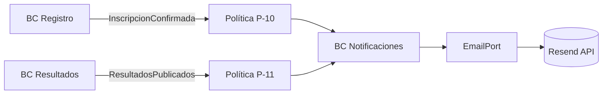
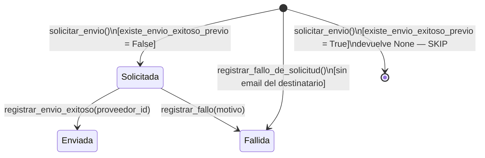
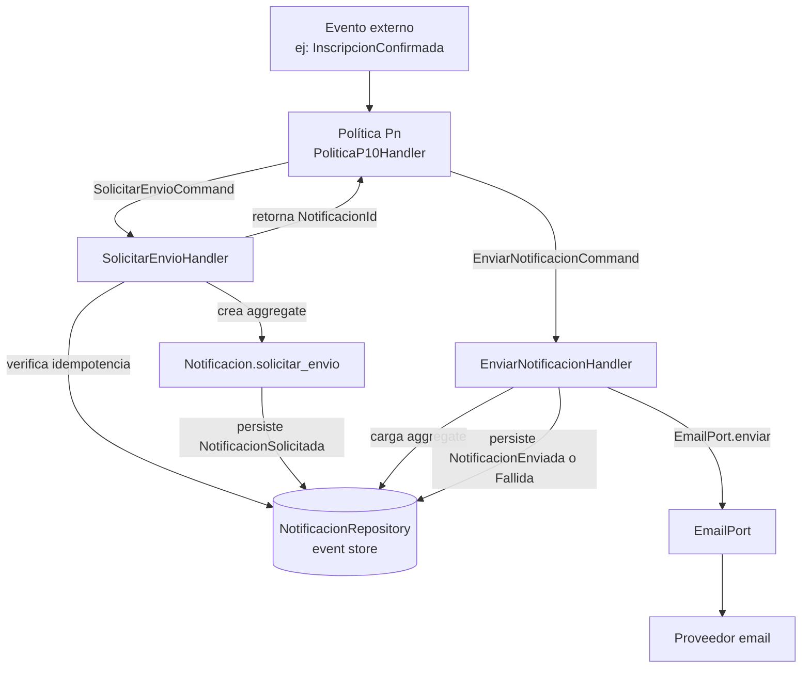
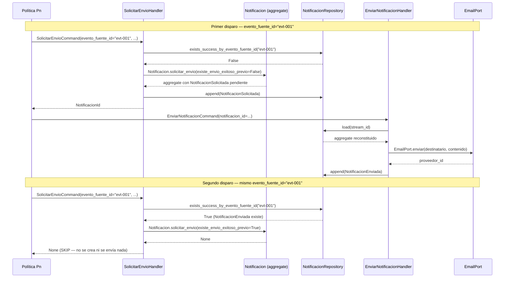

# Arquitectura del BC Notificaciones

**Versión:** 1.0 — INC-4.5 (2026-04-16)
**Aplica a:** `src/notificaciones/`
**ADRs relacionados:** ADR-016 (Resend), ADR-017 (ES en BC genérico), ADR-001 (ES en Competencia), ADR-008 (event store SQLite)

---

## 1. Rol del BC Notificaciones en el sistema

Notificaciones es un **BC genérico**: no contiene lógica de negocio del dominio de apnea.
Su responsabilidad única es garantizar que cada notificación se envía exactamente una vez.

En el Context Map (ADR-005), Notificaciones es un consumidor downstream:



Las políticas viven en la capa `application/` de Notificaciones y actúan como ACL
(Anti-Corruption Layer): traducen eventos de otros BCs al lenguaje del BC Notificaciones.

---

## 2. Modelo de dominio del BC

### Aggregate: Notificacion



### Eventos de dominio

| Evento | Cuándo se emite | Campos clave |
|--------|----------------|--------------|
| `NotificacionSolicitada` | Al crear el aggregate con éxito | `evento_fuente_id`, `destinatario_email`, `asunto`, `canal` |
| `NotificacionEnviada` | Tras envío exitoso al proveedor | `evento_fuente_id`, `proveedor_id`, `enviada_en` |
| `NotificacionFallida` | Ante error de envío o destinatario sin email | `evento_fuente_id`, `motivo`, `fallida_en` |

### Invariante de idempotencia (INV-4.5.1-01)

> Si existe `NotificacionEnviada` para un `evento_fuente_id` dado en el event store,
> `solicitar_envio()` devuelve `None` y no emite ningún evento.

El `evento_fuente_id` es el ID del evento de dominio externo que disparó la política
(ej. el ID del evento `InscripcionConfirmada`). Es la clave de deduplicación.

---

## 3. Patrón de políticas

Las políticas conectan eventos de otros BCs con el BC Notificaciones. El patrón es
siempre el mismo:



### Políticas implementadas

| Política | Evento disparador | Destinatario | Plantilla |
|----------|-------------------|-------------|-----------|
| **P-10** | `InscripcionConfirmada` (BC Registro) | Atleta | `InscripcionConfirmadaTemplate` |
| **P-11** | `ResultadosPublicados` (BC Resultados) | Todos los atletas de la disciplina (uno por atleta) | `ResultadosPublicadosTemplate` |

### Cómo agregar una nueva política

1. Crear `src/notificaciones/application/policies/politica_pNN.py` siguiendo el patrón de `politica_p10.py`
2. Definir el dataclass del evento externo (ACL)
3. Crear la plantilla en `infrastructure/templates/` si aplica
4. Registrar la política en `src/app.py` como dependencia inyectada en el router correspondiente

El BC Notificaciones no necesita cambios: solo cambia la capa `application/policies/`.

---

## 4. Garantía exactly-once — flujo de secuencia



---

## 5. Adaptadores de email y configuración

### Puerto: `EmailPort`

```python
# src/notificaciones/domain/ports/email_port.py
class EmailPort(Protocol):
    async def enviar(self, destinatario: Destinatario, contenido: ContenidoEmail) -> str | None: ...
```

El puerto retorna el `proveedor_id` (ID de mensaje del proveedor) o `None`. Este ID
queda registrado en `NotificacionEnviada.proveedor_id` para trazabilidad.

### Adaptadores disponibles

| Adaptador | Cuándo se usa | Comportamiento |
|-----------|--------------|----------------|
| `ResendEmailAdapter` | Producción / CI con API key | Llama a `POST https://api.resend.com/emails` — retorna el ID del mensaje Resend |
| `LoggingEmailAdapter` | Desarrollo local sin API key | Registra el email en el log de la aplicación — no envía nada real |

### Selección automática en `app.py`

```python
# Pseudocódigo del cableado en src/app.py
if RESEND_API_KEY:
    email_adapter = ResendEmailAdapter(api_key=RESEND_API_KEY, from_email=EMAIL_FROM)
else:
    email_adapter = LoggingEmailAdapter()
```

### Variables de entorno

| Variable | Requerida | Descripción |
|----------|:---------:|-------------|
| `RESEND_API_KEY` | En producción | API key de Resend |
| `NOTIFICACIONES_EMAIL_FROM` | En producción | Dirección remitente (ej. `noreply@ataraxiadive.com`) |
| `RESEND_BASE_URL` | No | Override de la base URL (default: `https://api.resend.com`) |

En desarrollo con `onboarding@resend.dev` como `EMAIL_FROM`, Resend no requiere
verificación de dominio propio (sandbox).

---

## 6. Límites del diseño

| Aspecto | Estado SP4 | Evolución SP5 |
|---------|-----------|--------------|
| Canales soportados | Solo email (`CanalEnvio.EMAIL`) | Agregar `CanalEnvio.PUSH` / `SMS` con nuevos adaptadores |
| Bus de eventos | In-process síncrono — las políticas se llaman directamente desde los endpoints de otros BCs en `app.py` | Bus asíncrono (ej. Redis Streams) para desacoplar emisor y consumidor |
| Durabilidad del evento fuente | Si el proceso cae entre el comando del BC origen y el dispatch de la política, el email no se envía | Outbox pattern: persistir el evento en la misma transacción que el comando origen |
| Reintentos de envío | No hay reintentos automáticos si `EmailPort.enviar()` falla — la notificación queda en `Fallida` | Retry con backoff en `EnviarNotificacionHandler` |

---

## 7. Evolución futura (SP5)

- **Nuevos canales:** crear `PushEmailAdapter` o `SmsEmailAdapter` implementando el puerto correspondiente. El aggregate soporta cualquier `CanalEnvio` sin cambios.
- **Bus asíncrono:** extraer el dispatch de políticas de `app.py` a un consumer de eventos. La lógica de idempotencia del aggregate no cambia — solo cambia el punto de entrada.
- **Outbox pattern:** persistir el evento junto al aggregate origen en la misma transacción SQLite para garantizar que el evento no se pierde ante caída del proceso.
- **Dashboard de notificaciones:** el event store ya tiene todos los datos necesarios para un panel de estado de notificaciones por atleta / torneo.

---

## Referencias

- [ADR-016](../adr/ADR-016-resend-email-provider.md) — Decisión Resend como proveedor de email
- [ADR-017](../adr/ADR-017-notificaciones-event-sourcing.md) — Event Sourcing en BC genérico para idempotencia
- [ADR-001](../adr/ADR-001-event-sourcing-competencia.md) — Event Sourcing en BC Competencia (contraste)
- [ADR-008](../adr/ADR-008-sqlite-event-store.md) — Event store SQLite (infraestructura compartida)
- `src/notificaciones/domain/aggregates/notificacion.py` — Aggregate raíz
- `src/notificaciones/application/policies/` — P-10 y P-11
- `src/notificaciones/infrastructure/email/` — Adaptadores de email
- US-4.5.1 (aggregate), US-4.5.2 (adaptador email), US-4.5.3 (P-10), US-4.5.4 (P-11), US-4.5.5 (cableado)
