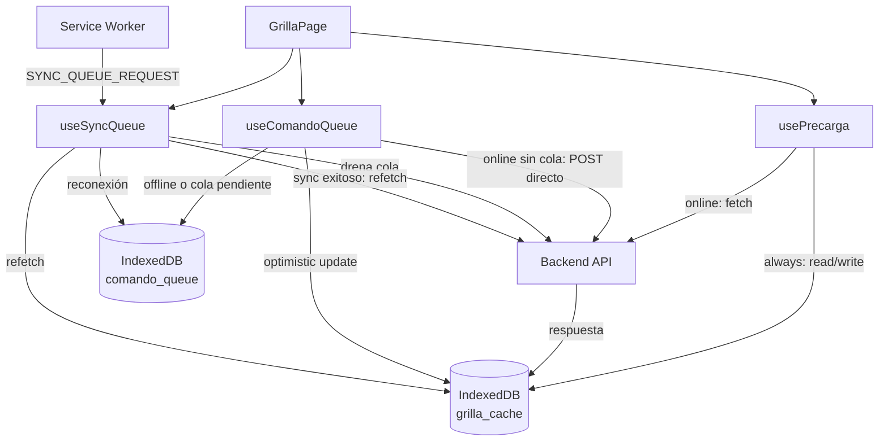
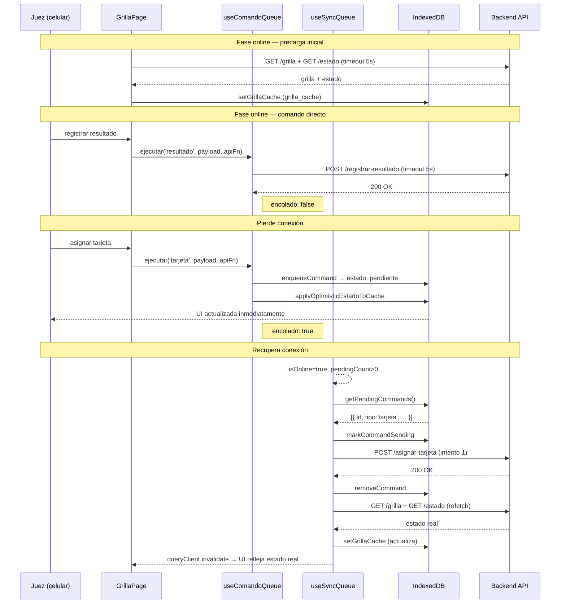
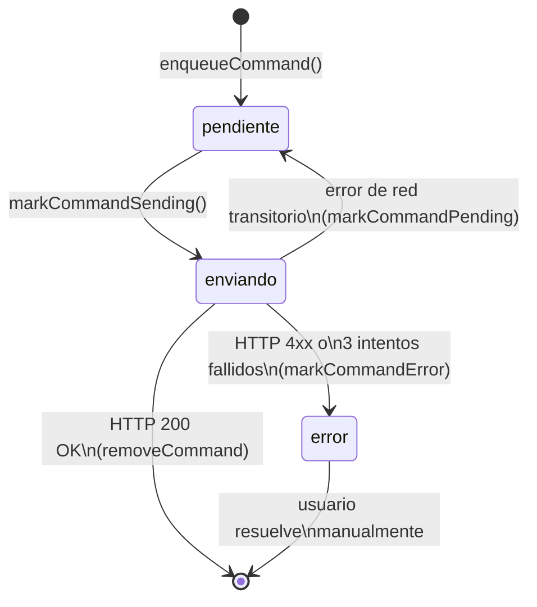

# Arquitectura Offline-First — Interfaz del Juez

**Versión:** 1.0 — INC-4.4 (2026-04-16)
**Aplica a:** `frontend/src/hooks/`, `frontend/src/db/`
**ADRs relacionados:** ADR-003 (decisión PWA), ADR-015 (Dexie.js)

---

## 1. Problema y decisión estratégica

Los torneos de apnea se realizan en piletas cubiertas o al aire libre. La conectividad
WiFi o celular es frecuentemente inestable o inexistente. El juez opera desde su celular
durante la competencia y no puede detenerse cuando se corta la señal.

El atributo de calidad **AC-DS-03** establece que la interfaz del juez debe funcionar
sin conexión a internet. La pérdida de datos de performance durante la competencia
es inaceptable.

La decisión estratégica fue adoptar **PWA con Service Worker + IndexedDB** en lugar
de una app nativa. Ver ADR-003 para el análisis de opciones y trade-offs.

---

## 2. Arquitectura del frontend offline

### Componentes y flujo de datos



### Ciclo completo: online → offline → reconexión → sync



---

## 3. Cola de comandos — protocolo

### Tabla IndexedDB: `comando_queue`

| Campo | Tipo | Descripción |
|-------|------|-------------|
| `id` | `number` (PK autoincrement) | Identificador local |
| `tipo` | `string` | Tipo de comando: `llamar` \| `resultado` \| `tarjeta` \| `dns` \| `resolver_revision` |
| `competencia_id` | `string` | ID de la competencia activa |
| `payload` | `string` (JSON) | Cuerpo del request serializado |
| `estado` | `string` | Estado del ciclo de vida (ver abajo) |
| `creado_at` | `number` | Timestamp de creación (ms epoch) |
| `intentos` | `number` | Acumulado de intentos realizados |
| `error_mensaje` | `string?` | Mensaje del último error (si aplica) |

### Estados del ciclo de vida



### Política de reintentos

- **Máximo 3 intentos** por comando dentro de cada ciclo de sync
- **Backoff exponencial:** espera 1s, 2s, 4s entre intentos
- **Error de red transitorio** (timeout, abort, sin ruta): el comando vuelve a `pendiente` para reintentar al próximo ciclo de sync — no cuenta como error permanente
- **Error HTTP 4xx o 3 intentos fallidos:** el comando pasa a estado `error`
- **En estado `error`:** el juez ve una alerta en la UI. El comando no se reintenta automáticamente. Requiere resolución manual o recarga de la página.

### Cuándo se encola vs. se envía directo

`useComandoQueue.ejecutar()` aplica la siguiente lógica antes de intentar el POST directo:

```
mustQueue = !isOnline OR pendingCount > 0 OR errorCount > 0
           OR persistedPending > 0 OR persistedErrors > 0
```

Si hay cola pendiente (aun estando online), los nuevos comandos se encolan para preservar
el orden causal de las operaciones. Un juez que volvió de offline no puede mezclar
comandos directos con comandos en cola.

---

## 4. Precarga y caché de grilla

### Tabla IndexedDB: `grilla_cache`

| Campo | Tipo | Descripción |
|-------|------|-------------|
| `id` | `number` (PK autoincrement) | — |
| `competencia_id` | `string` | — |
| `disciplina` | `string` | — |
| `grilla` | `GrillaAtletaDto[]` | Snapshot completo de la grilla |
| `estado` | `EstadoCompetenciaDto` | Estado de la competencia |
| `cached_at` | `number` | Timestamp del último fetch exitoso (ms epoch) |

### Estrategia de `usePrecarga`

1. **Online:** intenta fetch del servidor (timeout 5s). Si falla, cae al caché.
2. **Offline:** lee directamente del caché. Si no hay caché, lanza `NO_CACHE_OFFLINE`.
3. **TTL de caché:** 24 horas. Si `cached_at` supera el TTL, `isCacheExpired=true` — la UI muestra advertencia pero no bloquea.
4. **Actualización post-sync:** `useSyncQueue` escribe la grilla actualizada al caché y notifica a React Query (`queryClient.setQueryData`) para actualizar la UI sin un nuevo fetch.

---

## 5. Estrategia de conflictos

### Diseño actual

El dominio garantiza la ausencia de conflictos concurrentes por diseño: **cada atleta
es operado por un único juez**. No existe el caso de dos jueces editando el mismo
atleta simultáneamente.

Si por algún motivo dos comandos llegan al backend para el mismo atleta en el mismo
estado (ej. dos llamadas offline que se sincronizan en orden), el aggregate `Performance`
rechaza el segundo comando mediante sus invariantes de estado (`INV-P-*`). El backend
devuelve HTTP 422 o 409.

El comando rechazado pasa a estado `error` en la cola. El juez ve una alerta con el
mensaje devuelto por el backend.

### Evolución futura (SP5)

Si se requiere operación multi-juez concurrente sobre el mismo atleta, evaluar:
- **CRDT** (Conflict-free Replicated Data Types) para merge automático de estados
- **Timestamps lógicos** (Lamport o vector clocks) para ordenamiento causal

---

## 6. Restricciones de plataforma

### Safari / iOS

El Service Worker en Safari tiene restricciones:
- **Background Sync API** no disponible en iOS hasta Safari 17+ y solo parcialmente
- **Mitigación implementada:** `useSyncQueue` intenta registrar Background Sync pero captura el error silenciosamente. La sincronización se dispara igualmente por el listener reactivo `isOnline + pendingCount > 0` dentro del hook.
- El juez en iOS ve el mismo indicador de comandos pendientes y puede sincronizar manualmente recargando la página o esperando a que el hook detecte la reconexión.

### Chrome / Android

Comportamiento nominal. Background Sync API disponible. El Service Worker envía
`SYNC_QUEUE_REQUEST` al hook para disparar el drenado de la cola.

---

## 7. Límites del diseño — qué NO opera offline

| Funcionalidad | ¿Offline? | Motivo |
|--------------|:---------:|--------|
| Interfaz del juez (grilla, comandos) | ✅ Sí | Diseñado para offline en INC-4.4 |
| Pantallas del organizador | ❌ No | Requiere estado en tiempo real del backend |
| Pantalla de auditoría (INC-4.6) | ❌ No | Datos de audit log solo en backend |
| Exportación CSV/JSON (INC-4.6) | ❌ No | Generada server-side |
| Notificaciones email (INC-4.5) | ❌ No | Dispatch exclusivamente server-side |
| Login / autenticación | ❌ No | Requiere validación JWT contra backend |

El token JWT almacenado en memoria permite que la sesión del juez ya autenticado
sobreviva una desconexión dentro de la misma pestaña. Si el juez cierra el navegador
offline, deberá autenticarse al reconectar.

---

## 8. Evolución futura (SP5)

- **Service Worker más sofisticado:** actualmente el SW solo gestiona el canal de
  mensajes para disparar sync. En SP5, evaluar cache de assets estáticos (precaching
  del bundle) para permitir uso offline desde una recarga de página completa.
- **Multi-juez concurrente:** si el dominio evoluciona hacia grillas con múltiples
  jueces por atleta, revisar el modelo de conflictos (sección 5).
- **Persistencia cross-sesión del token:** evaluar almacenamiento seguro del JWT
  (ej. HttpOnly cookie) para sobrevivir recargas sin reautenticación.

---

## Referencias

- [ADR-003](../adr/ADR-003-offline-first-pwa.md) — Decisión estratégica PWA + Service Worker + IndexedDB
- [ADR-015](../adr/ADR-015-dexie-indexeddb-frontend.md) — Adopción de Dexie.js como capa de acceso a IndexedDB
- `frontend/src/hooks/usePrecarga.ts` — Precarga y caché de grilla
- `frontend/src/hooks/useComandoQueue.ts` — Cola de comandos con optimistic updates
- `frontend/src/hooks/useSyncQueue.ts` — Drenado de cola y Background Sync
- `frontend/src/db/schema.ts` — Esquema de tablas IndexedDB
- AC-DS-03 — Atributo de calidad: operación sin conexión
