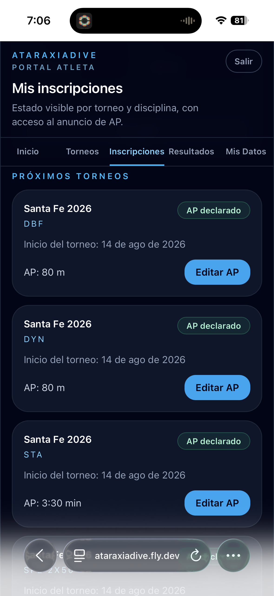
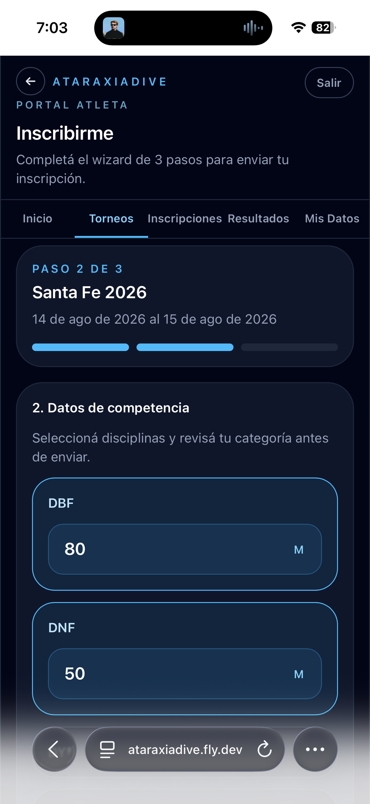
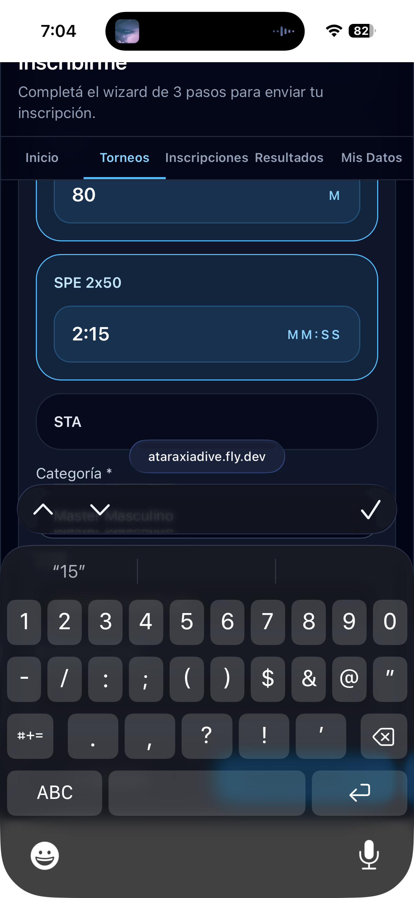

# Declarar o editar mi AP

La AP (Announced Performance) se declara en el **Paso 2 del wizard de inscripción**. Una vez inscripto, podés editarla desde la pestaña **Inscripciones** mientras el torneo esté en **Inscripción abierta** o **Preparación**.

## Editar AP desde Mis Inscripciones

En la pestaña **Inscripciones**, la sección **Próximos torneos** muestra cada disciplina con su AP declarada y el botón **Editar AP**:

Al tocar **Editar AP** se abre el mismo formulario del Paso 2 del wizard:

Modificá la marca de la disciplina que querés cambiar y guardá.

## Formato de la AP

| Disciplina | Formato | Ejemplo |
|------------|---------|---------|
| DBF, DNF, DYN, CWT | Metros | `80`, `52.5` |
| STA, SPE | Minutos:segundos | `3:30`, `2:15` |

!!! info "AP cerrada al iniciar ejecución"
    Una vez que el torneo pasa a **Ejecución**, la AP queda cerrada y no se puede modificar.
