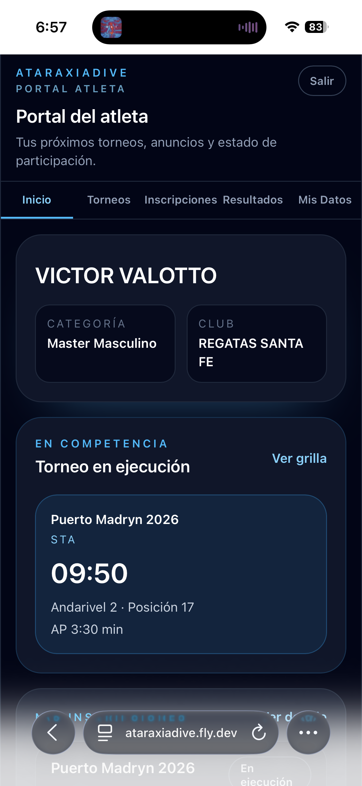
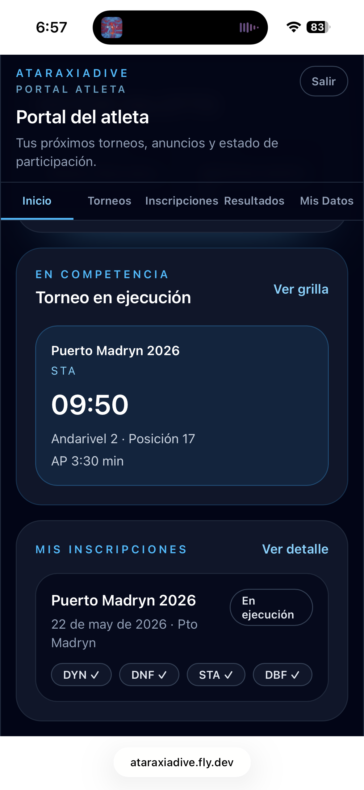

# Inicio

La pestaña **Inicio** es el dashboard principal del portal atleta. Muestra de un vistazo tu perfil, el próximo OT si hay un torneo en ejecución y un resumen de tus inscripciones activas.

## Tu perfil

El panel superior muestra tu nombre, categoría y club. Si estos datos no están completos, podés actualizarlos desde **Mis Datos**.

## En competencia

Cuando hay un torneo en ejecución con tu grilla publicada, aparece la card **En competencia** con:

- Nombre del torneo y disciplina
- Tu OT (Official Top) en formato destacado
- Andarivel y posición en la grilla
- Tu AP declarada

Tocá **Ver grilla** para ir directamente a la grilla completa de esa disciplina.

## Mis inscripciones

El panel inferior muestra los torneos en los que estás inscripto, con sus disciplinas y el estado de cada una:

- Las disciplinas con AP declarada muestran el check ✓
- Las disciplinas sin AP muestran "Sin AP"
- Tocá el torneo para ir al detalle
