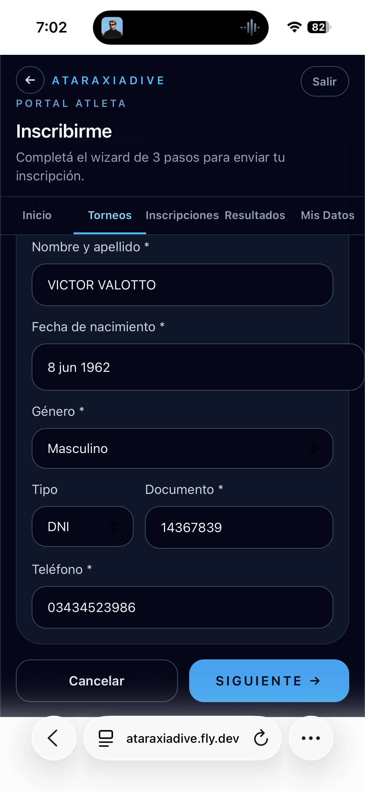
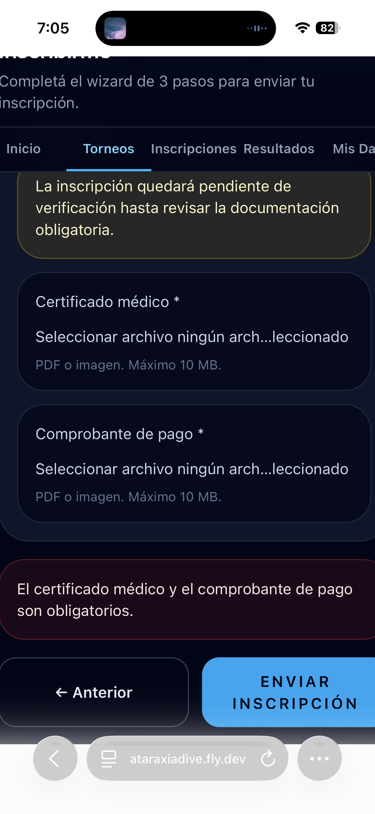
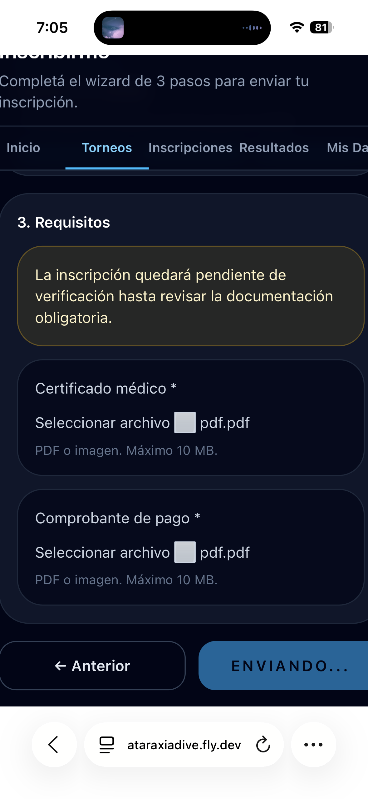
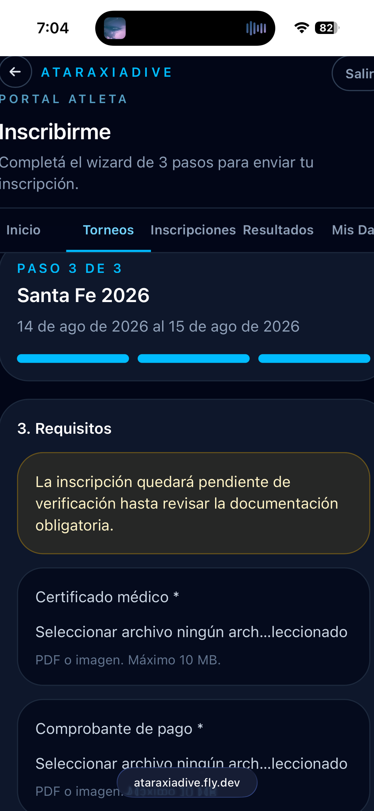

# Inscribirse a un torneo

La inscripción se realiza desde el **detalle del torneo** tocando **Inscribirme en este torneo**. El wizard tiene 3 pasos.

## Paso 1 — Datos personales

El primer paso verifica tus datos personales. Los campos se precargan desde tu perfil si ya los completaste:

| Campo | Descripción |
|-------|-------------|
| **Nombre y apellido** | Se precarga desde tu perfil |
| **Fecha de nacimiento** | Determina tu categoría etaria |
| **Género** | Masculino o Femenino |
| **Tipo y Documento** | DNI u otro documento |
| **Teléfono** | Contacto de emergencia |

Presioná **Siguiente** para avanzar.

## Paso 2 — Datos de competencia

El segundo paso muestra las disciplinas del torneo. Para cada disciplina ingresás tu **AP (Announced Performance)**:

- **Disciplinas de distancia** (DBF, DNF, DYN, CWT): metros con decimales
- **Disciplinas de tiempo** (STA, SPE): formato mm:ss

También seleccionás tu **categoría** (Junior, Senior, Master). Si ya está configurada en tu perfil, se precarga automáticamente.

## Paso 3 — Requisitos y adjuntos

El tercer paso requiere subir los documentos obligatorios:

| Documento | Formato |
|-----------|---------|
| **Certificado médico** | PDF o imagen · máximo 10 MB |
| **Comprobante de pago** | PDF o imagen · máximo 10 MB |

Subí ambos archivos y presioná **Enviar inscripción**.

!!! warning "Inscripción pendiente de verificación"
    Al enviar, el estado queda como **Pendiente** hasta que el organizador revise y apruebe la documentación. No es una inscripción confirmada hasta ese momento.
