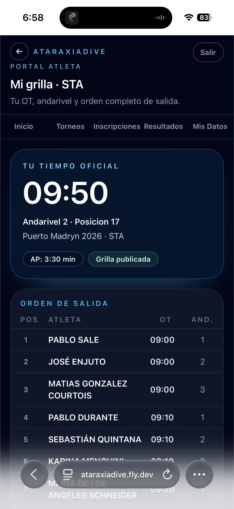
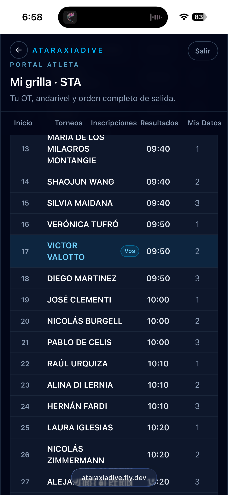

# Ver mi grilla

La página **Mi grilla** muestra tu posición en el orden de salida de una disciplina, con tu OT destacado y la tabla completa de todos los atletas.

Se accede desde **Inscripciones → Ver grilla** o desde el link **Ver grilla** en la card de Inicio.

## Tu tiempo oficial

El panel superior muestra tu información de salida:

| Dato | Descripción |
|------|-------------|
| **OT** | Tu Official Top — la hora exacta en que debés estar listo |
| **Andarivel** | El andarivel asignado |
| **Posición** | Tu número de salida en la grilla |
| **AP** | Tu Announced Performance |
| **Grilla publicada** | Badge que confirma que la grilla está confirmada |

## Orden de salida

Debajo del panel aparece la tabla completa con todos los atletas de la disciplina. Tu fila está resaltada en cyan con el badge **Vos**:

La tabla muestra posición, nombre del atleta, OT y andarivel de cada participante.
