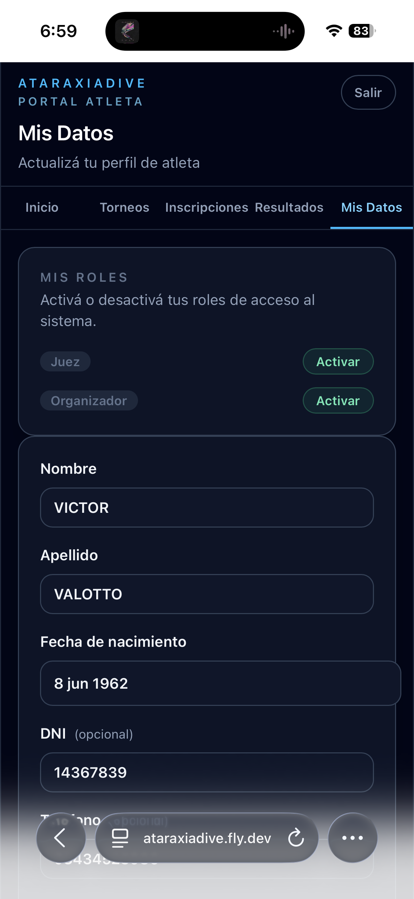
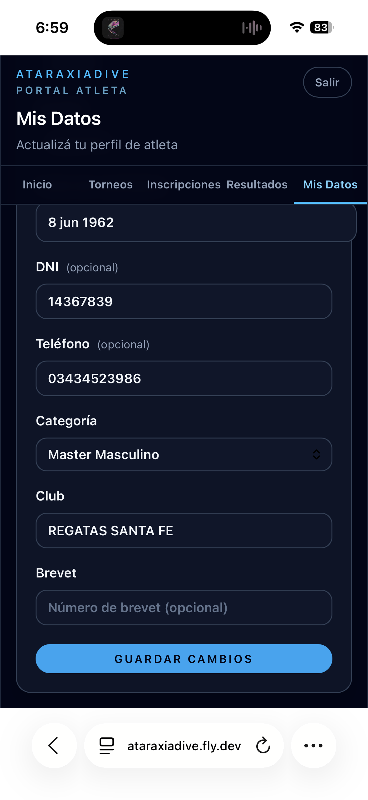

# Mis datos (Atleta)

La pestaña **Mis Datos** permite actualizar tu perfil de atleta y gestionar los roles activos en tu cuenta.

## Gestión de roles

La sección **Mis Roles** permite activar roles adicionales (Juez, Organizador):

- Botón **Activar** → el rol está inactivo
- Botón **Desactivar** → el rol está activo

!!! warning "No podés desactivar tu único rol activo"
    Si solo tenés el rol Atleta activo, el sistema no te permite desactivarlo.

## Perfil de atleta

| Campo | Obligatorio | Descripción |
|-------|:-----------:|-------------|
| **Nombre** | ✓ | Tu nombre |
| **Apellido** | ✓ | Tu apellido |
| **Fecha de nacimiento** | ✓ | Determina tu categoría etaria |
| **DNI** | — | Documento nacional de identidad |
| **Teléfono** | — | Contacto de emergencia |
| **Categoría** | ✓ | Junior / Senior / Master (según edad) |
| **Club** | — | Club o institución a la que pertenecés |
| **Brevet** | — | Número de brevet de apnea |

Presioná **Guardar cambios** para actualizar el perfil.

!!! tip "Completá el perfil antes de inscribirte"
    Si completás el perfil primero, el wizard de inscripción precarga automáticamente nombre, documento, teléfono, fecha de nacimiento y categoría.
