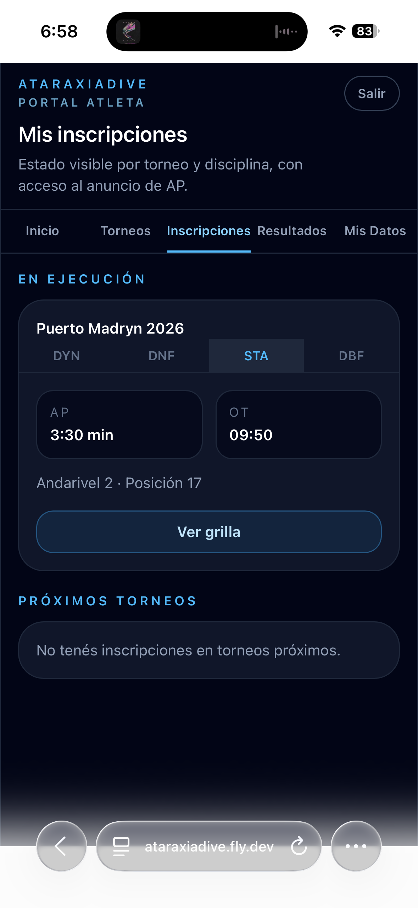

# Mis inscripciones

La pestaña **Inscripciones** muestra el estado de todas tus inscripciones activas, organizadas por momento del torneo.

## En ejecución

Cuando un torneo está en ejecución, tus disciplinas aparecen en la sección **En ejecución** con pestañas por disciplina:

Cada pestaña muestra:

| Dato | Descripción |
|------|-------------|
| **AP** | Tu Announced Performance declarada |
| **OT** | Tu Official Top (hora de salida) |
| **Andarivel** | El andarivel asignado |
| **Posición** | Tu posición en la grilla |

Tocá **Ver grilla** para ir a la grilla completa de esa disciplina.

## Próximos torneos

La sección **Próximos torneos** muestra tus inscripciones en torneos con inscripción abierta o en preparación. Para cada disciplina podés ver la AP declarada y editarla:

El badge **AP declarado** confirma que ya ingresaste tu marca para esa disciplina. Tocá **Editar AP** para modificarla.
