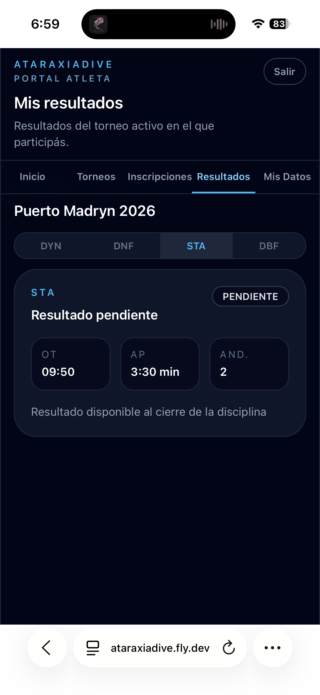
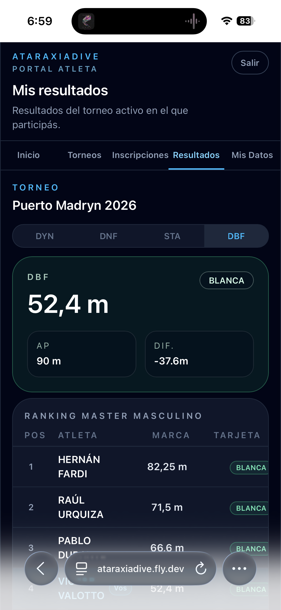
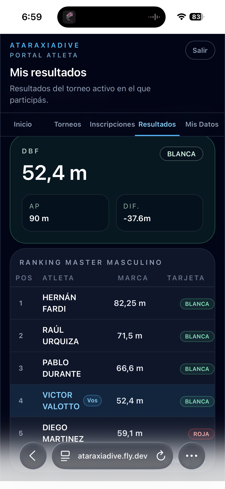

# Mis resultados

La pestaña **Resultados** muestra tu resultado por disciplina y el ranking de tu categoría.

## Resultado pendiente

Mientras la disciplina está en ejecución, el resultado aparece como **Pendiente**:

El resultado estará disponible al cierre de la disciplina.

## Resultado final

Una vez cerrada la disciplina, tu resultado muestra tarjeta, marca y diferencia respecto a tu AP:

| Dato | Descripción |
|------|-------------|
| **Tarjeta** | BLANCA, BLANCA CON PENALIZACIONES o ROJA |
| **Marca** | Tu Realized Performance (RP) registrada por el juez |
| **AP** | Tu Announced Performance declarada |
| **DIF** | Diferencia entre AP y RP |

## Ranking de categoría

Debajo de tu resultado aparece el ranking completo de tu categoría y género. Tu fila está marcada con el badge **Vos**:

Usá las pestañas en la parte superior para navegar entre las disciplinas del torneo.
