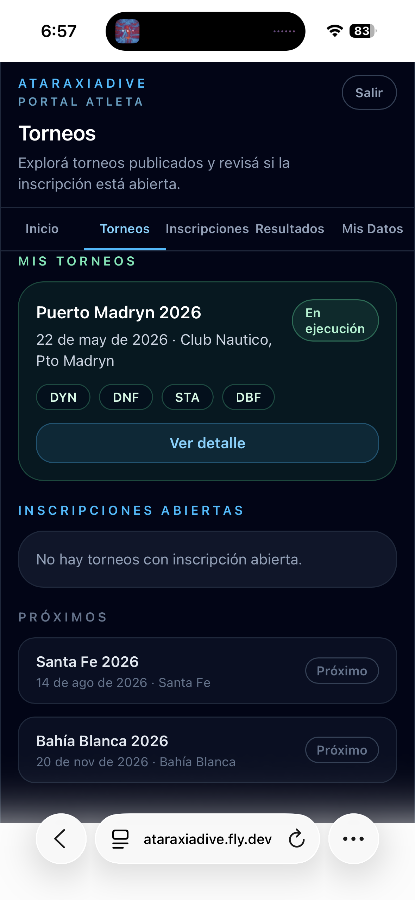
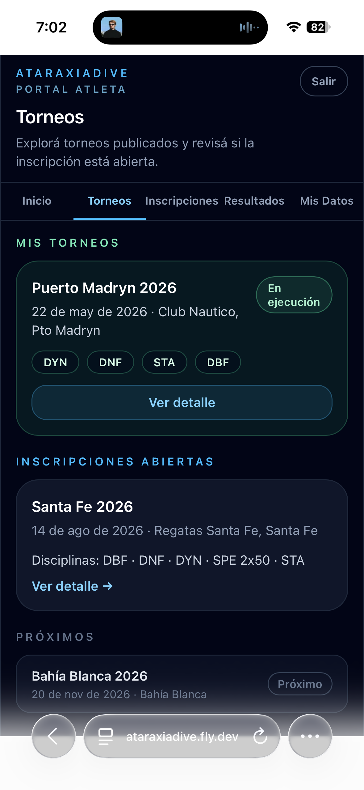
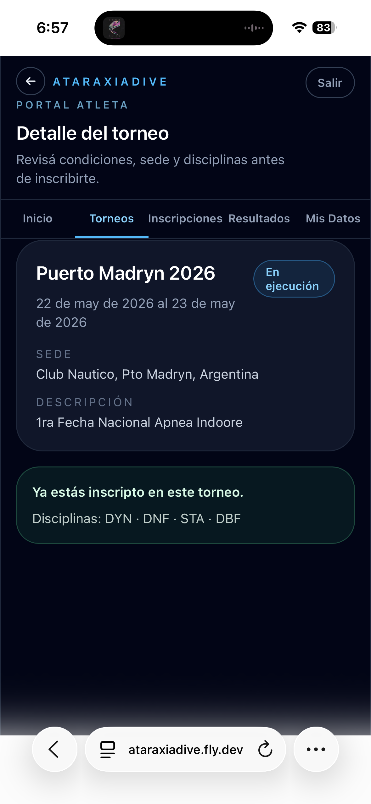
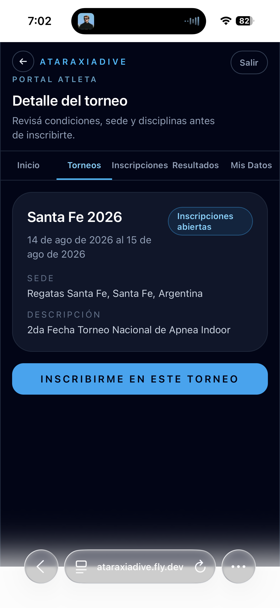

# Torneos

La pestaña **Torneos** muestra todos los torneos publicados organizados por estado, y permite acceder al detalle de cada uno para inscribirse.

## Lista de torneos

| Sección | Descripción |
|---------|-------------|
| **Mis torneos** | Torneos en ejecución o premiación donde estás inscripto (fondo verde) |
| **Inscripciones abiertas** | Torneos disponibles para inscribirse |
| **Próximos** | Torneos publicados con inscripción aún no abierta |
| **Historial** | Torneos cerrados en los que participaste |

Cuando se abren nuevas inscripciones, los torneos aparecen en la sección **Inscripciones abiertas**:

## Detalle del torneo

Al tocar cualquier torneo entrás al detalle, que muestra nombre, fechas, sede y descripción.

**Si ya estás inscripto**, el detalle confirma tus disciplinas:

**Si las inscripciones están abiertas**, aparece el botón para inscribirse:

