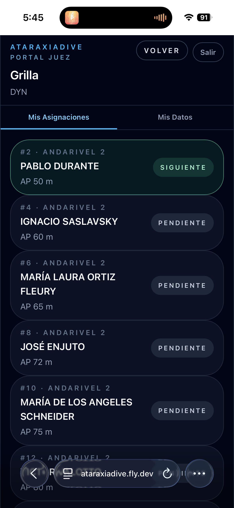
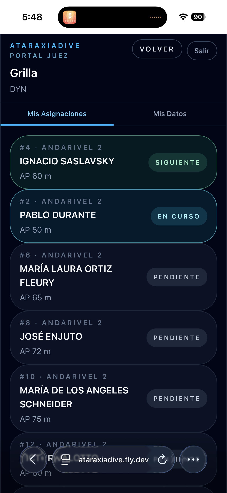
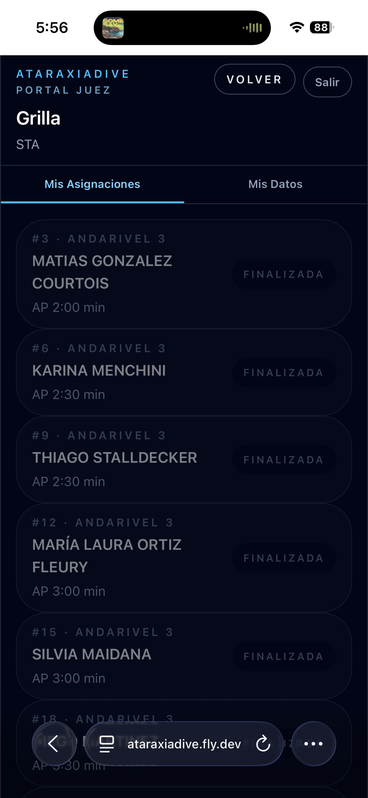
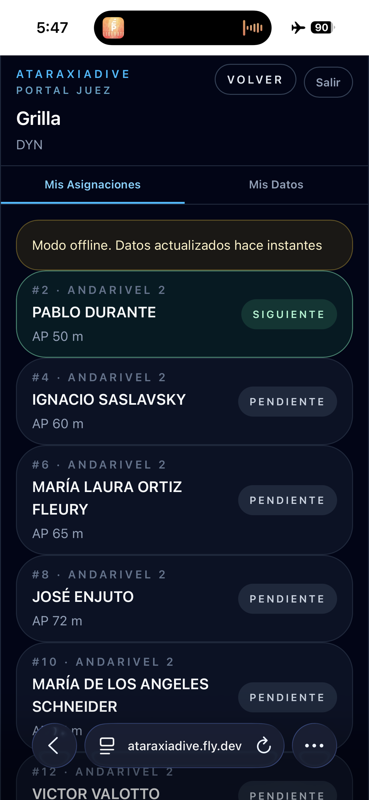

# Ver la grilla

La **Grilla** muestra los atletas asignados al juez en la disciplina seleccionada, ordenados dinámicamente según el estado de cada performance.

## La lista de atletas

Cada fila muestra la posición, andarivel, nombre del atleta, AP declarada y el estado actual:

| Columna | Descripción |
|---------|-------------|
| **Posición · andarivel** | Orden en la grilla y andarivel asignado |
| **Nombre** | Apellido y nombre del atleta |
| **AP** | Announced Performance declarada |
| **Estado** | Estado actual de la performance |

## Estados

La grilla se reordena automáticamente a medida que avanza la competencia:

| Estado | Color | Descripción |
|--------|-------|-------------|
| **Siguiente** | Verde | El próximo atleta en salir |
| **En curso** | Cyan | Performance actualmente en ejecución |
| **Revisión** | Ámbar | Tarjeta amarilla pendiente de resolución |
| **Pendiente** | Gris | Aún no fue llamado |
| **Finalizada** | Gris atenuado | Performance completada o DNS |

## Seleccionar un atleta

Tocá cualquier fila para abrir el flujo de registro de performance. Los atletas en estado **Finalizada** no son seleccionables.

## Disciplina completada

Cuando todos los atletas finalizaron, la grilla los muestra todos en estado **Finalizada**:

## Modo offline

Si no hay conexión, la grilla se carga desde el cache local y aparece un aviso con la antigüedad de los datos:

!!! warning "Cache expirado"
    Si el cache tiene más de 24 horas, la aplicación lo indica. Conectate a internet para actualizar los datos antes de continuar.
