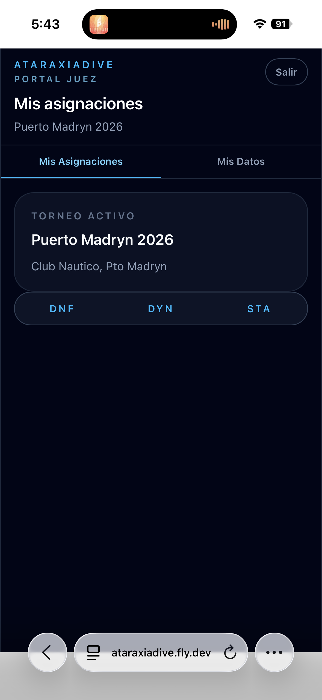

# Mis asignaciones

La pantalla **Mis Asignaciones** es la primera que ves al entrar al portal juez. Muestra el torneo activo y las disciplinas que tenés asignadas.

## Torneo activo

El panel superior muestra el nombre del torneo en curso y la sede. Si no hay torneo activo, aparece el mensaje *"No hay torneo en curso"*.

## Disciplinas asignadas

Las disciplinas aparecen como botones en la parte inferior del panel. Solo las disciplinas **activas** (en ejecución) son seleccionables — las demás aparecen en gris.

Al tocar una disciplina activa, entrás directamente a la **Grilla** de esa disciplina.

!!! info "Sin disciplinas asignadas"
    Si el organizador todavía no te asignó disciplinas, el panel muestra *"Sin disciplinas asignadas"*. Contactá al organizador del torneo.
