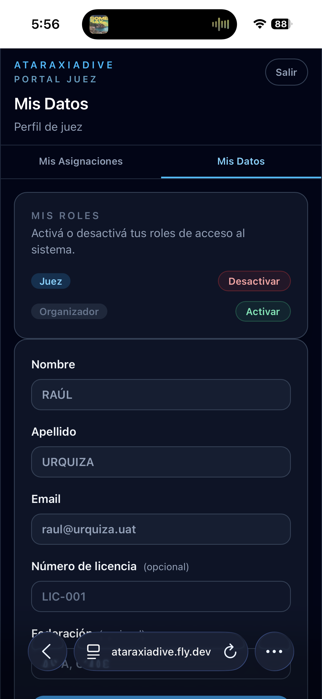
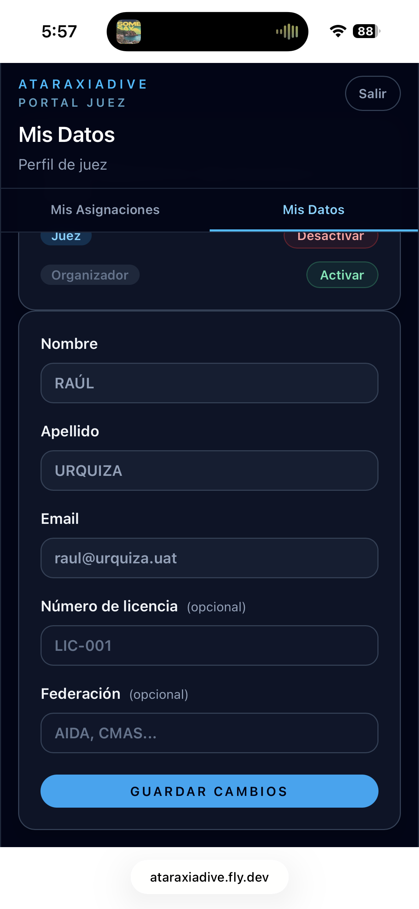

# Mis datos (Juez)

La sección **Mis Datos** permite configurar el perfil de juez y gestionar los roles activos en tu cuenta.

## Gestión de roles

La sección **Mis Roles** en la parte superior muestra todos los roles disponibles (Atleta, Juez, Organizador). Cada rol tiene un botón para activarlo o desactivarlo.

- Un rol con botón **Desactivar** está activo en tu cuenta
- Un rol con botón **Activar** está inactivo

!!! warning "No podés desactivar tu único rol activo"
    Si solo tenés un rol activo, el sistema no te permite desactivarlo. Activá otro rol antes de poder quitar el actual.

## Perfil de juez

Los campos del perfil son opcionales:

| Campo | Descripción |
|-------|-------------|
| **Nombre** | Tu nombre (solo lectura) |
| **Apellido** | Tu apellido (solo lectura) |
| **Email** | Tu correo de acceso (solo lectura) |
| **Número de licencia** | Tu licencia como juez — ej: "LIC-001" (opcional) |
| **Federación** | La federación a la que pertenecés — ej: "AIDA", "CMAS" (opcional) |

Presioná **Guardar cambios** para actualizar el perfil.

!!! tip "Activar el rol de Juez"
    Si entraste con otro rol y querés actuar como juez, activá el rol **Juez** desde esta sección y volvé a iniciar sesión para acceder al portal juez.
