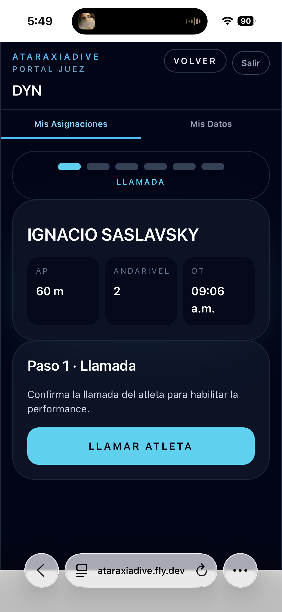
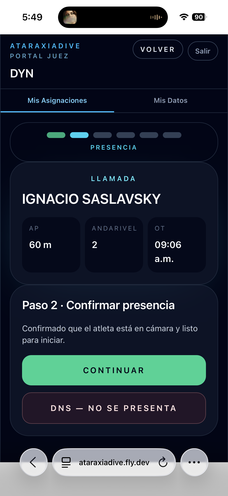
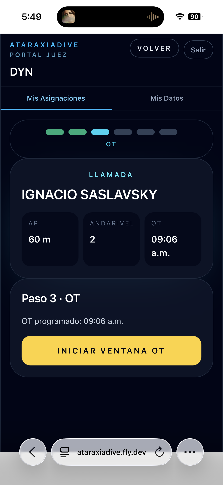
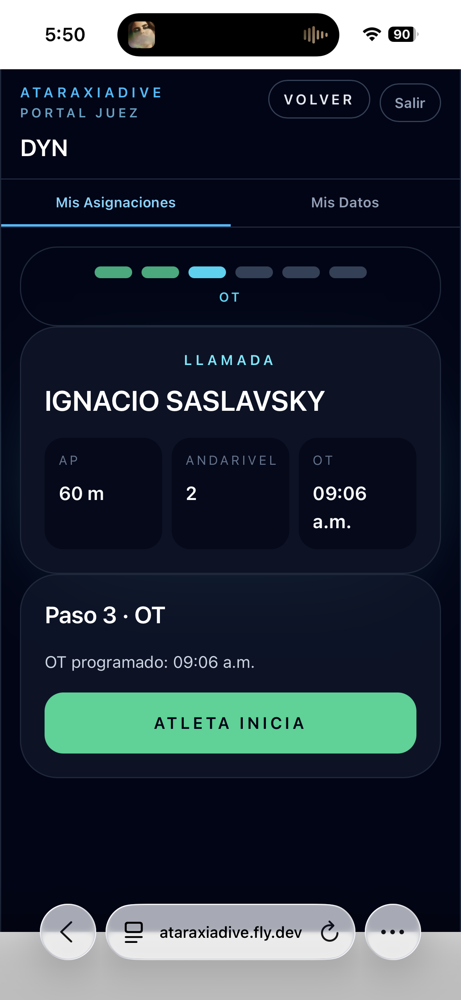
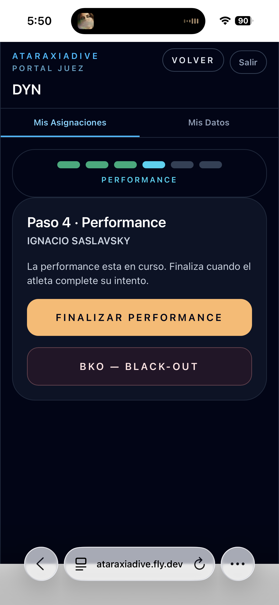
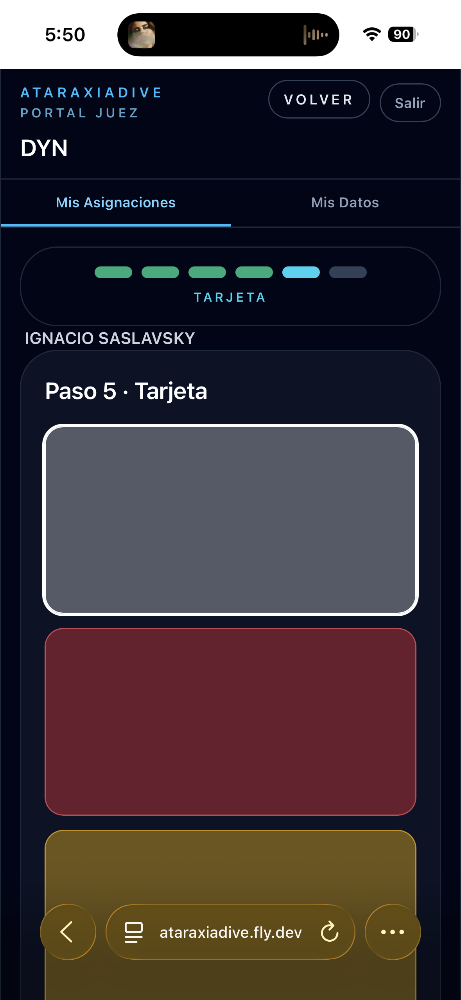
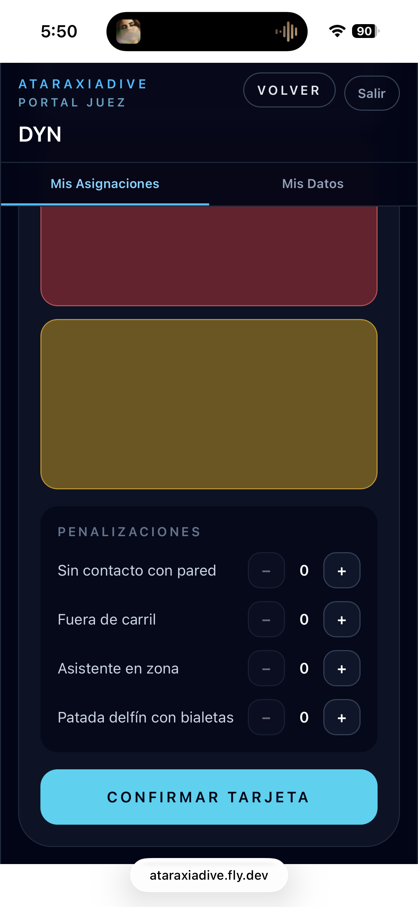
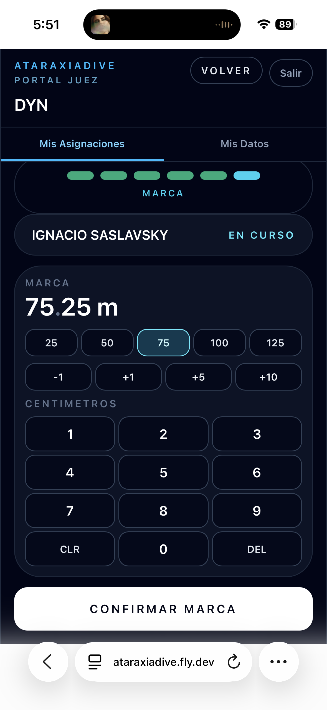
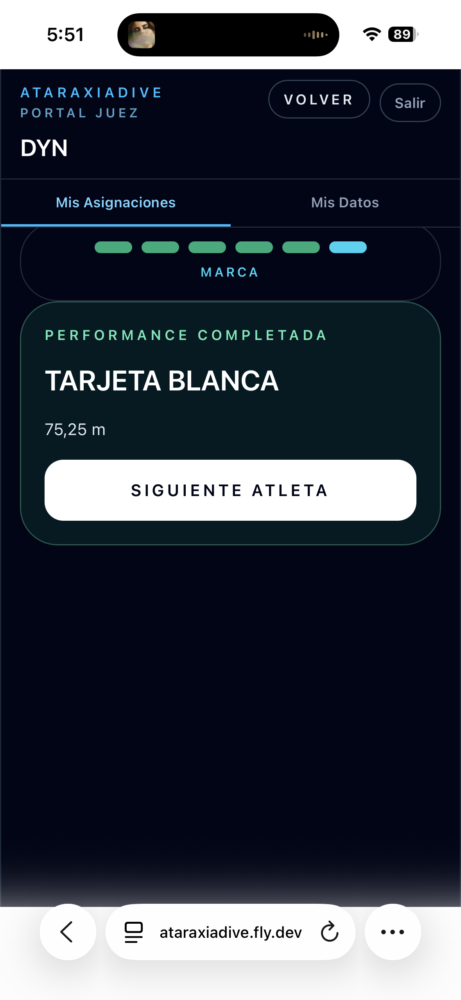

# Registrar una performance

El flujo de registro guía al juez paso a paso desde la llamada del atleta hasta la confirmación de la marca. El indicador en la parte superior muestra el paso actual.

Para los casos de **DNS**, **BKO**, **penalizaciones** y **tarjeta amarilla**, ver [Situaciones especiales](situaciones-especiales.md).

---

## Paso 1 — Llamada

Tocá el nombre del atleta en la grilla para abrir el flujo. La primera pantalla muestra los datos del atleta (AP, andarivel y OT programado) y el botón para confirmar la llamada.

Presioná **Llamar atleta** para habilitar la performance en el sistema.

---

## Paso 2 — Confirmar presencia

Verificá que el atleta está en cámara y listo para iniciar.

Presioná **Continuar** para avanzar al OT. Si el atleta no se presentó, ver [DNS](situaciones-especiales.md#dns).

---

## Paso 3 — OT

La pantalla muestra el OT programado del atleta. El flujo tiene dos momentos:

**Momento 1** — Abrí la ventana de 30 segundos presionando **Iniciar ventana OT**:

**Momento 2** — Cuando el atleta inicia la inmersión, presioná **Atleta inicia** (o *"Vías respiratorias en agua"* para STA):

---

## Paso 4 — Performance en curso

La performance está activa. Esperá a que el atleta complete su intento.

Presioná **Finalizar performance** cuando el atleta termine. Si ocurre un black-out, ver [BKO](situaciones-especiales.md#bko).

---

## Paso 5 — Asignar tarjeta

Seleccioná el resultado tocando una de las tres tarjetas:

| Tarjeta | Cuándo usarla |
|---------|---------------|
| **Blanca** (gris claro) | Performance válida sin infracciones |
| **Roja** (burdeos) | Descalificación — requiere seleccionar el motivo |
| **Amarilla** (dorado) | Resultado en revisión por el comité |

Para tarjeta blanca con infracciones técnicas, ver [Penalizaciones](situaciones-especiales.md#penalizaciones). Para tarjeta amarilla, ver [Tarjeta amarilla](situaciones-especiales.md#tarjeta-amarilla).

Una vez seleccionada la tarjeta, presioná **Confirmar tarjeta**:

---

## Paso 6 — Registrar la marca

Ingresá la Realized Performance medida usando el teclado numérico:

- **Metros y centímetros** para disciplinas de distancia (DNF, DYN, CWT, etc.)
- **Minutos y segundos** para apnea estática (STA)

Presioná **Confirmar marca** para cerrar la performance.

---

## Resultado

La pantalla muestra el resultado y la marca registrada:

Presioná **Siguiente atleta** para volver a la grilla y continuar con el próximo.
