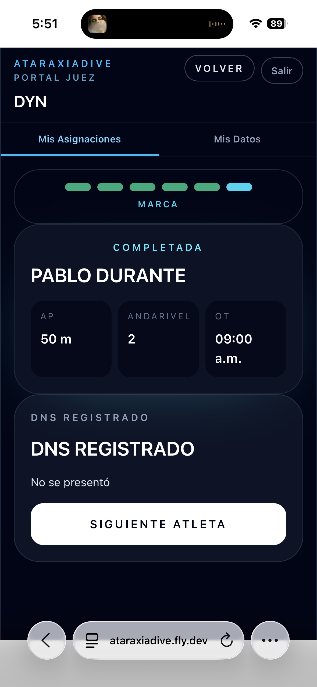
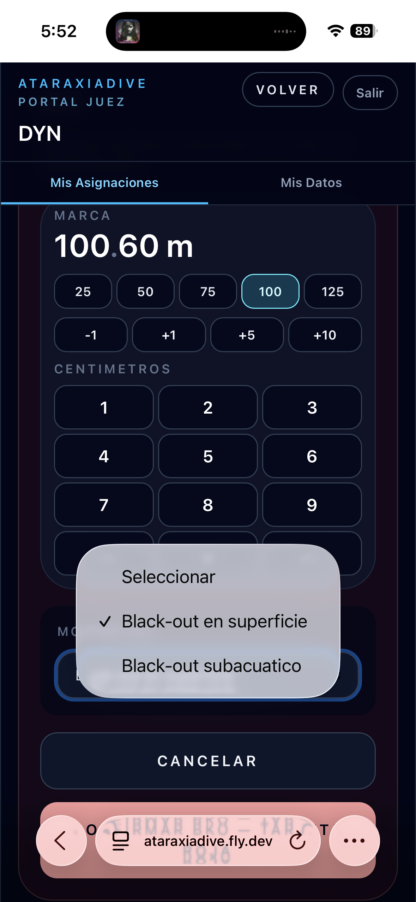
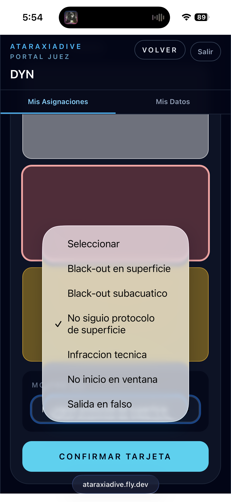
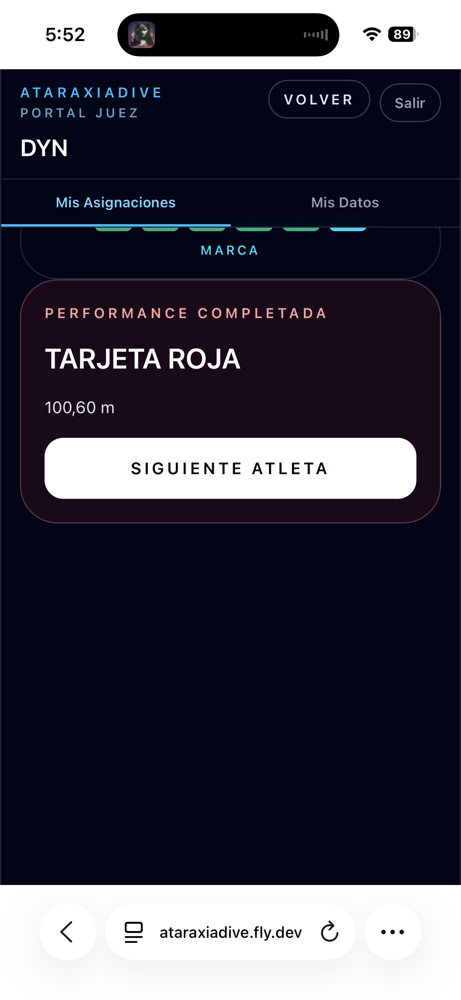
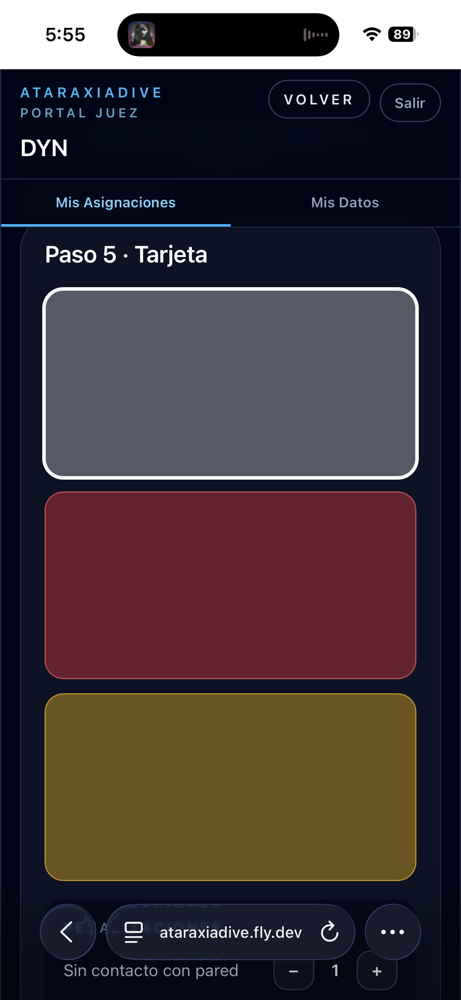
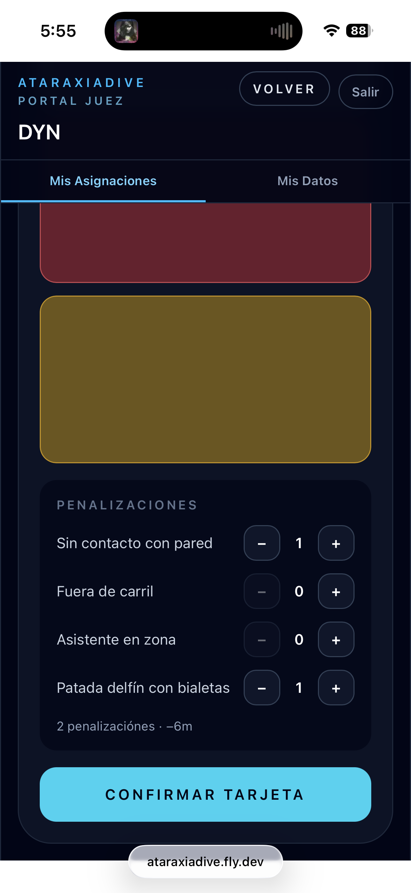
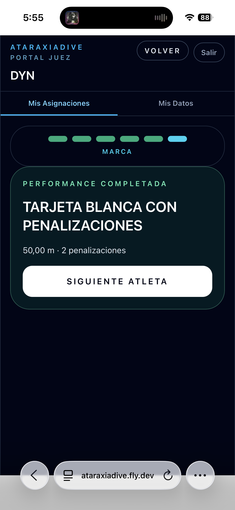
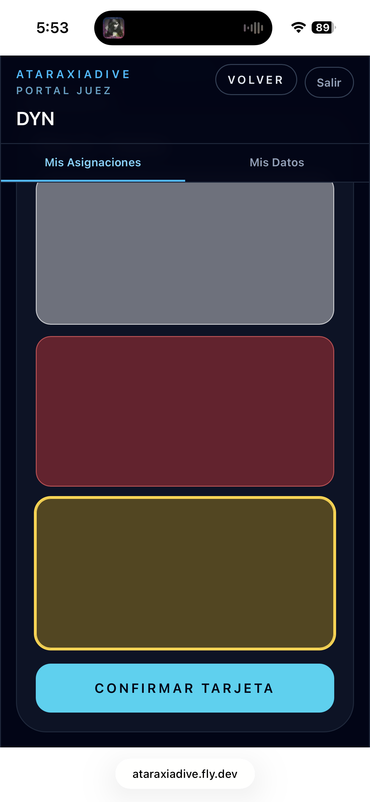
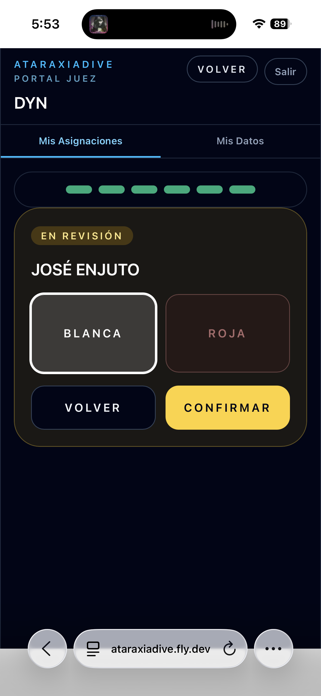

# Situaciones especiales

Esta sección cubre los casos que se apartan del flujo normal de registro. Para el flujo estándar paso a paso, ver [Registrar una performance](registrar-performance.md).

---

## DNS

El DNS (Did Not Start) se registra en el **Paso 2 — Confirmar presencia** cuando el atleta no se presentó al OT.

Presioná **DNS — No se presenta** en lugar de Continuar. La performance queda registrada como DNS y no puede modificarse.

---

## BKO

El BKO (Black-out) se registra en el **Paso 4 — Performance en curso** cuando el atleta pierde el conocimiento.

Presioná **BKO — Black-out**. El flujo cambia a modo BKO:

**1.** Ingresá la marca alcanzada antes del incidente y seleccioná el tipo de black-out:

**2.** Si necesitás cambiar el motivo, el selector muestra todas las opciones de descalificación:

| Motivo | Descripción |
|--------|-------------|
| Black-out en superficie | Pérdida de conciencia al salir del agua |
| Black-out subacuático | Pérdida de conciencia bajo el agua |
| No siguió protocolo de superficie | No completó el protocolo al salir |
| Infracción técnica | Infracción técnica grave |
| No inició en ventana | No inició dentro de la ventana OT |
| Salida en falso | Salida anticipada |

**3.** Presioná **Confirmar BKO**. La tarjeta roja se registra automáticamente:

---

## Penalizaciones

Las penalizaciones se aplican en el **Paso 5 — Asignar tarjeta** cuando la performance es válida pero tuvo infracciones técnicas menores.

**1.** Seleccioná la tarjeta **Blanca** (gris claro). La sección de penalizaciones aparece debajo de las tarjetas. Usá los botones **+** y **−** para indicar la cantidad de cada infracción:

**2.** El resumen al pie muestra el total de penalizaciones y el descuento acumulado (cada penalización descuenta 3 m o equivalente):

**3.** Presioná **Confirmar tarjeta** y continuá con el registro de la marca. El resultado final indica la cantidad de penalizaciones aplicadas:

!!! info "Disponibilidad según disciplina"
    Las penalizaciones solo están disponibles en las disciplinas que las admiten según el reglamento.

---

## Tarjeta amarilla

La tarjeta amarilla deja la performance **en revisión** para que el comité de jueces resuelva el resultado.

**Asignar:** En el **Paso 5**, seleccioná la tarjeta **Amarilla** (dorado) y presioná **Confirmar tarjeta**:

La performance queda en estado **Revisión** en la grilla hasta que el comité resuelva.

**Resolver:** Una vez que el comité tomó la decisión, la pantalla de resolución aparece automáticamente. Seleccioná el resultado final y presioná **Confirmar**:

!!! info "Opciones de resolución"
    El comité puede resolver la tarjeta amarilla como **Blanca** (válida), **Blanca con penalizaciones** o **Roja** (descalificada con motivo).
