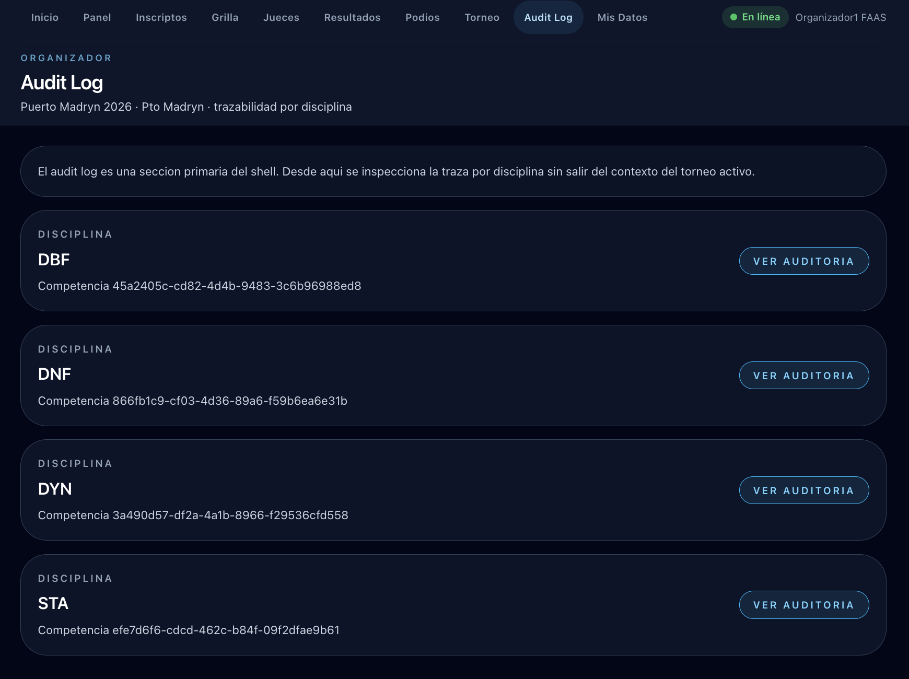
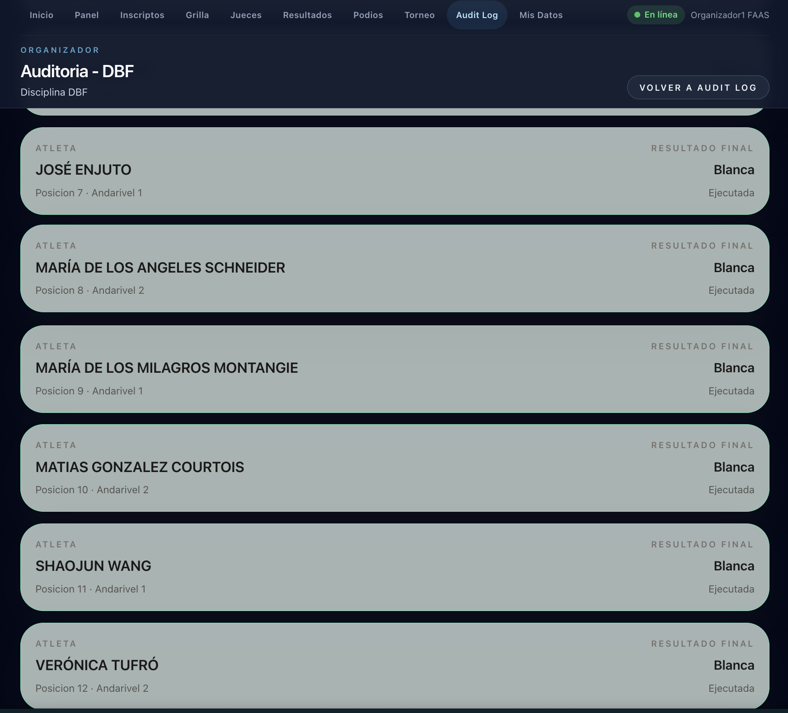
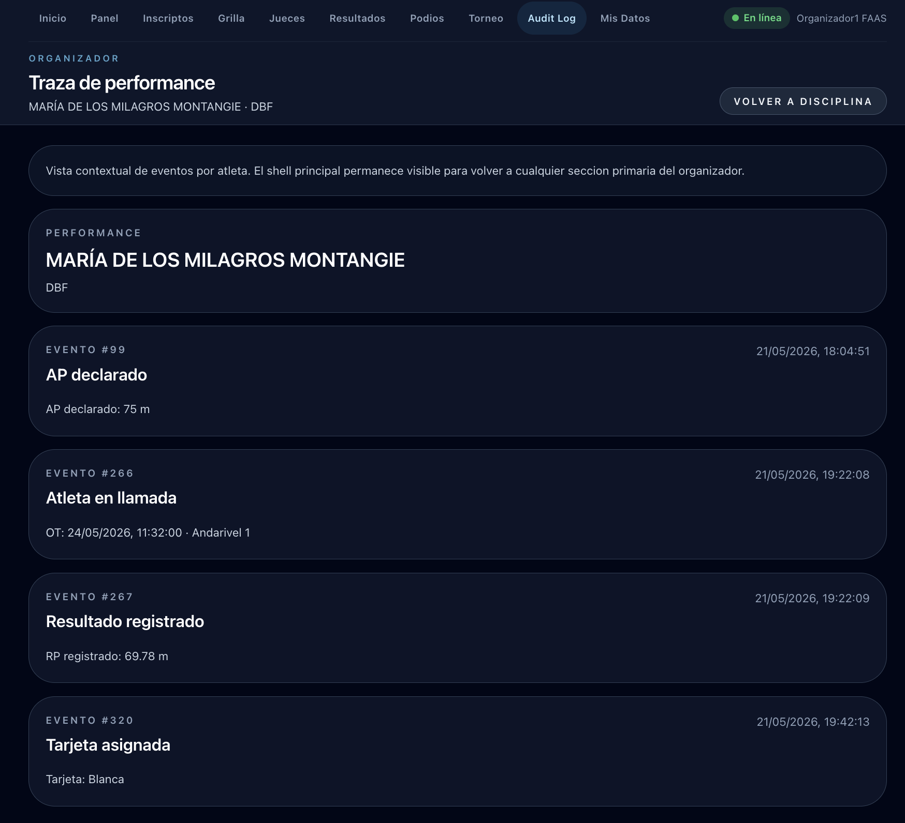

# Auditoría (Audit Log)

El **Audit Log** permite inspeccionar la trazabilidad completa de cada competencia: resultados por atleta y el historial de eventos de cada performance.

## Nivel 1 — Lista de competencias

La pantalla principal muestra una tarjeta por cada disciplina del torneo, con su ID de competencia y el botón **Ver auditoria**.

Hacé clic en **Ver auditoria** para entrar al detalle de esa disciplina.

## Nivel 2 — Resultados por atleta

Dentro de una disciplina, el audit log muestra todos los atletas con su resultado final:

Cada fila indica:

- **Atleta** — apellido y nombre, posición y andarivel
- **Resultado final** — tarjeta asignada (Blanca, Roja, DNS) y estado de la performance (Ejecutada / DNS)

Hacé clic en un atleta para ver la traza de eventos de su performance.

## Nivel 3 — Traza de performance

La vista de traza muestra el historial completo de eventos de un atleta en esa disciplina, en orden cronológico:

Cada evento incluye su número, fecha y hora, y los datos relevantes:

| Evento | Datos |
|--------|-------|
| **AP declarado** | Valor del AP y fecha de declaración |
| **Atleta en llamada** | OT asignado, fecha y andarivel |
| **Resultado registrado** | RP efectivo medido |
| **Tarjeta asignada** | Tipo de tarjeta resultante |

!!! info "Para qué sirve el Audit Log"
    El Audit Log es una herramienta para verificar y resolver disputas — permite confirmar que cada performance quedó registrada correctamente con su trazabilidad completa de eventos.
