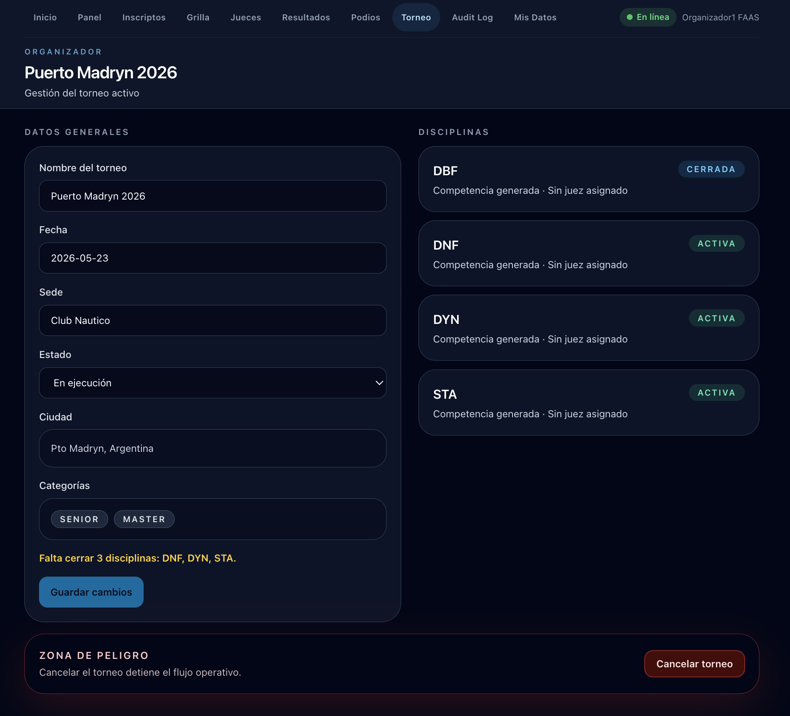
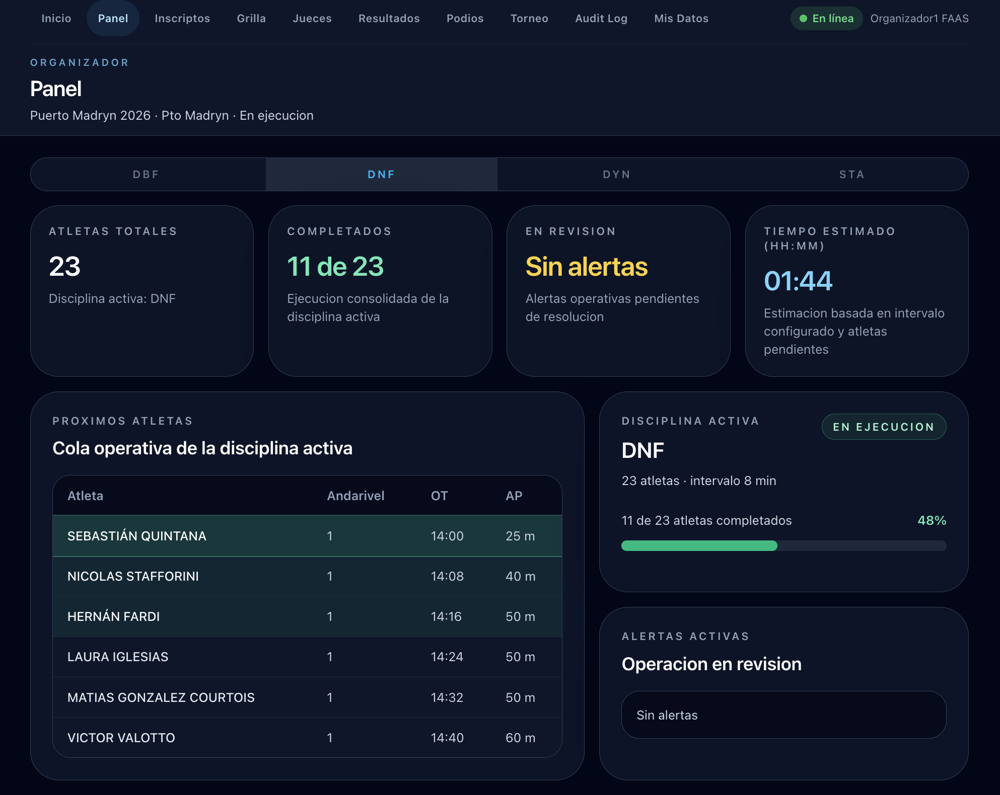

# Gestionar el torneo activo

El portal organizador tiene dos secciones para gestionar el torneo: **Torneo** (estado y datos) y **Panel** (seguimiento operativo durante la ejecución).

---

## Sección Torneo — estado y transiciones

La sección **Torneo** es desde donde controlás el ciclo de vida: avanzás entre estados, revisás disciplinas y cancelás el torneo si es necesario.

### Datos generales

La columna izquierda muestra:

- **Nombre del torneo**, fecha y sede
- **Estado** — con un selector para avanzar al siguiente estado
- **Ciudad y país**
- **Categorías** habilitadas (JUNIOR / SENIOR / MASTER)

### Disciplinas

La columna derecha lista las disciplinas del torneo con su estado:

| Estado | Significado |
|--------|-------------|
| **Activa** | La competencia está en ejecución |
| **Cerrada** | La competencia finalizó — resultados disponibles |

### Avanzar el estado del torneo

Seleccioná el próximo estado en el selector y hacé clic en **Guardar cambios**.

| Desde | Hacia |
|-------|-------|
| Creado | Inscripciones abiertas |
| Inscripciones abiertas | Preparación |
| Preparación | En ejecución |
| En ejecución | Premiación |
| Premiación | Cerrado |

!!! warning "Condición para pasar a Premiación"
    La transición solo se habilita cuando **todas las disciplinas tienen su competencia cerrada**. Si alguna sigue activa, aparece un aviso en ámbar indicando cuáles faltan (ej: "Falta cerrar 3 disciplinas: DNF, DYN, STA").

### Cancelar un torneo

Al pie de la página está la **Zona de peligro**. Hacé clic en **Cancelar torneo** y confirmá escribiendo el nombre exacto del torneo.

!!! danger "La cancelación es irreversible"
    Un torneo cancelado no puede volver a activarse.

---

## Sección Panel — seguimiento durante la ejecución

Durante la **Ejecución**, la sección **Panel** muestra el estado operativo en tiempo real de la disciplina activa.

### Pestañas por disciplina

Cada disciplina del torneo tiene su propia pestaña. Al cambiar de pestaña ves las métricas y la cola de atletas de esa disciplina.

### Métricas de la disciplina

| Tarjeta | Descripción |
|---------|-------------|
| **Atletas totales** | Total de atletas en la grilla de esta disciplina |
| **Completados** | Cuántos ya realizaron su performance |
| **En revisión** | Alertas operativas pendientes de resolución |
| **Tiempo estimado** | Tiempo restante estimado para cerrar la disciplina (hh:mm) |

### Cola operativa

La tabla **Próximos atletas** muestra a los siguientes en la grilla con su andarivel, hora de OT y AP declarada. Esta lista se actualiza automáticamente a medida que avanza la competencia.

### Disciplina activa y progreso

La columna derecha muestra el progreso de la disciplina activa (porcentaje de atletas completados) y las alertas operativas vigentes.
