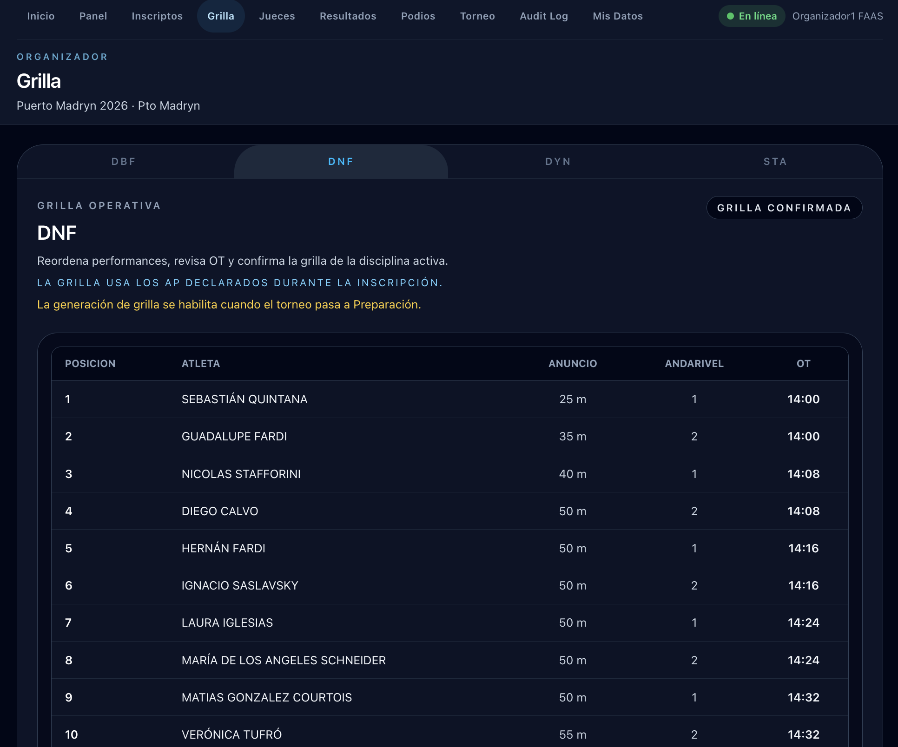

# Manejar la grilla

La sección **Grilla** permite generar, revisar, ajustar y confirmar el orden de salida de los atletas por disciplina. Solo se puede operar mientras el torneo esté en estado **Preparación**.

## Seleccionar la disciplina

Usá las pestañas para elegir la disciplina. La grilla y el estado mostrados corresponden a la disciplina seleccionada.

## Generar la grilla

Si la disciplina todavía no tiene grilla, el panel muestra el formulario de configuración:

| Campo | Descripción |
|-------|-------------|
| **Fecha del primer OT** | Fecha de la competencia (dentro del rango del torneo) |
| **Primer OT** | Hora del primer Official Top (formato `hh:mm`) |
| **Intervalo OT** | Minutos entre cada atleta (ej: 8 minutos) |
| **Andariveles** | Cantidad de andariveles disponibles simultáneamente |

Hacé clic en **Generar grilla** para crear la competencia y distribuir los atletas automáticamente según sus AP (de mayor a menor).

## La grilla generada

Una vez generada, la tabla muestra a todos los atletas en el orden de salida:

| Columna | Descripción |
|---------|-------------|
| **Posición** | Orden de salida |
| **Atleta** | Apellido y nombre |
| **Anuncio** | AP declarada |
| **Andarivel** | Andarivel asignado |
| **OT** | Hora del Official Top |

!!! info "Orden de la grilla"
    Los atletas se ordenan por AP declarada de mayor a menor. Si un atleta no declaró AP, queda al final.

## Ajustar el orden

Antes de confirmar, podés reorganizar los atletas usando los botones de flecha (↑ ↓). Los OT se recalculan automáticamente al mover posiciones.

## Regenerar la grilla

Si llegaron nuevos AP después de la generación, hacé clic en **Regenerar grilla** e ingresá nuevamente los parámetros. Esto reemplaza el orden actual con el automático por AP.

!!! warning "Regenerar borra los ajustes manuales"
    Si reorganizaste el orden a mano, regenerar descarta esos cambios.

## Confirmar la grilla

Cuando el orden es correcto, hacé clic en **Confirmar grilla**. El badge **GRILLA CONFIRMADA** aparece en la cabecera y la grilla pasa a solo lectura.

!!! info "Grilla confirmada"
    Una vez confirmada, no se puede modificar. La ejecución tomará este orden.
