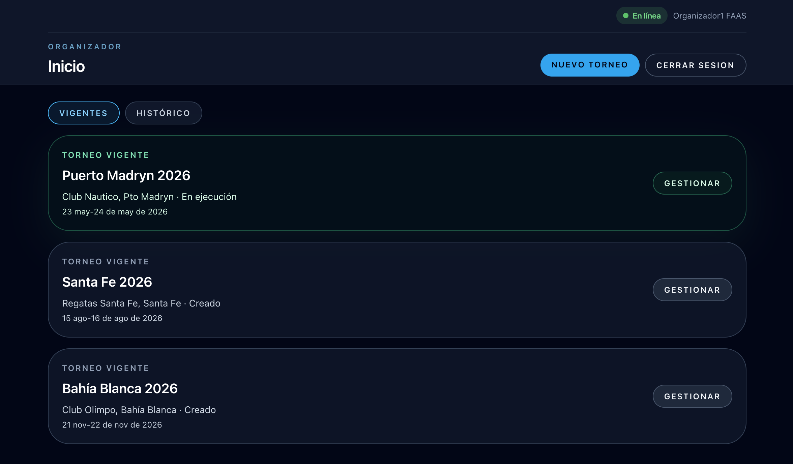

# Portal Organizador

El portal organizador permite gestionar el ciclo de vida completo de un torneo: creación, inscripciones, grilla, ejecución, resultados y cierre.

## Acceso

Iniciá sesión con tu cuenta y seleccioná el rol **Organizador** al entrar a la plataforma. Si todavía no tenés el perfil de organizador, podés activarlo desde **Mis Datos**.

## Tus torneos

Al entrar al portal ves la lista de torneos vigentes e históricos. Desde aquí podés acceder a cualquier torneo con el botón **Gestionar**, o crear uno nuevo con **Nuevo torneo**.



## Navegación

La barra de navegación del portal organizador tiene las siguientes secciones:

| Sección | Descripción |
|---------|-------------|
| **Panel** | Panel operativo durante la ejecución (cola de atletas, progreso por disciplina) |
| **Inscriptos** | Gestión de inscripciones y AP |
| **Grilla** | Generación y ajuste de la grilla de competencia |
| **Jueces** | Asignación de jueces por performance |
| **Resultados** | Tabla de resultados por disciplina |
| **Podios** | Podios y tabla Overall |
| **Torneo** | Datos del torneo activo y transiciones de estado |
| **Audit Log** | Trazabilidad de competencias y performances |
| **Mis Datos** | Datos del perfil de organizador |

## Ciclo de vida de un torneo

Un torneo atraviesa los siguientes estados en orden:

```
CREADO → INSCRIPCION_ABIERTA → PREPARACION → EJECUCION → PREMIACION → CERRADO
```

Cada transición la realiza el organizador desde la sección **Torneo**.

| Estado | Qué puede hacer el organizador |
|--------|-------------------------------|
| **Creado** | Editar datos, disciplinas y categorías; abrir inscripciones |
| **Inscripciones abiertas** | Ver inscriptos y AP declaradas; cerrar inscripciones |
| **Preparación** | Generar y confirmar la grilla; asignar jueces; iniciar ejecución |
| **En ejecución** | Monitorear el avance por disciplina; pasar a premiación cuando todas estén cerradas |
| **Premiación** | Revisar resultados y podios; cerrar el torneo |
| **Cerrado** | Solo lectura — resultados y podios disponibles para todos |
