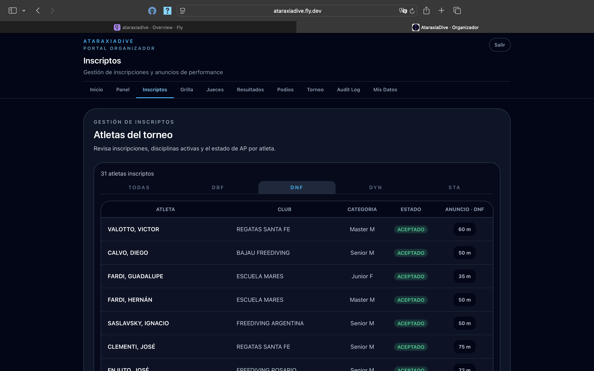
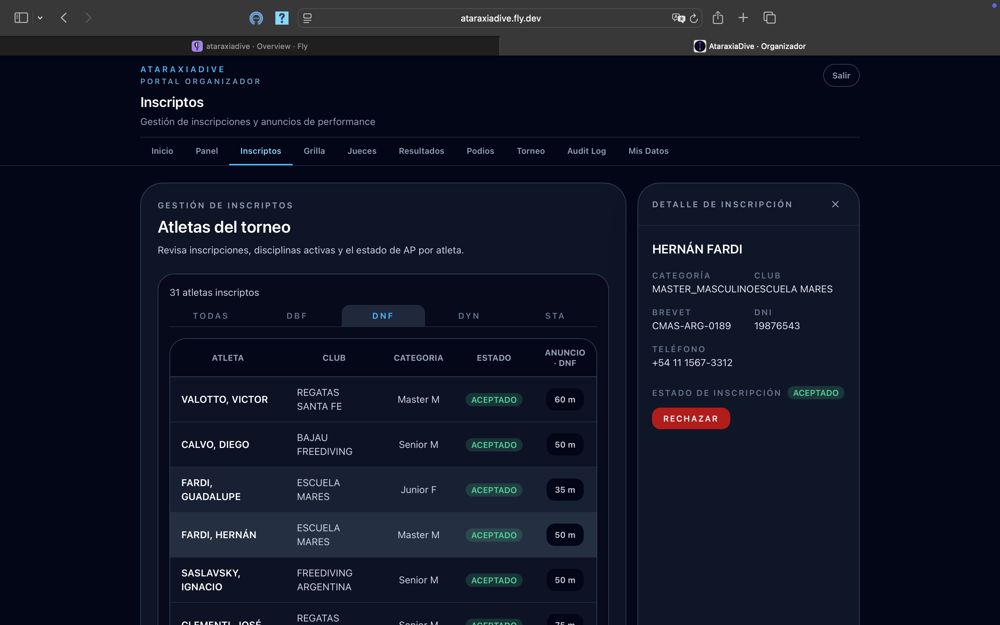

# Administrar inscriptos

La sección **Inscriptos** muestra todos los atletas inscriptos al torneo con sus disciplinas y el estado de su AP (Announced Performance).

## La tabla de inscriptos

Las solapas superiores permiten filtrar por disciplina (**TODAS**, **DBF**, **DNF**, **DYN**, **STA**). Cada fila muestra:

| Columna | Descripción |
|---------|-------------|
| **Atleta** | Apellido y nombre |
| **Club** | Club al que pertenece |
| **Categoría** | Grupo etario y género (ej: Master M, Junior F) |
| **Estado** | Estado de la inscripción — ACEPTADO en verde, RECHAZADO en rojo |
| **Anuncio** | AP declarada para la disciplina activa (ej: "90 m") |

!!! info "Estado del AP"
    Mientras el torneo esté en **Inscripciones abiertas**, el AP puede editarse. Una vez cerradas las inscripciones, el valor queda fijo para la generación de la grilla.

## Ver el detalle de un inscripto

Hacé clic en cualquier fila para abrir el panel lateral con el detalle completo del atleta:

- **Categoría y club**
- **Brevet** (número de licencia de apnea)
- **DNI** y **Teléfono**
- **Estado de la inscripción** (ACEPTADO / RECHAZADO)
- Botón de acción según el estado: **Rechazar** si está aceptada, **Aceptar** si está rechazada

## Aceptar o rechazar inscripciones

Desde el panel lateral podés cambiar el estado de aceptación de cada inscripción:

- **Aceptar** — la inscripción queda confirmada
- **Rechazar** — el atleta no aparecerá en la grilla

El badge de estado (ACEPTADO / RECHAZADO) se actualiza inmediatamente en la tabla.

