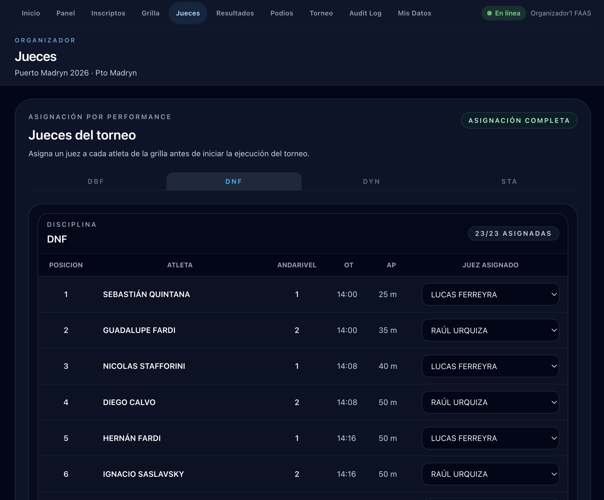

# Asignar jueces

La sección **Jueces** permite asignar un juez a cada performance de la grilla antes de iniciar la ejecución. La asignación es **por atleta dentro de cada disciplina**.

## La tabla de asignación

Usá las pestañas para seleccionar la disciplina y verás la grilla completa de esa disciplina. Por cada atleta podés elegir el juez que lo evaluará:

| Columna | Descripción |
|---------|-------------|
| **Posición** | Orden en la grilla |
| **Atleta** | Apellido y nombre |
| **Andarivel** | Andarivel asignado |
| **OT** | Hora del Official Top |
| **AP** | Announced Performance declarada |
| **Juez asignado** | Selector con todos los usuarios con rol JUEZ |

## Asignar un juez

Hacé clic en el selector de **Juez asignado** de la fila del atleta y elegí un juez de la lista. El cambio se guarda automáticamente.

Podés asignar el mismo juez a múltiples atletas. El badge **N/N Asignadas** en la cabecera muestra el progreso (ej: "23/23 Asignadas"). Cuando todas las performances tienen juez asignado, aparece el badge **ASIGNACIÓN COMPLETA**.

!!! tip "¿No aparece el juez en la lista?"
    El juez necesita una cuenta en la plataforma con el rol **Juez** activado. Si no aparece, pedile que active el rol desde su perfil en **Mis Datos**.

## Cuándo asignar jueces

La asignación se puede hacer desde que el torneo está en **Preparación**, una vez generada la grilla. Es un paso previo necesario para que el juez pueda acceder al panel operativo de esa disciplina durante la ejecución.
