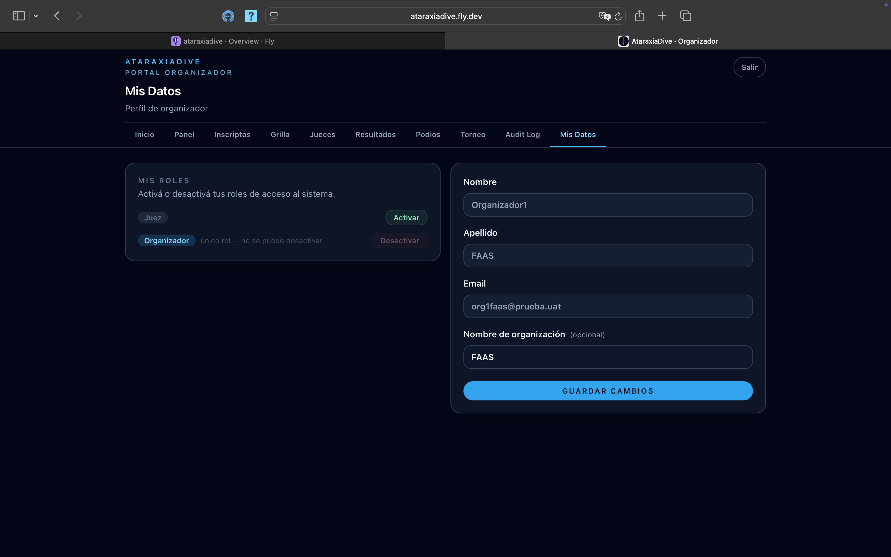

# Mis datos (Organizador)

La sección **Mis Datos** del portal organizador permite configurar el perfil de la organización y gestionar los roles activos en tu cuenta.

## Perfil de organizador

El formulario del perfil (columna derecha) muestra:

| Campo | Descripción |
|-------|-------------|
| **Nombre** y **Apellido** | Tus datos personales de la cuenta |
| **Email** | Correo de acceso a la plataforma |
| **Nombre de organización** *(opcional)* | El nombre que aparece asociado a los torneos que creás (ej: "FAAS", "Club Atlántico") |

Editá los campos y hacé clic en **Guardar cambios**.

## Gestión de roles

La sección **Roles** muestra todos los roles disponibles en la plataforma (Atleta, Juez, Organizador) y permite activarlos o desactivarlos desde la misma pantalla.

- Un **switch activado** indica que ese rol está activo en tu cuenta
- Podés tener más de un rol activo al mismo tiempo
- Al iniciar sesión, la plataforma te redirige al portal del rol con el que accediste

!!! warning "No podés desactivar tu único rol activo"
    Si solo tenés un rol, el sistema no te permite desactivarlo. Tenés que activar otro rol antes de poder quitar el actual.

!!! tip "Activar el rol de Organizador"
    Si entraste a la plataforma con otro rol (ej: Atleta) y querés organizar torneos, activá el rol **Organizador** desde Mis Datos y volvé a iniciar sesión para acceder al portal organizador.
