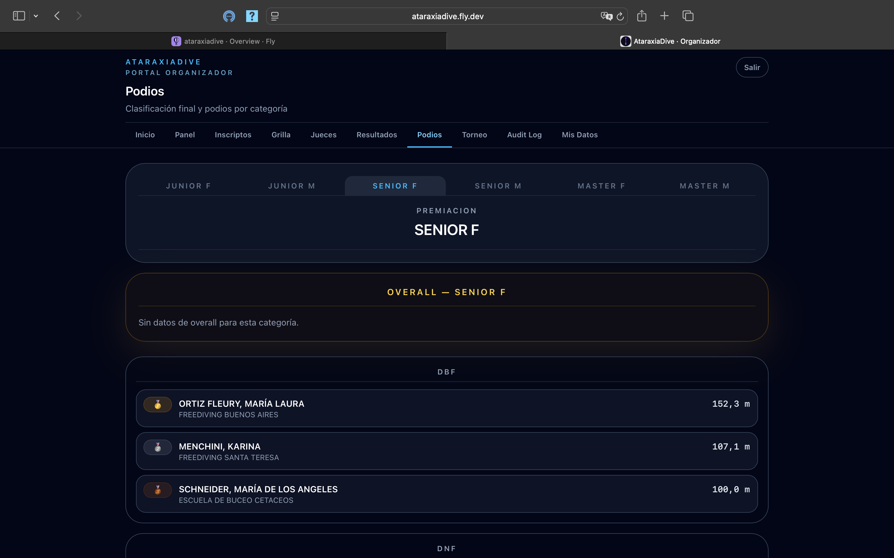
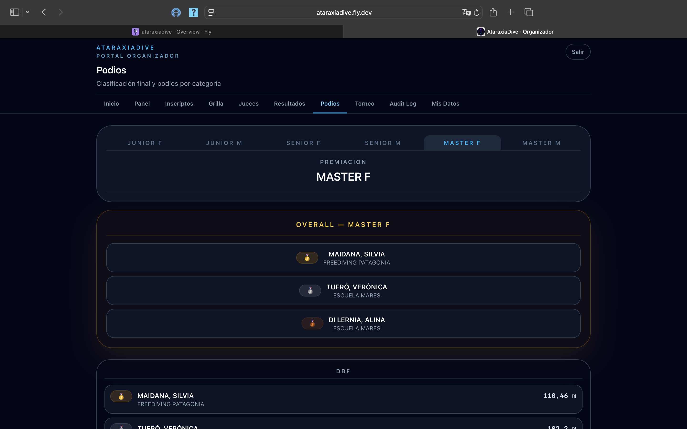
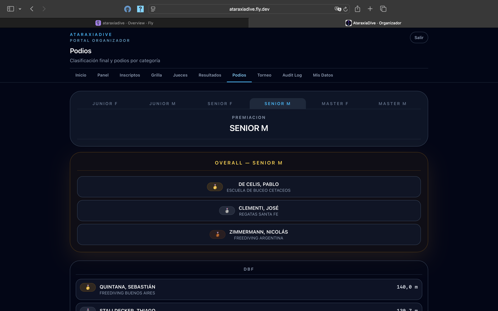
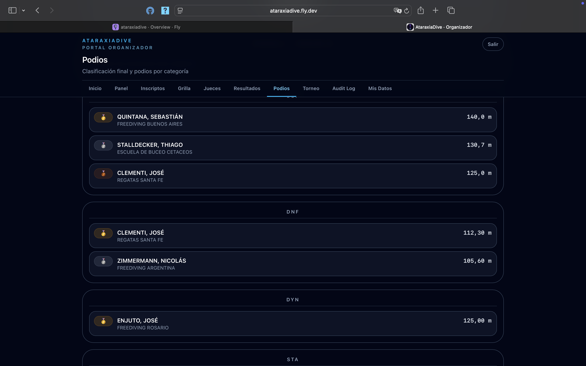

# Ver podios

La sección **Podios** muestra la clasificación final del torneo: el **Overall** y los podios por disciplina, organizados por categoría.

## Seleccionar la categoría

Las solapas superiores son las **categorías** del torneo:

- JUNIOR F / JUNIOR M
- SENIOR F / SENIOR M
- MASTER F / MASTER M

Al elegir una categoría ves, una debajo de la otra, su clasificación **Overall** y los podios de **cada disciplina** para esa categoría.

## Overall por categoría

La primera sección (**OVERALL — \<categoría\>**) muestra la clasificación general del top 3 combinando todas las disciplinas. Cada puesto indica posición (🥇 🥈 🥉), nombre y club del atleta.

El orden surge del **reglamento FAAS**: cada disciplina otorga puntos relativos al mejor de la categoría (la mejor marca recibe 100 puntos y el resto en proporción), y el Overall suma los puntos de todas las disciplinas. Las performances con tarjeta roja o DNS suman 0.

!!! info "Sin datos de overall"
    Si una categoría todavía no tiene puntaje calculado, la sección Overall muestra *"Sin datos de overall para esta categoría"*.

## Podios por disciplina

Debajo del Overall, cada disciplina (DBF, DNF, DYN, STA…) tiene su propio podio con los tres primeros puestos de esa categoría, mostrando posición, nombre, club y **RP logrado**.

## Cuándo están disponibles los podios

Los podios se calculan y muestran a partir del estado **Premiación**. También están disponibles cuando el torneo está **Cerrado**.

Durante la **Ejecución**, la sección Podios puede mostrar resultados parciales a medida que se van cerrando disciplinas.

!!! info "Vista pública"
    Los podios también son visibles para cualquier visitante en el [portal público](../portal-publico/ver-resultados.md) una vez que el torneo pasa a Premiación o Cerrado.
