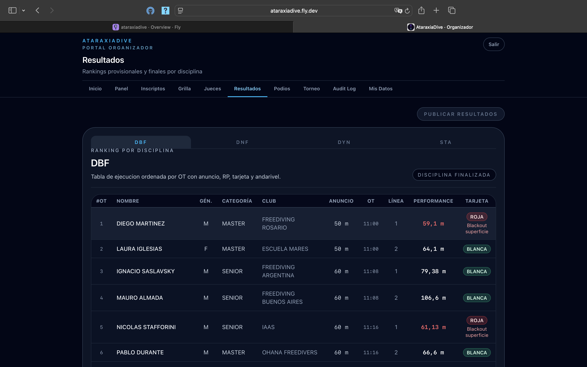
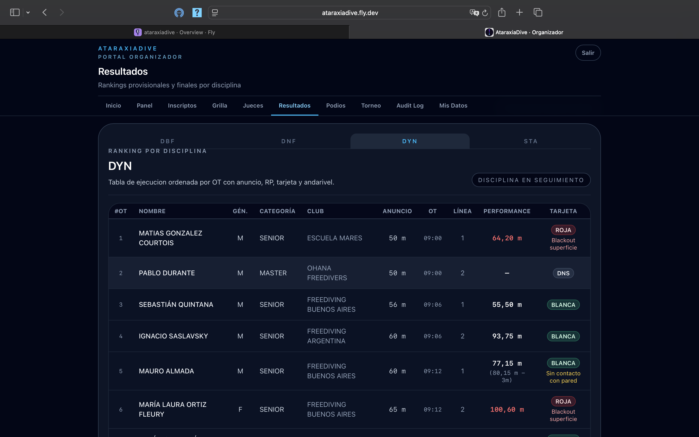
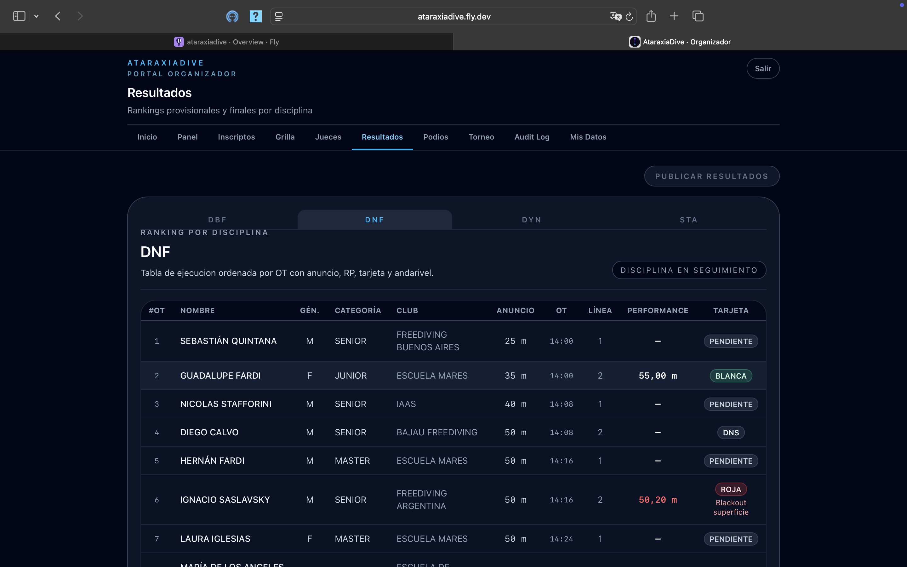
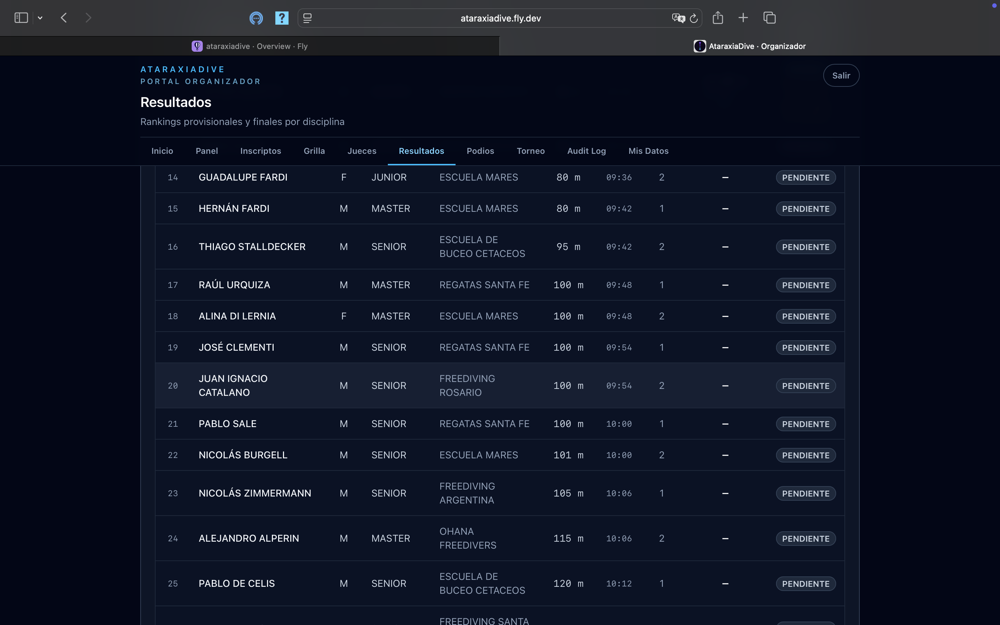
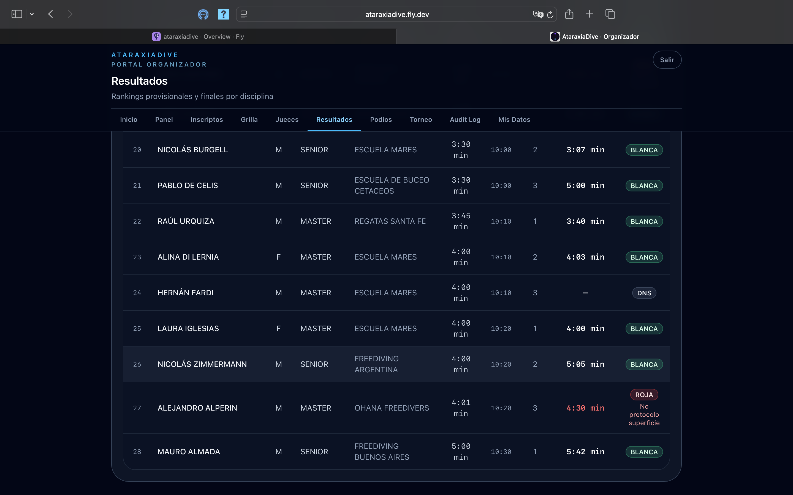

# Ver resultados

La sección **Resultados** muestra el ranking por disciplina con todas las performances, tarjetas y RP finales.

## Seleccionar la disciplina

Usá las pestañas (**DBF**, **DNF**, **DYN**, **STA**) para ver el ranking de cada disciplina. Cada una muestra un badge con su estado: **DISCIPLINA FINALIZADA** (ranking definitivo) o **DISCIPLINA EN SEGUIMIENTO** (ejecución en curso, valores provisorios).

## La tabla de resultados

La tabla está ordenada por OT (orden de ejecución) y muestra:

| Columna | Descripción |
|---------|-------------|
| **#OT** | Posición en el orden de salida |
| **Nombre** | Nombre del atleta |
| **Gén.** | Género (M / F) |
| **Categoría** | Grupo etario |
| **Club** | Club del atleta |
| **Anuncio** | AP declarada |
| **OT** | Hora del Official Top |
| **Línea** | Andarivel |
| **Performance** | RP logrado — en rojo si está cerca o por debajo del AP |
| **Tarjeta** | Resultado de la performance |

### Tipos de tarjeta

| Tarjeta | Significado |
|---------|-------------|
| **Blanca** | Performance válida sin infracciones |
| **Blanca + penaliz.** | Válida con infracciones técnicas; RP final = RP medido − penalizaciones (se muestra el motivo, ej: "Sin contacto con pared") |
| **Roja** | Descalificación — se muestra el motivo (ej: "Blackout superficie") |
| **DNS** | El atleta no se presentó al OT |
| **Pendiente** | La performance todavía no fue registrada (disciplina en seguimiento) |

En las disciplinas que aún están en ejecución conviven performances ya registradas con otras en estado **Pendiente**:

### Ejemplos por disciplina

Cada disciplina muestra su ranking con el mismo formato. En **DNF** se ven las primeras performances registradas junto a las pendientes:

En **STA**, las marcas son tiempos (mm:ss) en lugar de distancias, y el motivo de descalificación puede ser distinto (ej: "No protocolo superficie"):

## Publicar resultados

Cuando querés que los resultados de una disciplina sean visibles en el portal público, hacé clic en **Publicar resultados** en la esquina superior derecha. Esto actualiza la vista pública en tiempo real.

!!! info "Resultados en tiempo real"
    Durante la ejecución, los resultados de las disciplinas finalizadas aparecen automáticamente en el portal público sin necesidad de publicación manual.
