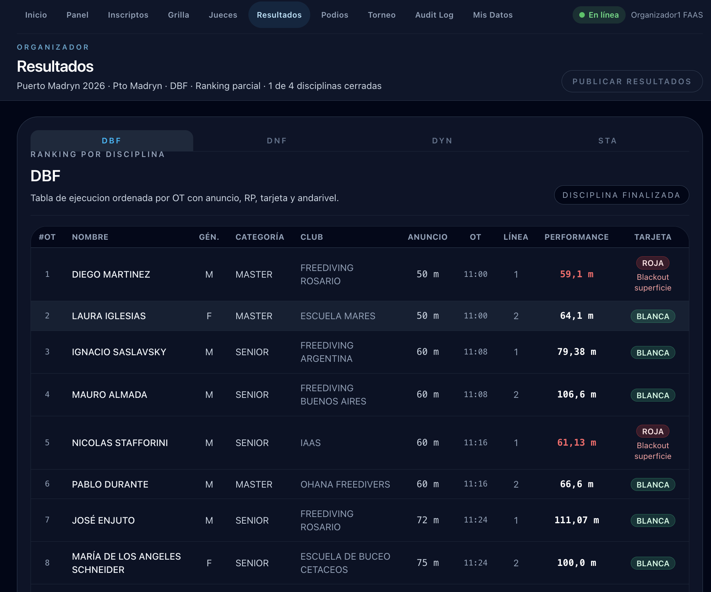

# Ver resultados

La sección **Resultados** muestra el ranking por disciplina con todas las performances, tarjetas y RP finales.

## Seleccionar la disciplina

Usá las pestañas (**DBF**, **DNF**, **DYN**, **STA**) para ver el ranking de cada disciplina. El encabezado muestra cuántas disciplinas están cerradas (ej: "Ranking parcial · 1 de 4 disciplinas cerradas").

## La tabla de resultados

La tabla está ordenada por OT (orden de ejecución) y muestra:

| Columna | Descripción |
|---------|-------------|
| **#OT** | Posición en el orden de salida |
| **Nombre** | Nombre del atleta |
| **Gén.** | Género (M / F) |
| **Categoría** | Grupo etario |
| **Club** | Club del atleta |
| **Anuncio** | AP declarada |
| **OT** | Hora del Official Top |
| **Línea** | Andarivel |
| **Performance** | RP logrado — en rojo si está cerca o por debajo del AP |
| **Tarjeta** | Resultado de la performance |

### Tipos de tarjeta

| Tarjeta | Significado |
|---------|-------------|
| **Blanca** | Performance válida sin infracciones |
| **Blanca + penaliz.** | Válida con infracciones técnicas; RP final = RP medido − penalizaciones |
| **Roja** | Descalificación — se muestra el motivo (ej: "Blackout superficie") |
| **DNS** | El atleta no se presentó al OT |

## Publicar resultados

Cuando querés que los resultados de una disciplina sean visibles en el portal público, hacé clic en **Publicar resultados** en la esquina superior derecha. Esto actualiza la vista pública en tiempo real.

!!! info "Resultados en tiempo real"
    Durante la ejecución, los resultados de las disciplinas finalizadas aparecen automáticamente en el portal público sin necesidad de publicación manual.
