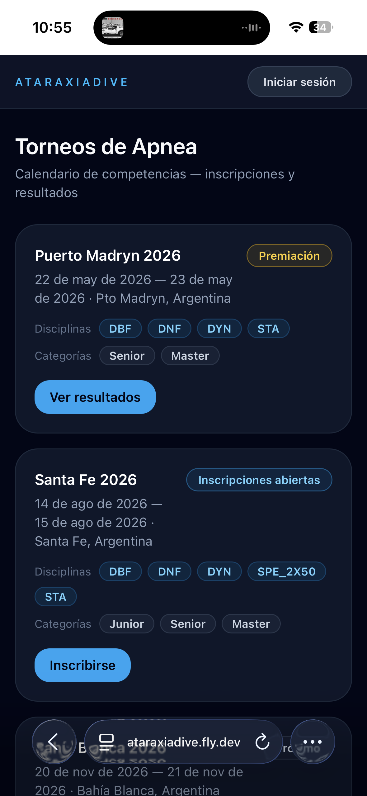
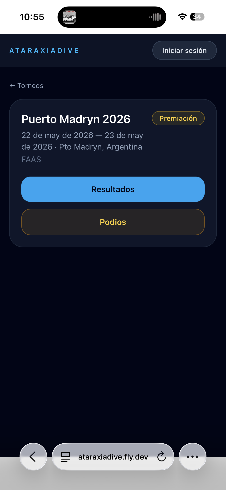
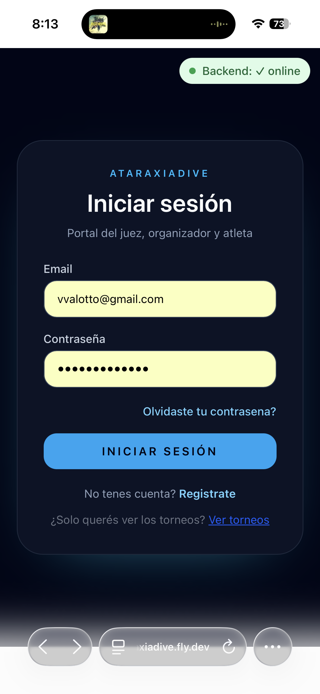

# Explorar torneos

## Ver la lista de torneos

Al ingresar a la plataforma vas a ver el listado de todos los torneos. Cada tarjeta muestra:

- Nombre del torneo
- Fechas (inicio — fin)
- Sede (ciudad y país)
- Disciplinas habilitadas (DBF, DNF, DYN, STA, SPE…)
- Categorías (Junior, Senior, Master)
- Estado del torneo
- Botón de acción según el estado (**Ver resultados**, **Inscribirse**, etc.)

### Estados posibles de un torneo

| Estado | Significado |
|--------|-------------|
| **Próximo** | El torneo está creado pero las inscripciones aún no abrieron |
| **Inscripciones abiertas** | Podés inscribirte si tenés cuenta de atleta |
| **Preparación** | Inscripciones cerradas, el organizador está finalizando la grilla |
| **En ejecución** | El torneo está en curso — podés seguir los resultados en vivo |
| **Premiación** | La competencia terminó, se están consolidando los resultados |
| **Cerrado** | Resultados finales disponibles |
| **Cancelado** | El torneo fue cancelado |

## Ver el detalle de un torneo

Tocá o hacé clic en cualquier tarjeta para ver más información:

- Nombre del torneo y organización responsable
- Sede completa (ciudad, país)
- Fechas de inicio y fin
- Estado actual con indicador visual
- Botones de acción según el estado:
    - **Resultados** → ranking de cada disciplina (disponible desde *En ejecución*)
    - **Podios** → top 3 por categoría (se habilita en *Premiación* y *Cerrado*; aparece atenuado mientras el torneo está en ejecución)
    - **Inscribirse** → cuando las inscripciones están abiertas (requiere sesión como atleta)

## Inscribirse a un torneo

Si el torneo tiene inscripciones abiertas y tocás **"Inscribirse"**, la plataforma te lleva primero a la pantalla de login.

Desde ahí podés:

- **Iniciar sesión** si ya tenés cuenta → la plataforma te lleva directamente al flujo de inscripción
- **Crear cuenta** si es tu primera vez → una vez registrado como atleta, podés inscribirte

Ver también: [Iniciar sesión](../tu-cuenta/iniciar-sesion.md) · [Crear tu cuenta](../tu-cuenta/crear-cuenta.md)

## Navegar entre pantallas

Desde el detalle del torneo podés volver a la lista de torneos usando la flecha "← Torneos" en la parte superior de la pantalla.
